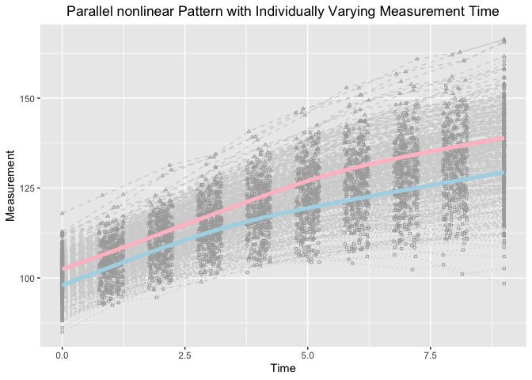

Estimating knots and Knot-knot Association of PBLSGMs in the framework
of individual measurement occasions
================
Jin Liu

## OS, R version and OpenMx Version

``` r
OpenMx::mxVersion()
```

    ## OpenMx version: 2.17.3 [GIT v2.17.3]
    ## R version: R version 3.6.3 (2020-02-29)
    ## Platform: x86_64-apple-darwin15.6.0 
    ## MacOS: 10.15.4
    ## Default optimizer: CSOLNP
    ## NPSOL-enabled?: No
    ## OpenMP-enabled?: Yes

## Require package would be used

``` r
library(tidyr)
library(ggplot2)
```

## Read in dataset for analyses (wide-format data)

``` r
dat <- read.csv(file = "example_data.csv")
```

## Summarize data

``` r
summary(dat)
```

    ##        id               Y1               Y2               Y3       
    ##  Min.   :  1.00   Min.   : 84.93   Min.   : 92.39   Min.   : 94.6  
    ##  1st Qu.: 50.75   1st Qu.: 94.68   1st Qu.: 98.76   1st Qu.:103.9  
    ##  Median :100.50   Median : 98.54   Median :103.22   Median :108.1  
    ##  Mean   :100.50   Mean   : 97.94   Mean   :102.96   Mean   :108.1  
    ##  3rd Qu.:150.25   3rd Qu.:100.75   3rd Qu.:106.65   3rd Qu.:112.5  
    ##  Max.   :200.00   Max.   :107.93   Max.   :113.54   Max.   :120.2  
    ##        Y4              Y5              Y6              Y7       
    ##  Min.   :100.9   Min.   :101.5   Min.   :104.4   Min.   :104.1  
    ##  1st Qu.:108.5   1st Qu.:111.7   1st Qu.:113.8   1st Qu.:116.4  
    ##  Median :113.0   Median :116.9   Median :119.2   Median :122.5  
    ##  Mean   :113.0   Mean   :116.8   Mean   :119.4   Mean   :122.0  
    ##  3rd Qu.:117.2   3rd Qu.:122.2   3rd Qu.:124.9   3rd Qu.:128.2  
    ##  Max.   :126.9   Max.   :134.7   Max.   :139.9   Max.   :143.5  
    ##        Y8              Y9             Y10               Z1        
    ##  Min.   :102.3   Min.   :101.0   Min.   : 98.45   Min.   : 88.04  
    ##  1st Qu.:118.9   1st Qu.:120.5   1st Qu.:122.92   1st Qu.: 99.19  
    ##  Median :124.2   Median :126.7   Median :129.22   Median :102.55  
    ##  Mean   :124.3   Mean   :127.0   Mean   :129.46   Mean   :102.49  
    ##  3rd Qu.:130.4   3rd Qu.:133.7   3rd Qu.:136.77   3rd Qu.:105.98  
    ##  Max.   :148.6   Max.   :153.6   Max.   :160.49   Max.   :117.94  
    ##        Z2               Z3               Z4               Z5       
    ##  Min.   : 93.65   Min.   : 96.66   Min.   : 98.87   Min.   :103.4  
    ##  1st Qu.:103.57   1st Qu.:108.04   1st Qu.:112.81   1st Qu.:117.5  
    ##  Median :107.18   Median :112.55   Median :117.08   Median :122.2  
    ##  Mean   :107.18   Mean   :112.38   Mean   :117.26   Mean   :122.3  
    ##  3rd Qu.:110.54   3rd Qu.:116.34   3rd Qu.:121.58   3rd Qu.:127.0  
    ##  Max.   :123.20   Max.   :131.31   Max.   :134.42   Max.   :140.7  
    ##        Z6              Z7              Z8              Z9       
    ##  Min.   :104.9   Min.   :108.5   Min.   :110.3   Min.   :111.1  
    ##  1st Qu.:121.9   1st Qu.:125.3   1st Qu.:127.2   1st Qu.:130.0  
    ##  Median :127.4   Median :130.9   Median :133.4   Median :135.9  
    ##  Mean   :127.3   Mean   :131.1   Mean   :133.7   Mean   :136.4  
    ##  3rd Qu.:132.4   3rd Qu.:136.8   3rd Qu.:139.2   3rd Qu.:142.6  
    ##  Max.   :147.1   Max.   :152.9   Max.   :160.9   Max.   :162.8  
    ##       Z10              T1          T2               T3              T4       
    ##  Min.   :112.6   Min.   :0   Min.   :0.7508   Min.   :1.753   Min.   :2.752  
    ##  1st Qu.:132.0   1st Qu.:0   1st Qu.:0.8667   1st Qu.:1.903   1st Qu.:2.888  
    ##  Median :138.3   Median :0   Median :0.9937   Median :2.017   Median :3.018  
    ##  Mean   :138.9   Mean   :0   Mean   :0.9947   Mean   :2.012   Mean   :3.011  
    ##  3rd Qu.:145.6   3rd Qu.:0   3rd Qu.:1.1134   3rd Qu.:2.121   3rd Qu.:3.130  
    ##  Max.   :166.4   Max.   :0   Max.   :1.2449   Max.   :2.248   Max.   :3.248  
    ##        T5              T6              T7              T8       
    ##  Min.   :3.750   Min.   :4.758   Min.   :5.751   Min.   :6.754  
    ##  1st Qu.:3.909   1st Qu.:4.900   1st Qu.:5.885   1st Qu.:6.875  
    ##  Median :4.026   Median :5.009   Median :6.021   Median :6.973  
    ##  Mean   :4.015   Mean   :5.008   Mean   :6.008   Mean   :6.994  
    ##  3rd Qu.:4.127   3rd Qu.:5.122   3rd Qu.:6.134   3rd Qu.:7.124  
    ##  Max.   :4.250   Max.   :5.237   Max.   :6.246   Max.   :7.250  
    ##        T9             T10        gammaY          gammaZ     
    ##  Min.   :7.752   Min.   :9   Min.   :2.759   Min.   :4.852  
    ##  1st Qu.:7.858   1st Qu.:9   1st Qu.:3.268   1st Qu.:5.287  
    ##  Median :7.996   Median :9   Median :3.486   Median :5.502  
    ##  Mean   :7.999   Mean   :9   Mean   :3.488   Mean   :5.522  
    ##  3rd Qu.:8.142   3rd Qu.:9   3rd Qu.:3.703   3rd Qu.:5.748  
    ##  Max.   :8.249   Max.   :9   Max.   :4.393   Max.   :6.257

## Visualize data

``` r
long_dat_T <- gather(dat[, c(1, 22:31), ], key = var.T, value = time, T1:T10)
long_dat_Y <- gather(dat[, c(1, 2:11), ], key = var.Y, value = measuresY, Y1:Y10)
long_dat_Y$outcome <- "Y"
long_dat_Z <- gather(dat[, c(1, 12:21), ], key = var.Z, value = measuresZ, Z1:Z10)
long_dat_Z$outcome <- "Z"
long_dat <- data.frame(id = rep(long_dat_T$id, 2),
                       time = rep(long_dat_T$time, 2),
                       measures = c(long_dat_Y$measuresY, long_dat_Z$measuresZ),
                       outcome = c(long_dat_Y$outcome, long_dat_Z$outcome))

ggplot(aes(x = time, y = measures), data = long_dat) +
  geom_line(aes(group = id), color = "lightgrey", linetype = "dotted", 
            data = long_dat[long_dat$outcome == "Y", ]) +
  geom_line(aes(group = id), color = "lightgrey", linetype = "dashed", 
            data = long_dat[long_dat$outcome == "Z", ]) +
  geom_point(aes(group = id), color = "darkgrey", shape = 0,
             data = long_dat[long_dat$outcome == "Y", ], size = 0.8) +
  geom_point(aes(group = id), color = "darkgrey", shape = 2,
             data = long_dat[long_dat$outcome == "Z", ], size = 0.8) +
  geom_smooth(aes(group = 1), size = 1.8, col = "lightblue", se = F, 
              data = long_dat[long_dat$outcome == "Y", ] ) + 
  geom_smooth(aes(group = 1), size = 1.8, col = "pink", se = F, 
              data = long_dat[long_dat$outcome == "Z", ] ) + 
  labs(title = "Parallel nonlinear Pattern with Individually Varying Measurement Time",
       x ="Time", y = "Measurement") + 
  theme(plot.title = element_text(hjust = 0.5))
```

    ## `geom_smooth()` using method = 'gam' and formula 'y ~ s(x, bs = "cs")'
    ## `geom_smooth()` using method = 'gam' and formula 'y ~ s(x, bs = "cs")'

<!-- -->

## Parallel Bilinear Spline Growth Model with Unknown Random Knots

``` r
source("PBLSGM_random.R")
```

``` r
out
```

    ##       Name     Estimate         SE    true
    ## 1  mueta0Y  97.95821961 0.32696630  98.000
    ## 2  mueta1Y   5.01351150 0.07347843   5.000
    ## 3  mueta2Y   2.54134747 0.07517423   2.600
    ## 4     mugY   3.50171526 0.04300879   3.500
    ## 5  mueta0Z 102.37516143 0.33920850 102.000
    ## 6  mueta1Z   4.95761168 0.07065924   5.000
    ## 7  mueta2Z   2.63661645 0.07061828   2.600
    ## 8     mugZ   5.53461134 0.04962194   5.500
    ## 9  psi0Y0Y  20.68761905 2.13306070  25.000
    ## 17 psi1Y1Y   0.89195179 0.10899915   1.000
    ## 24 psi2Y2Y   1.07254812 0.11258052   1.000
    ## 30 psigYgY   0.10601847 0.03898465   0.090
    ## 35 psi0Z0Z  22.47467454 2.29517016  25.000
    ## 39 psi1Z1Z   0.94082690 0.10006069   1.000
    ## 42 psi2Z2Z   0.80521017 0.10023901   1.000
    ## 44 psigZgZ   0.19169456 0.05244039   0.090
    ## 13 psi0Y0Z   7.60215630 1.65424835   7.500
    ## 21 psi1Y1Z   0.29290135 0.07699279   0.300
    ## 28 psi2Y2Z   0.24791693 0.07700491   0.300
    ## 34 psigYgZ   0.06679462 0.03105296   0.029

## Parallel Bilinear Spline Growth Model with Unknown Fixed Knots

``` r
source("PBLSGM_fixed.R")
```

``` r
out
```

    ##       Name    Estimate         SE  true
    ## 1  mueta0Y  97.9615360 0.32468228  98.0
    ## 2  mueta1Y   5.0081677 0.07905038   5.0
    ## 3  mueta2Y   2.5370482 0.07682728   2.6
    ## 4     mugY   3.5146772 0.03423454   3.5
    ## 5  mueta0Z 102.3640726 0.33827578 102.0
    ## 6  mueta1Z   4.9644399 0.07167159   5.0
    ## 7  mueta2Z   2.6520423 0.07503854   2.6
    ## 8     mugZ   5.5056468 0.03775728   5.5
    ## 9  psi0Y0Y  20.3614656 2.10399746  25.0
    ## 15 psi1Y1Y   1.0648591 0.11779397   1.0
    ## 20 psi2Y2Y   1.1228325 0.11680591   1.0
    ## 24 psi0Z0Z  22.3113910 2.28581387  25.0
    ## 27 psi1Z1Z   0.9679621 0.10126263   1.0
    ## 29 psi2Z2Z   0.9283767 0.10505197   1.0
    ## 12 psi0Y0Z   7.2178832 1.63692342   7.5
    ## 18 psi1Y1Z   0.3527135 0.08134432   0.3
    ## 23 psi2Y2Z   0.3192993 0.08190216   0.3
