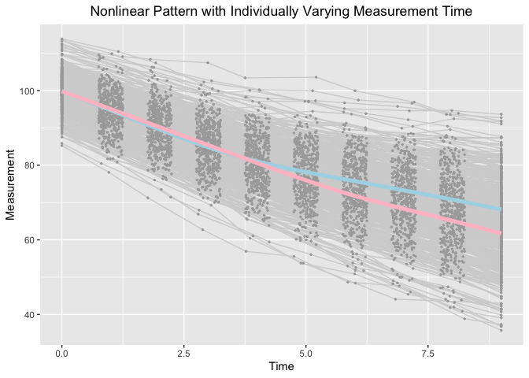

Estimating knots and Knot-knot Association of PBLSGMs in the framework
of individual measurement occasions
================
Jin Liu

## OS, R version and OpenMx Version

``` r
OpenMx::mxVersion()
```

    ## OpenMx version: 2.17.3 [GIT v2.17.3]
    ## R version: R version 3.6.3 (2020-02-29)
    ## Platform: x86_64-apple-darwin15.6.0 
    ## MacOS: 10.15.6
    ## Default optimizer: CSOLNP
    ## NPSOL-enabled?: No
    ## OpenMP-enabled?: Yes

## Require package would be used

``` r
library(tidyr)
library(ggplot2)
```

## Read in dataset for analyses (wide-format data)

``` r
dat <- read.csv(file = "example_data.csv")
```

## Summarize data

``` r
table(dat$class)
```

    ## 
    ##   1   2 
    ## 247 253

``` r
summary(dat[dat$class == 1, ])
```

    ##        X               id              Y1               Y2        
    ##  Min.   :  1.0   Min.   :  1.0   Min.   : 87.62   Min.   : 82.00  
    ##  1st Qu.:131.5   1st Qu.:131.5   1st Qu.: 96.12   1st Qu.: 91.00  
    ##  Median :258.0   Median :258.0   Median : 99.79   Median : 95.39  
    ##  Mean   :254.7   Mean   :254.7   Mean   :100.10   Mean   : 95.11  
    ##  3rd Qu.:387.0   3rd Qu.:387.0   3rd Qu.:103.99   3rd Qu.: 99.10  
    ##  Max.   :500.0   Max.   :500.0   Max.   :118.31   Max.   :109.69  
    ##        Y3               Y4               Y5               Y6       
    ##  Min.   : 75.38   Min.   : 68.79   Min.   : 59.43   Min.   :56.59  
    ##  1st Qu.: 85.92   1st Qu.: 80.20   1st Qu.: 75.33   1st Qu.:71.87  
    ##  Median : 89.98   Median : 85.49   Median : 80.34   Median :77.32  
    ##  Mean   : 90.01   Mean   : 85.13   Mean   : 80.22   Mean   :77.44  
    ##  3rd Qu.: 94.17   3rd Qu.: 89.57   3rd Qu.: 85.35   3rd Qu.:82.61  
    ##  Max.   :110.59   Max.   :104.53   Max.   :103.91   Max.   :98.40  
    ##        Y7              Y8              Y9             Y10              T1   
    ##  Min.   :52.75   Min.   :47.39   Min.   :42.42   Min.   :36.55   Min.   :0  
    ##  1st Qu.:68.95   1st Qu.:65.74   1st Qu.:62.91   1st Qu.:59.60   1st Qu.:0  
    ##  Median :75.16   Median :72.46   Median :69.66   Median :67.22   Median :0  
    ##  Mean   :74.89   Mean   :72.19   Mean   :69.59   Mean   :67.05   Mean   :0  
    ##  3rd Qu.:80.54   3rd Qu.:77.92   3rd Qu.:76.61   3rd Qu.:74.39   3rd Qu.:0  
    ##  Max.   :95.81   Max.   :93.97   Max.   :91.40   Max.   :90.96   Max.   :0  
    ##        T2               T3              T4              T5       
    ##  Min.   :0.7506   Min.   :1.751   Min.   :2.755   Min.   :3.752  
    ##  1st Qu.:0.8896   1st Qu.:1.884   1st Qu.:2.887   1st Qu.:3.887  
    ##  Median :1.0185   Median :2.009   Median :3.009   Median :3.999  
    ##  Mean   :1.0135   Mean   :2.005   Mean   :3.011   Mean   :4.002  
    ##  3rd Qu.:1.1309   3rd Qu.:2.143   3rd Qu.:3.131   3rd Qu.:4.120  
    ##  Max.   :1.2480   Max.   :2.250   Max.   :3.245   Max.   :4.248  
    ##        T6              T7              T8              T9             T10   
    ##  Min.   :4.752   Min.   :5.750   Min.   :6.750   Min.   :7.752   Min.   :9  
    ##  1st Qu.:4.877   1st Qu.:5.871   1st Qu.:6.871   1st Qu.:7.883   1st Qu.:9  
    ##  Median :4.995   Median :6.002   Median :7.006   Median :7.991   Median :9  
    ##  Mean   :4.992   Mean   :6.002   Mean   :7.003   Mean   :7.996   Mean   :9  
    ##  3rd Qu.:5.103   3rd Qu.:6.126   3rd Qu.:7.121   3rd Qu.:8.115   3rd Qu.:9  
    ##  Max.   :5.244   Max.   :6.250   Max.   :7.248   Max.   :8.245   Max.   :9  
    ##       gx1               gx2              class        ex1          
    ##  Min.   :-3.4539   Min.   :-3.1165   Min.   :1   Min.   :-2.76261  
    ##  1st Qu.:-0.9837   1st Qu.:-1.1019   1st Qu.:1   1st Qu.:-0.73209  
    ##  Median :-0.2596   Median :-0.3938   Median :1   Median :-0.03760  
    ##  Mean   :-0.2737   Mean   :-0.3647   Mean   :1   Mean   :-0.03986  
    ##  3rd Qu.: 0.4180   3rd Qu.: 0.2881   3rd Qu.:1   3rd Qu.: 0.64756  
    ##  Max.   : 2.6923   Max.   : 2.3988   Max.   :1   Max.   : 2.55311  
    ##       ex2         
    ##  Min.   :-2.6122  
    ##  1st Qu.:-0.7206  
    ##  Median :-0.1535  
    ##  Mean   :-0.1504  
    ##  3rd Qu.: 0.4958  
    ##  Max.   : 2.0914

``` r
summary(dat[dat$class == 2, ])
```

    ##        X               id              Y1               Y2        
    ##  Min.   :  2.0   Min.   :  2.0   Min.   : 85.39   Min.   : 81.44  
    ##  1st Qu.:120.0   1st Qu.:120.0   1st Qu.: 96.78   1st Qu.: 90.92  
    ##  Median :249.0   Median :249.0   Median : 99.99   Median : 95.09  
    ##  Mean   :246.4   Mean   :246.4   Mean   :100.22   Mean   : 95.15  
    ##  3rd Qu.:366.0   3rd Qu.:366.0   3rd Qu.:103.88   3rd Qu.: 98.94  
    ##  Max.   :499.0   Max.   :499.0   Max.   :113.84   Max.   :111.33  
    ##        Y3               Y4               Y5               Y6       
    ##  Min.   : 74.45   Min.   : 67.62   Min.   : 64.31   Min.   :55.31  
    ##  1st Qu.: 85.66   1st Qu.: 80.17   1st Qu.: 74.17   1st Qu.:69.42  
    ##  Median : 89.81   Median : 84.90   Median : 79.49   Median :74.89  
    ##  Mean   : 90.19   Mean   : 85.08   Mean   : 79.99   Mean   :75.08  
    ##  3rd Qu.: 94.56   3rd Qu.: 90.06   3rd Qu.: 85.11   3rd Qu.:81.12  
    ##  Max.   :107.21   Max.   :103.06   Max.   :100.48   Max.   :96.53  
    ##        Y7              Y8              Y9             Y10              T1   
    ##  Min.   :54.46   Min.   :48.01   Min.   :46.25   Min.   :39.41   Min.   :0  
    ##  1st Qu.:64.61   1st Qu.:60.94   1st Qu.:57.04   1st Qu.:53.89   1st Qu.:0  
    ##  Median :71.77   Median :67.76   Median :64.59   Median :61.17   Median :0  
    ##  Mean   :71.73   Mean   :68.20   Mean   :64.79   Mean   :61.40   Mean   :0  
    ##  3rd Qu.:77.52   3rd Qu.:74.08   3rd Qu.:70.60   3rd Qu.:67.65   3rd Qu.:0  
    ##  Max.   :95.88   Max.   :94.63   Max.   :92.61   Max.   :92.03   Max.   :0  
    ##        T2               T3              T4              T5       
    ##  Min.   :0.7503   Min.   :1.755   Min.   :2.752   Min.   :3.750  
    ##  1st Qu.:0.8551   1st Qu.:1.867   1st Qu.:2.884   1st Qu.:3.917  
    ##  Median :0.9865   Median :1.985   Median :3.018   Median :4.028  
    ##  Mean   :0.9888   Mean   :1.996   Mean   :3.004   Mean   :4.024  
    ##  3rd Qu.:1.1084   3rd Qu.:2.135   3rd Qu.:3.120   3rd Qu.:4.163  
    ##  Max.   :1.2491   Max.   :2.246   Max.   :3.250   Max.   :4.245  
    ##        T6              T7              T8              T9             T10   
    ##  Min.   :4.752   Min.   :5.751   Min.   :6.751   Min.   :7.751   Min.   :9  
    ##  1st Qu.:4.867   1st Qu.:5.882   1st Qu.:6.871   1st Qu.:7.871   1st Qu.:9  
    ##  Median :5.005   Median :5.992   Median :7.017   Median :8.017   Median :9  
    ##  Mean   :4.999   Mean   :5.992   Mean   :7.007   Mean   :8.004   Mean   :9  
    ##  3rd Qu.:5.125   3rd Qu.:6.096   3rd Qu.:7.145   3rd Qu.:8.122   3rd Qu.:9  
    ##  Max.   :5.250   Max.   :6.248   Max.   :7.248   Max.   :8.250   Max.   :9  
    ##       gx1               gx2              class        ex1          
    ##  Min.   :-1.8793   Min.   :-1.9415   Min.   :2   Min.   :-2.52378  
    ##  1st Qu.:-0.4496   1st Qu.:-0.2524   1st Qu.:2   1st Qu.:-0.58765  
    ##  Median : 0.1477   Median : 0.4658   Median :2   Median : 0.11279  
    ##  Mean   : 0.1954   Mean   : 0.4379   Mean   :2   Mean   : 0.06442  
    ##  3rd Qu.: 0.7502   3rd Qu.: 0.9444   3rd Qu.:2   3rd Qu.: 0.67668  
    ##  Max.   : 3.2315   Max.   : 2.9065   Max.   :2   Max.   : 2.78449  
    ##       ex2          
    ##  Min.   :-2.55698  
    ##  1st Qu.:-0.53788  
    ##  Median : 0.09801  
    ##  Mean   : 0.10060  
    ##  3rd Qu.: 0.66429  
    ##  Max.   : 2.97151

## Visualize data

``` r
long_dat_T <- gather(dat, var.T, time, T1:T10)
long_dat_Y <- gather(dat, var.Y, measures, Y1:Y10)
long_dat <- data.frame(id = long_dat_T[, "id"], time = long_dat_T[, "time"],
                       measures = long_dat_Y[, "measures"], class = long_dat_Y[, "class"])
ggplot(aes(x = time, y = measures), data = long_dat) +
  geom_line(aes(group = id), color = "lightgrey", data = long_dat) +
  geom_point(aes(group = id), color = "darkgrey", size = 0.5) +
  geom_smooth(aes(group = 1), size = 1.8, col = "lightblue", se = F, 
              data = long_dat[long_dat$class == 1, ] ) + 
  geom_smooth(aes(group = 1), size = 1.8, col = "pink", se = F, 
              data = long_dat[long_dat$class == 2, ] ) + 
  labs(title = "Nonlinear Pattern with Individually Varying Measurement Time",
       x ="Time", y = "Measurement") + 
  theme(plot.title = element_text(hjust = 0.5))
```

    ## `geom_smooth()` using method = 'gam' and formula 'y ~ s(x, bs = "cs")'
    ## `geom_smooth()` using method = 'gam' and formula 'y ~ s(x, bs = "cs")'

<!-- -->

## Full mixture of experts

``` r
source("full_MoE.R")
```

``` r
out
```

    ##           Name     Estimate         SE        ture
    ## 1     c1mueta0  99.96934379 0.38613909 100.0000000
    ## 2     c1mueta1  -4.91087270 0.08485158  -5.0000000
    ## 3     c1mueta2  -2.60646724 0.09966005  -2.6000000
    ## 4        c1mug   3.95382594 0.00338737   4.0000000
    ## 5      c1psi00  21.82189541 2.30286414  21.7499995
    ## 8      c1psi11   0.92444082 0.10025023   0.8700000
    ## 10     c1psi22   0.91336895 0.11696696   0.8700000
    ## 11    c1beta10   1.17016195 0.38058038   0.8849477
    ## 12    c1beta11   0.19070785 0.07692450   0.1769895
    ## 13    c1beta12   0.24757320 0.08622768   0.1769895
    ## 14    c1beta20   1.45809491 0.39289673   1.3274219
    ## 15    c1beta21   0.21846349 0.08011658   0.2654843
    ## 16    c1beta22   0.16487586 0.08914058   0.2654843
    ## 22 c1residuals   0.99138506 0.04019038   1.0000000
    ## 23    c2mueta0 100.36325322 0.37112749 100.0000000
    ## 24    c2mueta1  -5.12763077 0.08296056  -5.0000000
    ## 25    c2mueta2  -3.42565102 0.06895444  -3.4000000
    ## 26       c2mug   5.01948155 0.04822427   5.0000000
    ## 27     c2psi00  21.19235301 2.20358247  18.4999990
    ## 30     c2psi11   0.70348906 0.08735723   0.7400000
    ## 32     c2psi22   0.76233961 0.08915551   0.7400000
    ## 33    c2beta10   0.78890226 0.35527381   1.2515050
    ## 34    c2beta11   0.17812876 0.06870196   0.2503010
    ## 35    c2beta12   0.33610939 0.06689826   0.2503010
    ## 36    c2beta20   1.96660319 0.35594806   1.8772580
    ## 37    c2beta21   0.37061867 0.06675128   0.3754515
    ## 38    c2beta22   0.48913595 0.06872312   0.3754515
    ## 44 c2residuals   0.95519177 0.03855498   1.0000000
    ## 45      beta20   0.04416251 0.18517989   0.0000000
    ## 46      beta21   0.37979572 0.14629384   0.4054651
    ## 47      beta22   0.65919052 0.13944725   0.5306283

## Expert mixture of experts

``` r
source("expert_MoE.R")
```

``` r
out
```

    ##           Name    Estimate         SE        ture
    ## 1     c1mueta0 100.1494852 0.38764292 100.0000000
    ## 2     c1mueta1  -4.8883752 0.08324936  -5.0000000
    ## 3     c1mueta2  -2.6478030 0.10936062  -2.6000000
    ## 4        c1mug   3.9538259 0.00338140   4.0000000
    ## 5      c1psi00  21.8379796 2.29669221  21.7499995
    ## 8      c1psi11   0.9320882 0.10100358   0.8700000
    ## 10     c1psi22   0.9710564 0.13701730   0.8700000
    ## 11    c1beta10   1.3287874 0.40766566   0.8849477
    ## 12    c1beta11   0.2078733 0.07856981   0.1769895
    ## 13    c1beta12   0.2789324 0.09575403   0.1769895
    ## 14    c1beta20   1.4304906 0.41351029   1.3274219
    ## 15    c1beta21   0.2055879 0.08172372   0.2654843
    ## 16    c1beta22   0.1537937 0.10071793   0.2654843
    ## 22 c1residuals   0.9911888 0.04244483   1.0000000
    ## 23    c2mueta0 100.2180837 0.37649456 100.0000000
    ## 24    c2mueta1  -5.1590413 0.08389542  -5.0000000
    ## 25    c2mueta2  -3.4073107 0.07526708  -3.4000000
    ## 26       c2mug   5.0204016 0.04869784   5.0000000
    ## 27     c2psi00  21.2620513 2.22542166  18.4999990
    ## 30     c2psi11   0.6701643 0.08612043   0.7400000
    ## 32     c2psi22   0.7501738 0.09237009   0.7400000
    ## 33    c2beta10   0.6564976 0.36231009   1.2515050
    ## 34    c2beta11   0.1780462 0.07051382   0.2503010
    ## 35    c2beta12   0.3275512 0.06661415   0.2503010
    ## 36    c2beta20   2.0016583 0.37279091   1.8772580
    ## 37    c2beta21   0.3818233 0.06877966   0.3754515
    ## 38    c2beta22   0.4881598 0.07206343   0.3754515
    ## 44 c2residuals   0.9529680 0.04251099   1.0000000
    ## 45          p2   0.9932410 0.17536559   1.0000000

## Gating mixture of experts

``` r
source("gating_MoE.R")
```

``` r
out
```

    ##           Name     Estimate          SE        ture
    ## 1     c1mueta0  99.66838463 0.432544293 100.0000000
    ## 2     c1mueta1  -4.97249785 0.097037096  -5.0000000
    ## 3     c1mueta2  -2.62452383 0.099957451  -2.6000000
    ## 4        c1mug   3.95383606 0.003867177   4.0000000
    ## 5      c1psi00  26.64216783 2.845550926  25.0000000
    ## 8      c1psi11   1.03120657 0.113423772   1.0000000
    ## 10     c1psi22   0.97511086 0.115332140   1.0000000
    ## 11 c1residuals   0.99889218 0.040627553   1.0000000
    ## 12    c2mueta0 100.62063246 0.424072240 100.0000000
    ## 13    c2mueta1  -5.06650962 0.094808524  -5.0000000
    ## 14    c2mueta2  -3.37881801 0.081927609  -3.4000000
    ## 15       c2mug   5.01520787 0.004017461   5.0000000
    ## 16     c2psi00  25.92770322 2.754632654  25.0000000
    ## 19     c2psi11   0.91854028 0.101375728   1.0000000
    ## 21     c2psi22   1.21807923 0.127556169   1.0000000
    ## 22 c2residuals   0.95313054 0.037973627   1.0000000
    ## 23      beta20   0.06456231 0.198495717   0.0000000
    ## 24      beta21   0.48176832 0.159343492   0.4054651
    ## 25      beta22   0.67455257 0.143983573   0.5306283

## Finite mixture model

``` r
source("FMM.R")
```

``` r
out
```

    ##           Name    Estimate          SE  ture
    ## 1     c1mueta0  99.8399608 0.427638672 100.0
    ## 2     c1mueta1  -4.9242841 0.091856881  -5.0
    ## 3     c1mueta2  -2.6882235 0.101935141  -2.6
    ## 4        c1mug   3.9538260 0.003393199   4.0
    ## 5      c1psi00  26.9803295 2.883997544  25.0
    ## 8      c1psi11   1.0438729 0.110610459   1.0
    ## 10     c1psi22   1.0358370 0.123167027   1.0
    ## 11 c1residuals   1.0003562 0.040407443   1.0
    ## 12    c2mueta0 100.5046470 0.446684524 100.0
    ## 13    c2mueta1  -5.1270665 0.101938629  -5.0
    ## 14    c2mueta2  -3.3585088 0.091200336  -3.4
    ## 15       c2mug   5.0317399 0.051459257   5.0
    ## 16     c2psi00  25.9469761 2.875381410  25.0
    ## 19     c2psi11   0.8710971 0.108211427   1.0
    ## 21     c2psi22   1.2263952 0.135151567   1.0
    ## 22 c2residuals   0.9447267 0.040821239   1.0
    ## 23          p2   0.9385848 0.180760379   1.0
