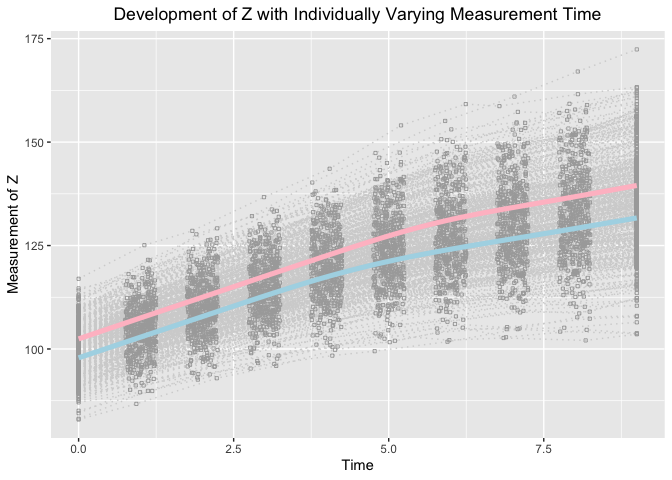

A Parallel Process Growth Mixture Model to Examine Joint Development
with Nonlinear Trajectories
================
Jin Liu

## OS, R version and OpenMx Version

``` r
OpenMx::mxVersion()
```

    ## OpenMx version: 2.17.3 [GIT v2.17.3]
    ## R version: R version 3.6.3 (2020-02-29)
    ## Platform: x86_64-apple-darwin15.6.0 
    ## MacOS: 10.15.7
    ## Default optimizer: CSOLNP
    ## NPSOL-enabled?: No
    ## OpenMP-enabled?: Yes

## Require package would be used

``` r
library(tidyr)
library(ggplot2)
```

## Read in dataset for analyses (wide-format data)

``` r
dat <- read.csv(file = "example_data.csv")
```

## Summarize data

``` r
table(dat$class)
```

    ## 
    ##   1   2 
    ## 260 240

``` r
summary(dat[dat$class == 1, ])
```

    ##        id              Y1               Y2               Y3        
    ##  Min.   :  1.0   Min.   : 81.51   Min.   : 85.45   Min.   : 87.84  
    ##  1st Qu.:130.5   1st Qu.: 94.36   1st Qu.: 99.02   1st Qu.:103.80  
    ##  Median :256.0   Median : 97.80   Median :103.24   Median :107.74  
    ##  Mean   :253.5   Mean   : 97.86   Mean   :103.02   Mean   :107.94  
    ##  3rd Qu.:372.8   3rd Qu.:101.68   3rd Qu.:106.93   3rd Qu.:112.29  
    ##  Max.   :497.0   Max.   :112.45   Max.   :123.21   Max.   :127.88  
    ##        Y4               Y5               Y6               Y7       
    ##  Min.   : 94.08   Min.   : 95.88   Min.   : 97.08   Min.   : 98.3  
    ##  1st Qu.:108.40   1st Qu.:113.43   1st Qu.:115.87   1st Qu.:118.0  
    ##  Median :112.65   Median :118.09   Median :120.73   Median :123.2  
    ##  Mean   :112.82   Mean   :118.01   Mean   :120.70   Mean   :123.3  
    ##  3rd Qu.:117.60   3rd Qu.:122.94   3rd Qu.:126.27   3rd Qu.:129.4  
    ##  Max.   :133.91   Max.   :143.12   Max.   :143.33   Max.   :146.1  
    ##        Y8               Y9              Y10              Z1        
    ##  Min.   : 99.06   Min.   : 97.59   Min.   :100.8   Min.   : 81.38  
    ##  1st Qu.:120.38   1st Qu.:122.43   1st Qu.:124.9   1st Qu.: 94.91  
    ##  Median :125.97   Median :128.25   Median :131.0   Median : 98.12  
    ##  Mean   :125.93   Mean   :128.46   Mean   :131.1   Mean   : 98.28  
    ##  3rd Qu.:132.68   3rd Qu.:135.34   3rd Qu.:138.4   3rd Qu.:101.30  
    ##  Max.   :151.02   Max.   :152.31   Max.   :155.3   Max.   :115.45  
    ##        Z2               Z3               Z4               Z5        
    ##  Min.   : 86.58   Min.   : 89.92   Min.   : 94.25   Min.   : 95.78  
    ##  1st Qu.: 99.86   1st Qu.:104.44   1st Qu.:108.56   1st Qu.:112.59  
    ##  Median :103.01   Median :107.93   Median :112.86   Median :117.98  
    ##  Mean   :103.32   Mean   :108.32   Mean   :113.18   Mean   :118.20  
    ##  3rd Qu.:106.49   3rd Qu.:112.92   3rd Qu.:117.81   3rd Qu.:123.78  
    ##  Max.   :118.76   Max.   :127.62   Max.   :133.03   Max.   :141.76  
    ##        Z6               Z7               Z8               Z9       
    ##  Min.   : 98.03   Min.   : 98.38   Min.   : 98.63   Min.   :100.4  
    ##  1st Qu.:116.11   1st Qu.:118.32   1st Qu.:119.83   1st Qu.:122.7  
    ##  Median :122.30   Median :124.54   Median :126.77   Median :129.6  
    ##  Mean   :122.01   Mean   :124.51   Mean   :126.90   Mean   :129.4  
    ##  3rd Qu.:127.93   3rd Qu.:130.31   3rd Qu.:133.22   3rd Qu.:136.3  
    ##  Max.   :145.09   Max.   :147.59   Max.   :152.68   Max.   :155.8  
    ##       Z10              T1          T2               T3              T4       
    ##  Min.   :102.0   Min.   :0   Min.   :0.7531   Min.   :1.752   Min.   :2.752  
    ##  1st Qu.:124.8   1st Qu.:0   1st Qu.:0.8861   1st Qu.:1.869   1st Qu.:2.855  
    ##  Median :132.2   Median :0   Median :1.0166   Median :2.005   Median :2.977  
    ##  Mean   :132.0   Mean   :0   Mean   :1.0136   Mean   :1.999   Mean   :2.984  
    ##  3rd Qu.:139.8   3rd Qu.:0   3rd Qu.:1.1369   3rd Qu.:2.116   3rd Qu.:3.108  
    ##  Max.   :157.8   Max.   :0   Max.   :1.2492   Max.   :2.250   Max.   :3.249  
    ##        T5              T6              T7              T8       
    ##  Min.   :3.753   Min.   :4.751   Min.   :5.750   Min.   :6.753  
    ##  1st Qu.:3.858   1st Qu.:4.896   1st Qu.:5.885   1st Qu.:6.863  
    ##  Median :3.988   Median :5.021   Median :5.999   Median :6.989  
    ##  Mean   :3.989   Mean   :5.010   Mean   :6.004   Mean   :6.996  
    ##  3rd Qu.:4.109   3rd Qu.:5.121   3rd Qu.:6.139   3rd Qu.:7.136  
    ##  Max.   :4.248   Max.   :5.248   Max.   :6.243   Max.   :7.247  
    ##        T9             T10          x1                x2              class  
    ##  Min.   :7.751   Min.   :9   Min.   :-3.1946   Min.   :-2.8517   Min.   :1  
    ##  1st Qu.:7.881   1st Qu.:9   1st Qu.:-0.8502   1st Qu.:-0.9558   1st Qu.:1  
    ##  Median :8.006   Median :9   Median :-0.2372   Median :-0.3433   Median :1  
    ##  Mean   :8.001   Mean   :9   Mean   :-0.2369   Mean   :-0.2998   Mean   :1  
    ##  3rd Qu.:8.115   3rd Qu.:9   3rd Qu.: 0.3761   3rd Qu.: 0.3326   3rd Qu.:1  
    ##  Max.   :8.245   Max.   :9   Max.   : 2.1404   Max.   : 2.9269   Max.   :1

``` r
summary(dat[dat$class == 2, ])
```

    ##        id              Y1               Y2               Y3        
    ##  Min.   :  4.0   Min.   : 90.02   Min.   : 92.47   Min.   : 97.64  
    ##  1st Qu.:122.8   1st Qu.: 99.14   1st Qu.:104.20   1st Qu.:109.01  
    ##  Median :243.5   Median :102.36   Median :107.57   Median :112.69  
    ##  Mean   :247.2   Mean   :102.30   Mean   :107.57   Mean   :112.56  
    ##  3rd Qu.:378.8   3rd Qu.:105.60   3rd Qu.:111.01   3rd Qu.:116.15  
    ##  Max.   :500.0   Max.   :113.81   Max.   :122.39   Max.   :127.45  
    ##        Y4               Y5              Y6              Y7       
    ##  Min.   : 99.15   Min.   :104.5   Min.   :104.7   Min.   :106.4  
    ##  1st Qu.:113.64   1st Qu.:117.9   1st Qu.:121.6   1st Qu.:124.2  
    ##  Median :117.71   Median :122.4   Median :126.0   Median :129.0  
    ##  Mean   :117.55   Mean   :122.5   Mean   :126.2   Mean   :128.9  
    ##  3rd Qu.:121.77   3rd Qu.:127.1   3rd Qu.:131.2   3rd Qu.:133.9  
    ##  Max.   :131.52   Max.   :138.6   Max.   :143.2   Max.   :146.5  
    ##        Y8              Y9             Y10              Z1        
    ##  Min.   :109.5   Min.   :109.5   Min.   :110.8   Min.   : 84.43  
    ##  1st Qu.:126.1   1st Qu.:129.0   1st Qu.:130.7   1st Qu.: 98.81  
    ##  Median :131.9   Median :134.2   Median :136.7   Median :101.68  
    ##  Mean   :131.5   Mean   :134.2   Mean   :136.8   Mean   :101.85  
    ##  3rd Qu.:137.1   3rd Qu.:140.4   3rd Qu.:143.0   3rd Qu.:104.87  
    ##  Max.   :150.8   Max.   :153.6   Max.   :158.5   Max.   :119.55  
    ##        Z2               Z3               Z4               Z5       
    ##  Min.   : 87.63   Min.   : 91.29   Min.   : 97.06   Min.   :101.5  
    ##  1st Qu.:103.92   1st Qu.:108.62   1st Qu.:113.28   1st Qu.:117.8  
    ##  Median :106.71   Median :112.18   Median :116.95   Median :121.9  
    ##  Mean   :107.07   Mean   :112.15   Mean   :117.10   Mean   :122.0  
    ##  3rd Qu.:110.31   3rd Qu.:115.98   3rd Qu.:120.79   3rd Qu.:126.1  
    ##  Max.   :125.75   Max.   :131.35   Max.   :137.49   Max.   :145.0  
    ##        Z6              Z7              Z8              Z9       
    ##  Min.   :102.6   Min.   :103.5   Min.   :105.4   Min.   :108.5  
    ##  1st Qu.:121.7   1st Qu.:124.4   1st Qu.:126.9   1st Qu.:127.9  
    ##  Median :126.8   Median :129.3   Median :132.5   Median :135.1  
    ##  Mean   :127.0   Mean   :129.8   Mean   :132.3   Mean   :135.0  
    ##  3rd Qu.:131.6   3rd Qu.:135.0   3rd Qu.:137.4   3rd Qu.:140.5  
    ##  Max.   :151.4   Max.   :154.7   Max.   :157.8   Max.   :160.7  
    ##       Z10              T1          T2               T3              T4       
    ##  Min.   :109.2   Min.   :0   Min.   :0.7526   Min.   :1.751   Min.   :2.754  
    ##  1st Qu.:130.5   1st Qu.:0   1st Qu.:0.8751   1st Qu.:1.865   1st Qu.:2.881  
    ##  Median :137.5   Median :0   Median :1.0185   Median :1.996   Median :3.000  
    ##  Mean   :137.6   Mean   :0   Mean   :1.0132   Mean   :1.997   Mean   :3.001  
    ##  3rd Qu.:143.6   3rd Qu.:0   3rd Qu.:1.1458   3rd Qu.:2.115   3rd Qu.:3.119  
    ##  Max.   :165.5   Max.   :0   Max.   :1.2488   Max.   :2.250   Max.   :3.250  
    ##        T5              T6              T7              T8       
    ##  Min.   :3.754   Min.   :4.751   Min.   :5.754   Min.   :6.761  
    ##  1st Qu.:3.863   1st Qu.:4.868   1st Qu.:5.860   1st Qu.:6.856  
    ##  Median :3.988   Median :4.992   Median :6.004   Median :6.999  
    ##  Mean   :3.995   Mean   :4.994   Mean   :6.004   Mean   :6.990  
    ##  3rd Qu.:4.137   3rd Qu.:5.128   3rd Qu.:6.132   3rd Qu.:7.108  
    ##  Max.   :4.250   Max.   :5.250   Max.   :6.249   Max.   :7.249  
    ##        T9             T10          x1                x2              class  
    ##  Min.   :7.750   Min.   :9   Min.   :-2.0000   Min.   :-2.2556   Min.   :2  
    ##  1st Qu.:7.870   1st Qu.:9   1st Qu.:-0.4830   1st Qu.:-0.2564   1st Qu.:2  
    ##  Median :8.022   Median :9   Median : 0.1491   Median : 0.3540   Median :2  
    ##  Mean   :8.006   Mean   :9   Mean   : 0.1792   Mean   : 0.3497   Mean   :2  
    ##  3rd Qu.:8.139   3rd Qu.:9   3rd Qu.: 0.8585   3rd Qu.: 0.9708   3rd Qu.:2  
    ##  Max.   :8.248   Max.   :9   Max.   : 2.6971   Max.   : 3.2404   Max.   :2

## Visualize data

``` r
long_dat_T <- gather(dat[, c(1, 22:31, 34), ], key = var.T, value = time, T1:T10)
long_dat_Y <- gather(dat[, c(1, 2:11), ], key = var.Y, value = measuresY, Y1:Y10)
long_dat_Y$outcome <- "Y"
long_dat_Z <- gather(dat[, c(1, 12:21), ], key = var.Z, value = measuresZ, Z1:Z10)
long_dat_Z$outcome <- "Z"
long_dat <- data.frame(id = rep(long_dat_T$id, 2),
                       time = rep(long_dat_T$time, 2),
                       measures = c(long_dat_Y$measuresY, long_dat_Z$measuresZ),
                       outcome = c(long_dat_Y$outcome, long_dat_Z$outcome),
                       class = long_dat_T[, "class"])

ggplot(aes(x = time, y = measures), data = long_dat[long_dat$outcome == "Y", ]) +
  geom_line(aes(group = id), color = "lightgrey", linetype = "dotted") +
  geom_point(aes(group = id), color = "darkgrey", shape = 0, size = 0.8) +
  geom_smooth(aes(group = 1), size = 1.8, col = "lightblue", se = F, 
              data = long_dat[I(long_dat$outcome == "Y" & long_dat$class == 1), ] ) + 
  geom_smooth(aes(group = 1), size = 1.8, col = "pink", se = F, 
              data = long_dat[I(long_dat$outcome == "Y" & long_dat$class == 2), ] ) + 
  labs(title = "Development of Y with Individually Varying Measurement Time",
       x ="Time", y = "Measurement of Y") + 
  theme(plot.title = element_text(hjust = 0.5))
```

    ## `geom_smooth()` using method = 'gam' and formula 'y ~ s(x, bs = "cs")'
    ## `geom_smooth()` using method = 'gam' and formula 'y ~ s(x, bs = "cs")'

<!-- -->

``` r
ggplot(aes(x = time, y = measures), data = long_dat[long_dat$outcome == "Z", ]) +
  geom_line(aes(group = id), color = "lightgrey", linetype = "dotted") +
  geom_point(aes(group = id), color = "darkgrey", shape = 0, size = 0.8) +
  geom_smooth(aes(group = 1), size = 1.8, col = "lightblue", se = F, 
              data = long_dat[I(long_dat$outcome == "Z" & long_dat$class == 1), ] ) + 
  geom_smooth(aes(group = 1), size = 1.8, col = "pink", se = F, 
              data = long_dat[I(long_dat$outcome == "Z" & long_dat$class == 2), ] ) + 
  labs(title = "Development of Z with Individually Varying Measurement Time",
       x ="Time", y = "Measurement of Z") + 
  theme(plot.title = element_text(hjust = 0.5))
```

    ## `geom_smooth()` using method = 'gam' and formula 'y ~ s(x, bs = "cs")'
    ## `geom_smooth()` using method = 'gam' and formula 'y ~ s(x, bs = "cs")'

<!-- -->

## Parallel Bilinear Spline Growth Model with Unknown Fixed Knots

``` r
source("PBLSGMM_fixed.R")
```

``` r
out
```

    ##             Name     Estimate         SE        true
    ## 1      c1mueta0Y 9.743934e+01 0.54284490  98.0000000
    ## 2      c1mueta1Y 5.035707e+00 0.07707454   5.0000000
    ## 3      c1mueta2Y 2.688393e+00 0.07851394   2.6000000
    ## 4         c1mugY 3.992734e+00 0.03905109   4.0000000
    ## 5      c1mueta0Z 9.838916e+01 0.45036189  98.0000000
    ## 6      c1mueta1Z 4.956197e+00 0.08525136   5.0000000
    ## 7      c1mueta2Z 2.418097e+00 0.09102622   2.6000000
    ## 8         c1mugZ 4.448633e+00 0.04154643   4.5000000
    ## 9      c1psi0Y0Y 2.624254e+01 3.13930834  25.0000000
    ## 15     c1psi1Y1Y 8.275280e-01 0.09865964   1.0000000
    ## 20     c1psi2Y2Y 9.395685e-01 0.10047851   1.0000000
    ## 24     c1psi0Z0Z 2.569726e+01 2.98666653  25.0000000
    ## 27     c1psi1Z1Z 9.197399e-01 0.11069795   1.0000000
    ## 29     c1psi2Z2Z 1.035630e+00 0.12128393   1.0000000
    ## 12     c1psi0Y0Z 9.126314e+00 2.35970657   7.5000000
    ## 18     c1psi1Y1Z 2.673580e-01 0.07160429   0.3000000
    ## 23     c1psi2Y2Z 3.383375e-01 0.07829711   0.3000000
    ## 30  c1residualsY 9.113640e-01 0.03864012   1.0000000
    ## 31  c1residualsZ 1.020161e+00 0.04123699   1.0000000
    ## 32 c1residualsYZ 2.891179e-01 0.02843768   0.3000000
    ## 33     c2mueta0Y 1.026370e+02 0.46299149 102.0000000
    ## 34     c2mueta1Y 5.061393e+00 0.08186898   5.0000000
    ## 35     c2mueta2Y 2.538036e+00 0.08041323   2.6000000
    ## 36        c2mugY 4.430812e+00 0.03877437   4.5000000
    ## 37     c2mueta0Z 1.016892e+02 0.44341414 102.0000000
    ## 38     c2mueta1Z 5.085147e+00 0.08478039   5.0000000
    ## 39     c2mueta2Z 2.661700e+00 0.08453863   2.6000000
    ## 41     c2psi0Y0Y 2.043601e+01 2.67507619  25.0000000
    ## 47     c2psi1Y1Y 1.025555e+00 0.11445121   1.0000000
    ## 52     c2psi2Y2Y 8.769090e-01 0.09968733   1.0000000
    ## 56     c2psi0Z0Z 2.405231e+01 2.75467992  25.0000000
    ## 59     c2psi1Z1Z 9.256672e-01 0.10893832   1.0000000
    ## 61     c2psi2Z2Z 9.915508e-01 0.11210108   1.0000000
    ## 44     c2psi0Y0Z 5.873647e+00 1.90364475   7.5000000
    ## 50     c2psi1Y1Z 2.615963e-01 0.07731404   0.3000000
    ## 55     c2psi2Y2Z 1.746390e-01 0.07223977   0.3000000
    ## 62  c2residualsY 9.658301e-01 0.04089530   1.0000000
    ## 63  c2residualsZ 1.010288e+00 0.04127846   1.0000000
    ## 64 c2residualsYZ 2.606341e-01 0.02945620   0.3000000
    ## 65        beta20 3.292791e-03 0.23329468   0.0000000
    ## 66        beta21 2.970817e-01 0.15542710   0.4054651
    ## 67        beta22 4.164918e-01 0.15819266   0.5306283
