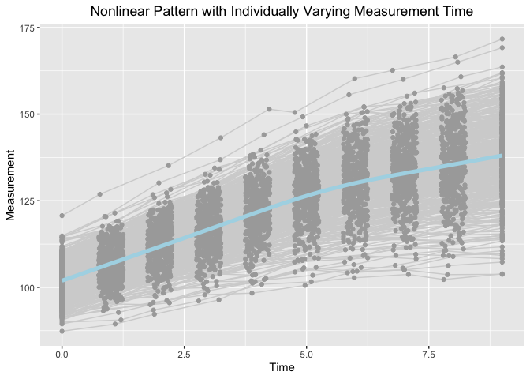

Estimating knots and Knot-knot Association of PBLSGMs in the framework
of individual measurement occasions
================
Jin Liu
2021/11/21

## Require package would be used

``` r
library(OpenMx)
```

    ## OpenMx may run faster if it is compiled to take advantage of multiple cores.

``` r
library(tidyr)
library(ggplot2)
```

## OS, R version and OpenMx Version

``` r
mxOption(model = NULL, key = "Default optimizer", "CSOLNP", reset = FALSE)
mxVersion()
```

    ## OpenMx version: 2.19.6 [GIT v2.19.6]
    ## R version: R version 4.1.0 (2021-05-18)
    ## Platform: x86_64-apple-darwin17.0 
    ## MacOS: 12.0.1
    ## Default optimizer: CSOLNP
    ## NPSOL-enabled?: No
    ## OpenMP-enabled?: No

## “True” values of parameters

``` r
### Population values of outcome-specific growth factor means
# meanY0 <- c(98, 5, 2.6, 3.5)
# mean0Z <- c(102, 5, 2.6, 5.5)
### Population values of growth factor var-cov matrix
# psiYZ0 <- matrix(c(25, 1.5, 1.5, 0.45, 7.5, 1.5, 1.5, 0.45,
#                    1.5, 1.0, 0.3, 0.09, 1.5, 0.3, 0.3, 0.09, 
#                    1.5, 0.3, 1.0, 0.09, 1.5, 0.3, 0.3, 0.09,
#                    0.45, 0.09, 0.09, 0.09, 0.45, 0.09, 0.09, 0.029,
#                    7.5, 1.5, 1.5, 0.45, 25, 1.5, 1.5, 0.45, 
#                    1.5, 0.3, 0.3, 0.09, 1.5, 1.0, 0.3, 0.09,
#                    1.5, 0.3, 0.3, 0.09, 1.5, 0.3, 1.0, 0.09,
#                    0.45, 0.09, 0.09, 0.029, 0.45, 0.09, 0.09, 0.09), nrow = 8)
```

## Define Parameter lists

``` r
### Bilinear spline with fixed knots
paraBiFixed <- c("mueta0Y", "mueta1Y", "mueta2Y", "mugY", paste0("psi", c("0Y0Y", "0Y1Y", "0Y2Y", "1Y1Y", "1Y2Y", "2Y2Y")),
                 "mueta0Z", "mueta1Z", "mueta2Z", "mugZ", paste0("psi", c("0Z0Z", "0Z1Z", "0Z2Z", "1Z1Z", "1Z2Z", "2Z2Z")),
                 paste0("psi", c("0Y0Z", "1Y0Z", "2Y0Z", "0Y1Z", "1Y1Z", "2Y1Z", "0Y2Z", "1Y2Z", "2Y2Z")),
                 "residualsY", "residualsYZ", "residualsZ")

### Bilinear spline with random knots
paraBiRandom <- c("mueta0Y", "mueta1Y", "mueta2Y", "mugY", 
                  paste0("psi", c("0Y0Y", "0Y1Y", "0Y2Y", "0YgY", "1Y1Y", "1Y2Y", "1YgY", "2Y2Y", "2YgY", "gYgY")),
                  "mueta0Z", "mueta1Z", "mueta2Z", "mugZ", 
                  paste0("psi", c("0Z0Z", "0Z1Z", "0Z2Z", "0ZgZ", "1Z1Z", "1Z2Z", "1ZgZ", "2Z2Z", "2ZgZ", "gZgZ")),
                  paste0("psi", c("0Y0Z", "1Y0Z", "2Y0Z", "gY0Z",
                                  "0Y1Z", "1Y1Z", "2Y1Z", "gY1Z",
                                  "0Y2Z", "1Y2Z", "2Y2Z", "gY2Z",
                                  "0YgZ", "1YgZ", "2YgZ", "gYgZ")),
                  "residualsY", "residualsYZ", "residualsZ")
```

## Read in dataset for analyses (wide-format data)

``` r
load("BLSGM_bi_dat.RData")
```

## Summarize data

``` r
summary(BLSGM_bi_dat)
```

    ##        id              Y1               Y2               Y3        
    ##  Min.   :  1.0   Min.   : 78.66   Min.   : 84.30   Min.   : 86.53  
    ##  1st Qu.:125.8   1st Qu.: 94.15   1st Qu.: 99.02   1st Qu.:103.52  
    ##  Median :250.5   Median : 98.01   Median :103.47   Median :108.35  
    ##  Mean   :250.5   Mean   : 97.96   Mean   :103.12   Mean   :108.06  
    ##  3rd Qu.:375.2   3rd Qu.:101.88   3rd Qu.:107.32   3rd Qu.:112.67  
    ##  Max.   :500.0   Max.   :115.33   Max.   :121.35   Max.   :127.75  
    ##        Y4              Y5               Y6               Y7        
    ##  Min.   : 87.9   Min.   : 91.78   Min.   : 90.71   Min.   : 93.06  
    ##  1st Qu.:108.2   1st Qu.:111.42   1st Qu.:113.74   1st Qu.:115.95  
    ##  Median :113.0   Median :116.94   Median :119.70   Median :122.21  
    ##  Mean   :113.1   Mean   :116.84   Mean   :119.30   Mean   :122.06  
    ##  3rd Qu.:117.8   3rd Qu.:122.20   3rd Qu.:125.19   3rd Qu.:128.34  
    ##  Max.   :133.0   Max.   :139.25   Max.   :144.21   Max.   :147.77  
    ##        Y8               Y9              Y10               Z1        
    ##  Min.   : 92.32   Min.   : 94.18   Min.   : 94.13   Min.   : 87.33  
    ##  1st Qu.:118.31   1st Qu.:121.24   1st Qu.:122.72   1st Qu.: 97.96  
    ##  Median :124.72   Median :127.80   Median :130.24   Median :101.91  
    ##  Mean   :124.64   Mean   :127.35   Mean   :129.89   Mean   :101.89  
    ##  3rd Qu.:131.28   3rd Qu.:134.57   3rd Qu.:137.80   3rd Qu.:105.63  
    ##  Max.   :151.28   Max.   :155.18   Max.   :158.33   Max.   :120.70  
    ##        Z2               Z3               Z4               Z5        
    ##  Min.   : 89.42   Min.   : 92.23   Min.   : 96.08   Min.   : 98.34  
    ##  1st Qu.:102.82   1st Qu.:107.26   1st Qu.:112.20   1st Qu.:117.10  
    ##  Median :106.96   Median :111.90   Median :116.93   Median :121.74  
    ##  Mean   :106.95   Mean   :111.77   Mean   :116.75   Mean   :121.57  
    ##  3rd Qu.:110.82   3rd Qu.:116.28   3rd Qu.:121.49   3rd Qu.:126.85  
    ##  Max.   :126.85   Max.   :135.15   Max.   :143.17   Max.   :151.44  
    ##        Z6              Z7              Z8              Z9       
    ##  Min.   :100.6   Min.   :102.8   Min.   :103.7   Min.   :102.3  
    ##  1st Qu.:121.0   1st Qu.:124.3   1st Qu.:126.6   1st Qu.:129.0  
    ##  Median :126.7   Median :130.5   Median :132.8   Median :135.5  
    ##  Mean   :126.4   Mean   :130.3   Mean   :132.8   Mean   :135.5  
    ##  3rd Qu.:132.1   3rd Qu.:136.8   3rd Qu.:139.1   3rd Qu.:142.7  
    ##  Max.   :150.5   Max.   :160.2   Max.   :162.7   Max.   :166.5  
    ##       Z10              T1          T2               T3              T4       
    ##  Min.   :103.8   Min.   :0   Min.   :0.7500   Min.   :1.751   Min.   :2.751  
    ##  1st Qu.:131.0   1st Qu.:0   1st Qu.:0.8755   1st Qu.:1.889   1st Qu.:2.890  
    ##  Median :138.0   Median :0   Median :1.0107   Median :1.990   Median :3.017  
    ##  Mean   :138.0   Mean   :0   Mean   :1.0056   Mean   :1.997   Mean   :3.009  
    ##  3rd Qu.:145.6   3rd Qu.:0   3rd Qu.:1.1336   3rd Qu.:2.125   3rd Qu.:3.134  
    ##  Max.   :171.7   Max.   :0   Max.   :1.2500   Max.   :2.249   Max.   :3.250  
    ##        T5              T6              T7              T8       
    ##  Min.   :3.751   Min.   :4.752   Min.   :5.752   Min.   :6.751  
    ##  1st Qu.:3.873   1st Qu.:4.853   1st Qu.:5.873   1st Qu.:6.882  
    ##  Median :3.994   Median :4.996   Median :6.006   Median :7.017  
    ##  Mean   :3.996   Mean   :4.993   Mean   :6.003   Mean   :7.006  
    ##  3rd Qu.:4.119   3rd Qu.:5.127   3rd Qu.:6.130   3rd Qu.:7.120  
    ##  Max.   :4.249   Max.   :5.249   Max.   :6.249   Max.   :7.249  
    ##        T9             T10   
    ##  Min.   :7.751   Min.   :9  
    ##  1st Qu.:7.888   1st Qu.:9  
    ##  Median :7.997   Median :9  
    ##  Mean   :8.003   Mean   :9  
    ##  3rd Qu.:8.117   3rd Qu.:9  
    ##  Max.   :8.249   Max.   :9

## Visualize data

``` r
long_dat_T <- gather(BLSGM_bi_dat[, c(1, 22:31), ], key = var.T, value = time, T1:T10)
long_dat_Y <- gather(BLSGM_bi_dat[, c(1, 2:11), ], key = var.Y, value = measuresY, Y1:Y10)
long_dat_Y$outcome <- "Y"
long_dat_Z <- gather(BLSGM_bi_dat[, c(1, 12:21), ], key = var.Z, value = measuresZ, Z1:Z10)
long_dat_Z$outcome <- "Z"
long_dat <- data.frame(id = rep(long_dat_T$id, 2),
                       time = rep(long_dat_T$time, 2),
                       measures = c(long_dat_Y$measuresY, long_dat_Z$measuresZ),
                       outcome = c(long_dat_Y$outcome, long_dat_Z$outcome))

ggplot(aes(x = time, y = measures), data = long_dat[long_dat$outcome == "Y", ]) +
  geom_line(aes(group = id), color = "lightgrey") +
  geom_point(aes(group = id), color = "darkgrey") +
  geom_smooth(aes(group = 1), size = 1.8, col = "lightblue", se = F) + 
  labs(title = "Nonlinear Pattern with Individually Varying Measurement Time",
       x ="Time", y = "Measurement") + 
  theme(plot.title = element_text(hjust = 0.5))
```

    ## `geom_smooth()` using method = 'gam' and formula 'y ~ s(x, bs = "cs")'

<!-- -->

``` r
ggplot(aes(x = time, y = measures), data = long_dat[long_dat$outcome == "Z", ]) +
  geom_line(aes(group = id), color = "lightgrey") +
  geom_point(aes(group = id), color = "darkgrey") +
  geom_smooth(aes(group = 1), size = 1.8, col = "lightblue", se = F) + 
  labs(title = "Nonlinear Pattern with Individually Varying Measurement Time",
       x ="Time", y = "Measurement") + 
  theme(plot.title = element_text(hjust = 0.5))
```

    ## `geom_smooth()` using method = 'gam' and formula 'y ~ s(x, bs = "cs")'

<!-- -->

## Load functions that help calculate initial values

``` r
source("BLSGM_fixed.R")
```

## Parallel Bilinear Spline Growth Model with Unknown Fixed Knots

``` r
source("PBLSGM_fixed.R")
PBLSGM_F <- getPBLSGM_Fixed(dat = BLSGM_bi_dat, T_records = list(1:10, 1:10), traj_var = c("Y", "Z"), t_var = rep("T", 2), 
                            paraNames = paraBiFixed)
PBLSGM_F[[2]]
```

    ##           Name Estimate     SE
    ## 1      mueta0Y  98.0263 0.2387
    ## 2      mueta1Y   5.0047 0.0521
    ## 3      mueta2Y   2.6184 0.0479
    ## 4         mugY   3.4822 0.0219
    ## 5      psi0Y0Y  27.7901 1.7923
    ## 6      psi0Y1Y   1.8665 0.2777
    ## 7      psi0Y2Y   1.5969 0.2626
    ## 8      psi1Y1Y   1.1786 0.0812
    ## 9      psi1Y2Y   0.4386 0.0566
    ## 10     psi2Y2Y   1.0909 0.0713
    ## 11     mueta0Z 101.9378 0.2306
    ## 12     mueta1Z   4.9186 0.0492
    ## 13     mueta2Z   2.5874 0.0514
    ## 14        mugZ   5.4955 0.0225
    ## 15     psi0Z0Z  26.0433 1.6747
    ## 16     psi0Z1Z   1.6174 0.2606
    ## 17     psi0Z2Z   1.7955 0.2681
    ## 18     psi1Z1Z   1.1538 0.0760
    ## 19     psi1Z2Z   0.3810 0.0564
    ## 20     psi2Z2Z   1.1382 0.0787
    ## 21     psi0Y0Z   8.2910 1.2779
    ## 22     psi1Y0Z   2.0344 0.2751
    ## 23     psi2Y0Z   1.8397 0.2572
    ## 24     psi0Y1Z   1.2542 0.2653
    ## 25     psi1Y1Z   0.3875 0.0585
    ## 26     psi2Y1Z   0.3383 0.0539
    ## 27     psi0Y2Z   2.0548 0.2795
    ## 28     psi1Y2Z   0.4940 0.0599
    ## 29     psi2Y2Z   0.3814 0.0556
    ## 30  residualsY   1.0267 0.0245
    ## 31 residualsYZ   0.2926 0.0186
    ## 32  residualsZ   1.0532 0.0252

## Parallel Bilinear Spline Growth Model with Unknown Random Knots

``` r
source("PBLSGM_random.R")
PBLSGM_R <- getPBLSGM_Random(dat = BLSGM_bi_dat, T_records = list(1:10, 1:10), traj_var = c("Y", "Z"), t_var = rep("T", 2),
                             paraNames = paraBiRandom)
PBLSGM_R[[2]]
```

    ##           Name Estimate     SE
    ## 1      mueta0Y  98.0199 0.2394
    ## 2      mueta1Y   5.0129 0.0491
    ## 3      mueta2Y   2.6232 0.0470
    ## 4         mugY   3.4653 0.0266
    ## 5      psi0Y0Y  27.9805 1.8287
    ## 6      psi0Y1Y   1.8621 0.2717
    ## 7      psi0Y2Y   1.6468 0.2693
    ## 8      psi0YgY   0.0951 0.1442
    ## 9      psi1Y1Y   1.0228 0.0755
    ## 10     psi1Y2Y   0.3498 0.0546
    ## 11     psi1YgY   0.1213 0.0305
    ## 12     psi2Y2Y   1.0503 0.0712
    ## 13     psi2YgY   0.0816 0.0295
    ## 14     psigYgY   0.0814 0.0239
    ## 15     mueta0Z 101.9473 0.2318
    ## 16     mueta1Z   4.9127 0.0483
    ## 17     mueta2Z   2.5775 0.0482
    ## 18        mugZ   5.5170 0.0273
    ## 19     psi0Z0Z  26.3356 1.7186
    ## 20     psi0Z1Z   1.5526 0.2603
    ## 21     psi0Z2Z   1.6024 0.2633
    ## 22     psi0ZgZ   0.4479 0.1459
    ## 23     psi1Z1Z   1.1110 0.0738
    ## 24     psi1Z2Z   0.2835 0.0539
    ## 25     psi1ZgZ   0.0894 0.0314
    ## 26     psi2Z2Z   0.9673 0.0738
    ## 27     psi2ZgZ   0.1441 0.0312
    ## 28     psigZgZ   0.0743 0.0252
    ## 29     psi0Y0Z  12.4270 1.9073
    ## 30     psi1Y0Z   0.7776 0.2994
    ## 31     psi2Y0Z   1.2679 0.3008
    ## 32     psigY0Z   0.3478 0.1399
    ## 33     psi0Y1Z   1.3213 0.2752
    ## 34     psi1Y1Z   0.2650 0.0657
    ## 35     psi2Y1Z   0.3367 0.0417
    ## 36     psigY1Z   0.1006 0.0294
    ## 37     psi0Y2Z   1.9587 0.3147
    ## 38     psi1Y2Z   0.3367 0.0417
    ## 39     psi2Y2Z   0.3545 0.0655
    ## 40     psigY2Z   0.0661 0.0291
    ## 41     psi0YgZ   0.5348 0.1509
    ## 42     psi1YgZ   0.1149 0.0306
    ## 43     psi2YgZ   0.0906 0.0296
    ## 44     psigYgZ   0.0137 0.0163
    ## 45  residualsY   0.9868 0.0254
    ## 46 residualsYZ   0.2848 0.0182
    ## 47  residualsZ   1.0177 0.0261
