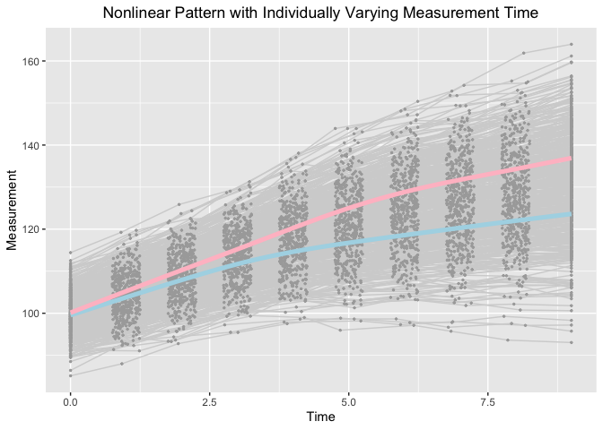

Extending Mixture of Experts Model to Investigate Heterogeneity of
Trajectories
================
Jin Liu
2021/11/21

## Require package would be used

``` r
library(OpenMx)
```

    ## OpenMx may run faster if it is compiled to take advantage of multiple cores.

``` r
library(tidyr)
library(ggplot2)
```

## OS, R version and OpenMx Version

``` r
mxOption(model = NULL, key = "Default optimizer", "CSOLNP", reset = FALSE)
mxVersion()
```

    ## OpenMx version: 2.19.6 [GIT v2.19.6]
    ## R version: R version 4.1.0 (2021-05-18)
    ## Platform: x86_64-apple-darwin17.0 
    ## MacOS: 12.0.1
    ## Default optimizer: CSOLNP
    ## NPSOL-enabled?: No
    ## OpenMP-enabled?: No

## “True” values of parameters

``` r
### Class 1
#### Population values of growth factor means
# meanY0 <- c(100, -5, -2.6, 3.5)
### Population values of growth factor var-cov matrix
# psiY0 <- matrix(c(25, 1.5, 1.5, 
#                   1.5, 1.0, 0.3, 
#                   1.5, 0.3, 1.0), nrow = 3)
#### Population values of TIC means
# meanX0 <- c(0, 0)
### Population values of growth factor var-cov matrix
# phi0 <- matrix(c(1, 0.3, 0.3, 1), nrow = 2)
#### Population values of path coefficients
# betaXtoY <- matrix(c(0.88494767, 1.32742186, 
#                      0.17698953, 0.26548430, 
#                      0.17698953, 0.26548430), byrow = T, nrow = 3)
### Class 2
#### Population values of growth factor means
# meanY0 <- c(100, -5, -3.4, 5.5)
#### Population values of growth factor var-cov matrix
# psiY0 <- matrix(c(25, 1.5, 1.5, 
#                   1.5, 1.0, 0.3, 
#                   1.5, 0.3, 1.0), nrow = 3)
#### Population values of TIC means
# meanX0 <- c(0, 0)
#### Population values of growth factor var-cov matrix
# phi0 <- matrix(c(1, 0.3, 0.3, 1), nrow = 2)
#### Population values of path coefficients
# betaXtoY <- matrix(c(1.251505, 1.877258,
#                      0.250301, 0.3754515,
#                      0.250301, 0.3754515), byrow = T, nrow = 3)
### Population values of logistic coefficients
# beta0 <- 0; beta1 <- log(1.5); beta2 <- log(1.7)
```

## Define Parameter lists

``` r
### Bilinear spline with a fixed knot
paraFixed <- c("mueta0", "mueta1", "mueta2", "mug",
               paste0("psi", c("00", "01", "02", "11", "12", "22")),
               "residuals")

### Bilinear spline with a fixed knot and two baseline covariates
paraFixedTIC <- c("mueta0", "mueta1", "mueta2", "mug",
                  paste0("psi", c("00", "01", "02", "11", "12", "22")),
                  paste0("beta1", 0:2), paste0("beta2", 0:2),
                  paste0("mux", 1:2), paste0("phi", c("11", "12", "22")),
                  "residuals")
```

## Read in dataset for analyses (wide-format data)

``` r
load("uni_sub_dat.RData")
```

## Summarize data

``` r
summary(uni_sub_dat)
```

    ##        id              Y1               Y2               Y3        
    ##  Min.   :  1.0   Min.   : 80.33   Min.   : 76.11   Min.   : 71.05  
    ##  1st Qu.:125.8   1st Qu.: 96.66   1st Qu.: 91.23   1st Qu.: 85.87  
    ##  Median :250.5   Median : 99.89   Median : 94.73   Median : 90.05  
    ##  Mean   :250.5   Mean   :100.00   Mean   : 94.97   Mean   : 89.99  
    ##  3rd Qu.:375.2   3rd Qu.:103.25   3rd Qu.: 98.55   3rd Qu.: 93.69  
    ##  Max.   :500.0   Max.   :116.42   Max.   :108.92   Max.   :105.69  
    ##        Y4               Y5              Y6              Y7       
    ##  Min.   : 63.62   Min.   :58.75   Min.   :52.10   Min.   :46.45  
    ##  1st Qu.: 80.44   1st Qu.:75.89   1st Qu.:71.85   1st Qu.:67.43  
    ##  Median : 84.60   Median :80.40   Median :76.59   Median :72.98  
    ##  Mean   : 84.77   Mean   :80.36   Mean   :76.34   Mean   :72.95  
    ##  3rd Qu.: 89.16   3rd Qu.:85.17   3rd Qu.:81.87   3rd Qu.:78.98  
    ##  Max.   :102.43   Max.   :98.79   Max.   :98.85   Max.   :98.67  
    ##        Y8               Y9              Y10              T1          T2        
    ##  Min.   : 39.06   Min.   : 33.59   Min.   :28.61   Min.   :0   Min.   :0.7520  
    ##  1st Qu.: 63.93   1st Qu.: 60.40   1st Qu.:56.61   1st Qu.:0   1st Qu.:0.8536  
    ##  Median : 69.80   Median : 66.74   Median :63.48   Median :0   Median :0.9953  
    ##  Mean   : 69.73   Mean   : 66.65   Mean   :63.49   Mean   :0   Mean   :0.9936  
    ##  3rd Qu.: 76.13   3rd Qu.: 73.77   3rd Qu.:70.97   3rd Qu.:0   3rd Qu.:1.1276  
    ##  Max.   :100.35   Max.   :100.23   Max.   :99.87   Max.   :0   Max.   :1.2491  
    ##        T3              T4              T5              T6       
    ##  Min.   :1.752   Min.   :2.753   Min.   :3.754   Min.   :4.750  
    ##  1st Qu.:1.867   1st Qu.:2.884   1st Qu.:3.898   1st Qu.:4.871  
    ##  Median :1.998   Median :3.013   Median :4.001   Median :5.011  
    ##  Mean   :1.998   Mean   :3.005   Mean   :4.006   Mean   :5.007  
    ##  3rd Qu.:2.126   3rd Qu.:3.115   3rd Qu.:4.122   3rd Qu.:5.136  
    ##  Max.   :2.249   Max.   :3.249   Max.   :4.249   Max.   :5.249  
    ##        T7              T8              T9             T10   
    ##  Min.   :5.751   Min.   :6.751   Min.   :7.751   Min.   :9  
    ##  1st Qu.:5.878   1st Qu.:6.890   1st Qu.:7.873   1st Qu.:9  
    ##  Median :5.988   Median :7.022   Median :7.999   Median :9  
    ##  Mean   :5.994   Mean   :7.011   Mean   :7.998   Mean   :9  
    ##  3rd Qu.:6.121   3rd Qu.:7.139   3rd Qu.:8.123   3rd Qu.:9  
    ##  Max.   :6.249   Max.   :7.250   Max.   :8.249   Max.   :9  
    ##       gx1                 gx2                ex1                ex2          
    ##  Min.   :-3.379334   Min.   :-3.87034   Min.   :-3.16972   Min.   :-2.86510  
    ##  1st Qu.:-0.808100   1st Qu.:-0.71771   1st Qu.:-0.81168   1st Qu.:-0.68914  
    ##  Median : 0.018376   Median : 0.02739   Median :-0.11460   Median :-0.07459  
    ##  Mean   : 0.006869   Mean   : 0.01487   Mean   :-0.08722   Mean   :-0.02276  
    ##  3rd Qu.: 0.720155   3rd Qu.: 0.76661   3rd Qu.: 0.59728   3rd Qu.: 0.62466  
    ##  Max.   : 3.527651   Max.   : 3.15211   Max.   : 2.77872   Max.   : 3.19017  
    ##     subgroup    
    ##  Min.   :1.000  
    ##  1st Qu.:1.000  
    ##  Median :2.000  
    ##  Mean   :1.534  
    ##  3rd Qu.:2.000  
    ##  Max.   :2.000

## Visualize data

``` r
long_dat_T <- gather(uni_sub_dat, var.T, time, T1:T10)
long_dat_Y <- gather(uni_sub_dat, var.Y, measures, Y1:Y10)
long_dat <- data.frame(id = long_dat_T[, "id"], time = long_dat_T[, "time"],
                       measures = long_dat_Y[, "measures"], class = long_dat_Y[, "subgroup"])
ggplot(aes(x = time, y = measures), data = long_dat) +
  geom_line(aes(group = id), color = "lightgrey", data = long_dat) +
  geom_point(aes(group = id), color = "darkgrey", size = 0.5) +
  geom_smooth(aes(group = 1), size = 1.8, col = "lightblue", se = F, 
              data = long_dat[long_dat$class == 1, ] ) + 
  geom_smooth(aes(group = 1), size = 1.8, col = "pink", se = F, 
              data = long_dat[long_dat$class == 2, ] ) + 
  labs(title = "Nonlinear Pattern with Individually Varying Measurement Time",
       x ="Time", y = "Measurement") + 
  theme(plot.title = element_text(hjust = 0.5))
```

    ## `geom_smooth()` using method = 'gam' and formula 'y ~ s(x, bs = "cs")'
    ## `geom_smooth()` using method = 'gam' and formula 'y ~ s(x, bs = "cs")'

<!-- -->

## Load functions that help calculate initial values

``` r
source("getPosterior.R")
source("BLSGM_fixed.R")
source("BLSGM_TIC_fixed.R")
```

## Finite Mixture Model

``` r
source("FMM_BLSGM.R")
FMM_BLSGM <- getFMM_BLSGM(dat = uni_sub_dat, T_records = 1:10, nClass = 2, traj_var = "Y", t_var = "T", paraNames = paraFixed)
FMM_BLSGM[[2]]
```

    ##           Name    Estimate         SE
    ## 1     c1mueta0 100.1980911 0.45519750
    ## 2     c1mueta1  -5.0929005 0.09162143
    ## 3     c1mueta2  -3.4246930 0.07827129
    ## 4        c1mug   5.5083126 0.04636504
    ## 5      c1psi00  24.6476246 3.32377176
    ## 6      c1psi01   1.7830187 0.45268024
    ## 7      c1psi02   1.3169476 0.38936367
    ## 8      c1psi11   1.0988082 0.12288353
    ## 9      c1psi12   0.4182075 0.08354762
    ## 10     c1psi22   0.9665499 0.10220708
    ## 11 c1residuals   1.0780624 0.04017222
    ## 12    c2mueta0  99.8225057 0.47060402
    ## 13    c2mueta1  -5.0196333 0.09043175
    ## 14    c2mueta2  -2.7792720 0.09285159
    ## 15       c2mug   3.4490243 0.03433629
    ## 16     c2psi00  24.0456029 3.27532902
    ## 17     c2psi01   1.1575468 0.40494765
    ## 18     c2psi02   1.6047968 0.52112383
    ## 19     c2psi11   0.9734101 0.11678534
    ## 20     c2psi12   0.1782717 0.07857679
    ## 21     c2psi22   0.8663984 0.12040080
    ## 22 c2residuals   0.9424377 0.03768175
    ## 23          p2   0.9357382 0.15024624

## Cluter Predictor Mixture model (Gating-network Mixture of Experts)

``` r
source("CPMM_BLSGM.R")
CPMM_BLSGM <- getCPMM_BLSGM(dat = uni_sub_dat, T_records = 1:10, nClass = 2, traj_var = "Y", t_var = "T", clus_cov = c("gx1", "gx2"),
                            paraNames = paraFixed)
```

    ## # weights:  4 (3 variable)
    ## initial  value 346.573590 
    ## final  value 313.296800 
    ## converged

``` r
CPMM_BLSGM[[2]]
```

    ##           Name    Estimate         SE
    ## 1     c1mueta0 100.2974680 0.37407087
    ## 2     c1mueta1  -5.0584360 0.08029691
    ## 3     c1mueta2  -3.4287716 0.07412239
    ## 4        c1mug   5.5110290 0.04574653
    ## 5      c1psi00  22.8319542 2.83263958
    ## 6      c1psi01   1.7501544 0.38652758
    ## 7      c1psi02   1.2203797 0.37332742
    ## 8      c1psi11   1.1250759 0.11504463
    ## 9      c1psi12   0.4100612 0.07996293
    ## 10     c1psi22   0.9581182 0.09994375
    ## 11 c1residuals   1.0779558 0.03869697
    ## 12    c2mueta0  99.7014750 0.41598873
    ## 13    c2mueta1  -5.0550869 0.08241635
    ## 14    c2mueta2  -2.7603549 0.08290614
    ## 15       c2mug   3.4516507 0.03390863
    ## 16     c2psi00  25.9093692 3.12332969
    ## 17     c2psi01   1.1809639 0.39216200
    ## 18     c2psi02   1.8333853 0.47898869
    ## 19     c2psi11   0.9537296 0.11081771
    ## 20     c2psi12   0.2082534 0.07407267
    ## 21     c2psi22   0.8634219 0.11686369
    ## 22 c2residuals   0.9371461 0.03655608
    ## 23      beta20  -0.1193990 0.14464850
    ## 24      beta21  -0.5427333 0.12841523
    ## 25      beta22  -0.5767085 0.12979319

## Growth Predictor Mixture model (Expert-network Mixture of Experts)

``` r
source("GPMM_BLSGM.R")
GPMM_BLSGM <- getGPMM_BLSGM(dat = uni_sub_dat, T_records = 1:10, nClass = 2, traj_var = "Y", t_var = "T", growth_cov = c("ex1", "ex2"),
                            paraNames = paraFixedTIC)
GPMM_BLSGM[[2]]
```

    ##           Name     Estimate         SE
    ## 1     c1mueta0 100.18003947 0.36654015
    ## 2     c1mueta1  -5.06260888 0.07089249
    ## 3     c1mueta2  -3.41650805 0.06748387
    ## 4        c1mug   5.50628061 0.04621944
    ## 5      c1psi00  18.95895044 2.40425767
    ## 6      c1psi01   0.09010840 0.32732079
    ## 7      c1psi02   0.05830484 0.27182621
    ## 8      c1psi11   0.69708365 0.08132120
    ## 9      c1psi12   0.07620651 0.05493380
    ## 10     c1psi22   0.68313827 0.07794596
    ## 11    c1beta10   1.52194687 0.33294373
    ## 12    c1beta11   0.41005667 0.06399953
    ## 13    c1beta12   0.32830036 0.06215412
    ## 14    c1beta20   1.35855216 0.32586151
    ## 15    c1beta21   0.34526609 0.06636030
    ## 16    c1beta22   0.28948176 0.07078412
    ## 17      c1mux1  -0.01664650 0.07808887
    ## 18      c1mux2  -0.03103107 0.08170994
    ## 19     c1phi11   1.11772610 0.10929022
    ## 20     c1phi12   0.39966867 0.08154024
    ## 21     c1phi22   1.02068906 0.11368006
    ## 22 c1residuals   1.07651612 0.03967368
    ## 23    c2mueta0 100.04814214 0.41513317
    ## 24    c2mueta1  -5.00640458 0.08149010
    ## 25    c2mueta2  -2.72991176 0.08387626
    ## 26       c2mug   3.45812871 0.03416531
    ## 27     c2psi00  22.06352151 2.82016675
    ## 28     c2psi01   0.90132356 0.36140567
    ## 29     c2psi02   1.19026407 0.44703619
    ## 30     c2psi11   0.88357169 0.09965225
    ## 31     c2psi12   0.12910955 0.07091996
    ## 32     c2psi22   0.78225101 0.10251246
    ## 33    c2beta10   0.75799755 0.34728584
    ## 34    c2beta11   0.13953578 0.07093828
    ## 35    c2beta12   0.26040103 0.07281856
    ## 36    c2beta20   0.83517571 0.33427483
    ## 37    c2beta21   0.20646508 0.06906438
    ## 38    c2beta22   0.04566925 0.08128479
    ## 39      c2mux1  -0.16309413 0.08015889
    ## 40      c2mux2  -0.01386078 0.08638424
    ## 41     c2phi11   1.03184762 0.10790934
    ## 42     c2phi12   0.16728981 0.08378567
    ## 43     c2phi22   1.04490659 0.12032269
    ## 44 c2residuals   0.94708843 0.03790484
    ## 45          p2   0.92770464 0.13562315

## Full Mixture Model (Full Mixture of Experts)

``` r
source("FullMM_BLSGM.R")
FullMM_BLSGM <- getFullMM_BLSGM(dat = uni_sub_dat, T_records = 1:10, nClass = 2, traj_var = "Y", t_var = "T", growth_cov = c("ex1", "ex2"),
                                clus_cov = c("gx1", "gx2"), paraNames = paraFixedTIC)
```

    ## # weights:  4 (3 variable)
    ## initial  value 346.573590 
    ## final  value 313.296800 
    ## converged

``` r
FullMM_BLSGM[[2]]
```

    ##           Name      Estimate         SE
    ## 1     c1mueta0 100.334537172 0.31145527
    ## 2     c1mueta1  -5.048411545 0.06278959
    ## 3     c1mueta2  -3.428947831 0.06325578
    ## 4        c1mug   5.508254923 0.04590610
    ## 5      c1psi00  17.531436464 2.04094429
    ## 6      c1psi01   0.228871081 0.27071728
    ## 7      c1psi02   0.034440392 0.25501168
    ## 8      c1psi11   0.708017741 0.07376265
    ## 9      c1psi12   0.074518549 0.05353300
    ## 10     c1psi22   0.690141462 0.07596929
    ## 11    c1beta10   1.434275835 0.31381936
    ## 12    c1beta11   0.416642532 0.06238773
    ## 13    c1beta12   0.338425693 0.06148474
    ## 14    c1beta20   1.322792167 0.30377395
    ## 15    c1beta21   0.338341606 0.06294969
    ## 16    c1beta22   0.265063217 0.06445778
    ## 17      c1mux1  -0.006054918 0.07293168
    ## 18      c1mux2  -0.020838749 0.07150550
    ## 19     c1phi11   1.090859285 0.10518242
    ## 20     c1phi12   0.391568848 0.07577965
    ## 21     c1phi22   1.021466781 0.10155242
    ## 22 c1residuals   1.080127685 0.03847949
    ## 23    c2mueta0  99.873400394 0.37313655
    ## 24    c2mueta1  -5.024585336 0.07560727
    ## 25    c2mueta2  -2.708497856 0.07605782
    ## 26       c2mug   3.461033267 0.03380936
    ## 27     c2psi00  23.764163536 2.65979855
    ## 28     c2psi01   0.837856831 0.34691666
    ## 29     c2psi02   1.446034576 0.38643856
    ## 30     c2psi11   0.882041490 0.09692991
    ## 31     c2psi12   0.149706791 0.06669236
    ## 32     c2psi22   0.768858206 0.09481119
    ## 33    c2beta10   0.840098540 0.34857315
    ## 34    c2beta11   0.139255434 0.06859951
    ## 35    c2beta12   0.272465979 0.06792523
    ## 36    c2beta20   0.889148986 0.33992032
    ## 37    c2beta21   0.210504153 0.06819017
    ## 38    c2beta22   0.069438046 0.06884841
    ## 39      c2mux1  -0.176971856 0.07674650
    ## 40      c2mux2  -0.024875711 0.07687487
    ## 41     c2phi11   1.056218239 0.10905796
    ## 42     c2phi12   0.171122937 0.07833694
    ## 43     c2phi22   1.044551980 0.11011477
    ## 44 c2residuals   0.940794636 0.03620086
    ## 45      beta20  -0.110782811 0.13791504
    ## 46      beta21  -0.533665624 0.12513031
    ## 47      beta22  -0.603702071 0.12856046
