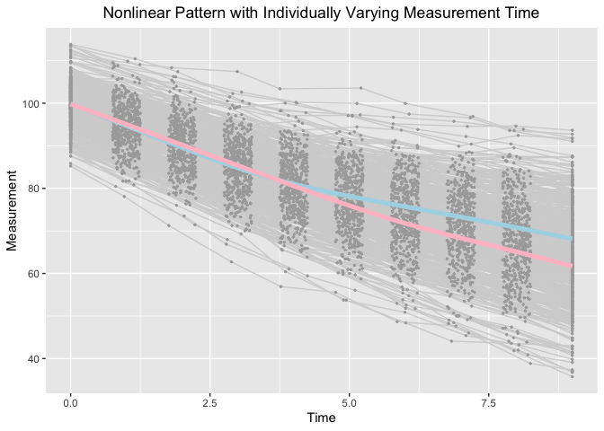

Extending Mixture of Experts Model to Investigate Heterogeneity of Trajectories: When, Where and How to Add Which Covariates
================
Jin Liu

## OS, R version and OpenMx Version

``` r
OpenMx::mxVersion()
```

    ## OpenMx version: 2.17.3 [GIT v2.17.3]
    ## R version: R version 3.6.3 (2020-02-29)
    ## Platform: x86_64-apple-darwin15.6.0 
    ## MacOS: 10.15.7
    ## Default optimizer: CSOLNP
    ## NPSOL-enabled?: No
    ## OpenMP-enabled?: Yes

## Require package would be used

``` r
library(tidyr)
library(ggplot2)
```

## Read in dataset for analyses (wide-format data)

``` r
dat <- read.csv(file = "example_data.csv")
```

## Summarize data

``` r
table(dat$class)
```

    ## 
    ##   1   2 
    ## 244 256

``` r
summary(dat[dat$class == 1, ])
```

    ##        id              Y1               Y2               Y3        
    ##  Min.   :  3.0   Min.   : 85.25   Min.   : 78.08   Min.   : 71.26  
    ##  1st Qu.:142.2   1st Qu.: 96.34   1st Qu.: 91.33   1st Qu.: 85.20  
    ##  Median :264.5   Median : 99.85   Median : 94.82   Median : 90.02  
    ##  Mean   :261.3   Mean   : 99.87   Mean   : 94.81   Mean   : 89.73  
    ##  3rd Qu.:380.5   3rd Qu.:103.55   3rd Qu.: 98.54   3rd Qu.: 93.69  
    ##  Max.   :498.0   Max.   :113.84   Max.   :110.45   Max.   :107.41  
    ##        Y4               Y5               Y6              Y7       
    ##  Min.   : 62.72   Min.   : 56.91   Min.   :55.55   Min.   :48.68  
    ##  1st Qu.: 79.86   1st Qu.: 75.85   1st Qu.:73.39   1st Qu.:69.96  
    ##  Median : 85.22   Median : 80.90   Median :78.75   Median :76.55  
    ##  Mean   : 84.69   Mean   : 80.79   Mean   :78.33   Mean   :75.82  
    ##  3rd Qu.: 89.21   3rd Qu.: 85.77   3rd Qu.:83.19   3rd Qu.:81.31  
    ##  Max.   :102.61   Max.   :100.22   Max.   :99.96   Max.   :97.45  
    ##        Y8              Y9             Y10              T1          T2        
    ##  Min.   :46.00   Min.   :40.89   Min.   :37.06   Min.   :0   Min.   :0.7531  
    ##  1st Qu.:67.76   1st Qu.:65.37   1st Qu.:61.51   1st Qu.:0   1st Qu.:0.8600  
    ##  Median :73.66   Median :71.28   Median :68.73   Median :0   Median :0.9728  
    ##  Mean   :73.26   Mean   :70.72   Mean   :68.11   Mean   :0   Mean   :0.9900  
    ##  3rd Qu.:78.75   3rd Qu.:76.49   3rd Qu.:74.24   3rd Qu.:0   3rd Qu.:1.1228  
    ##  Max.   :96.59   Max.   :94.66   Max.   :93.63   Max.   :0   Max.   :1.2484  
    ##        T3              T4              T5              T6       
    ##  Min.   :1.753   Min.   :2.753   Min.   :3.753   Min.   :4.753  
    ##  1st Qu.:1.879   1st Qu.:2.885   1st Qu.:3.882   1st Qu.:4.885  
    ##  Median :1.971   Median :2.992   Median :4.004   Median :5.016  
    ##  Mean   :1.999   Mean   :2.997   Mean   :4.004   Mean   :5.010  
    ##  3rd Qu.:2.125   3rd Qu.:3.107   3rd Qu.:4.127   3rd Qu.:5.128  
    ##  Max.   :2.248   Max.   :3.249   Max.   :4.250   Max.   :5.246  
    ##        T7              T8              T9             T10         gx1         
    ##  Min.   :5.753   Min.   :6.751   Min.   :7.751   Min.   :9   Min.   :-2.5428  
    ##  1st Qu.:5.866   1st Qu.:6.889   1st Qu.:7.861   1st Qu.:9   1st Qu.:-0.8585  
    ##  Median :5.996   Median :7.035   Median :7.987   Median :9   Median :-0.2578  
    ##  Mean   :5.996   Mean   :7.016   Mean   :7.988   Mean   :9   Mean   :-0.2428  
    ##  3rd Qu.:6.126   3rd Qu.:7.131   3rd Qu.:8.111   3rd Qu.:9   3rd Qu.: 0.4625  
    ##  Max.   :6.250   Max.   :7.249   Max.   :8.249   Max.   :9   Max.   : 2.0940  
    ##       gx2              class        ex1                 ex2         
    ##  Min.   :-2.8455   Min.   :1   Min.   :-2.254540   Min.   :-2.7415  
    ##  1st Qu.:-0.9761   1st Qu.:1   1st Qu.:-0.619226   1st Qu.:-0.6356  
    ##  Median :-0.3068   Median :1   Median :-0.000542   Median : 0.1531  
    ##  Mean   :-0.2783   Mean   :1   Mean   : 0.081072   Mean   : 0.1132  
    ##  3rd Qu.: 0.3856   3rd Qu.:1   3rd Qu.: 0.681577   3rd Qu.: 0.8717  
    ##  Max.   : 2.0279   Max.   :1   Max.   : 3.405456   Max.   : 3.0797

``` r
summary(dat[dat$class == 2, ])
```

    ##        id              Y1               Y2               Y3        
    ##  Min.   :  1.0   Min.   : 85.86   Min.   : 80.46   Min.   : 73.50  
    ##  1st Qu.:112.5   1st Qu.: 96.99   1st Qu.: 91.94   1st Qu.: 86.98  
    ##  Median :234.0   Median :100.02   Median : 95.26   Median : 90.28  
    ##  Mean   :240.2   Mean   : 99.86   Mean   : 95.04   Mean   : 90.19  
    ##  3rd Qu.:358.8   3rd Qu.:103.07   3rd Qu.: 98.53   3rd Qu.: 93.93  
    ##  Max.   :500.0   Max.   :113.62   Max.   :109.89   Max.   :108.35  
    ##        Y4               Y5               Y6               Y7       
    ##  Min.   : 66.87   Min.   : 60.40   Min.   : 53.74   Min.   :48.39  
    ##  1st Qu.: 81.45   1st Qu.: 76.10   1st Qu.: 70.83   1st Qu.:66.38  
    ##  Median : 85.42   Median : 80.44   Median : 75.32   Median :71.41  
    ##  Mean   : 85.48   Mean   : 80.73   Mean   : 75.81   Mean   :71.72  
    ##  3rd Qu.: 89.45   3rd Qu.: 85.46   3rd Qu.: 81.11   3rd Qu.:77.64  
    ##  Max.   :107.45   Max.   :103.39   Max.   :103.57   Max.   :99.95  
    ##        Y8              Y9             Y10              T1          T2        
    ##  Min.   :44.10   Min.   :38.84   Min.   :35.74   Min.   :0   Min.   :0.7572  
    ##  1st Qu.:62.24   1st Qu.:58.49   1st Qu.:54.56   1st Qu.:0   1st Qu.:0.8694  
    ##  Median :68.52   Median :65.13   Median :62.22   Median :0   Median :0.9939  
    ##  Mean   :68.31   Mean   :65.00   Mean   :61.72   Mean   :0   Mean   :1.0022  
    ##  3rd Qu.:74.11   3rd Qu.:71.02   3rd Qu.:68.54   3rd Qu.:0   3rd Qu.:1.1499  
    ##  Max.   :96.90   Max.   :93.58   Max.   :92.74   Max.   :0   Max.   :1.2461  
    ##        T3              T4              T5              T6       
    ##  Min.   :1.751   Min.   :2.755   Min.   :3.753   Min.   :4.751  
    ##  1st Qu.:1.876   1st Qu.:2.882   1st Qu.:3.866   1st Qu.:4.900  
    ##  Median :1.987   Median :2.975   Median :3.992   Median :5.009  
    ##  Mean   :1.995   Mean   :2.988   Mean   :3.989   Mean   :5.013  
    ##  3rd Qu.:2.125   3rd Qu.:3.105   3rd Qu.:4.109   3rd Qu.:5.134  
    ##  Max.   :2.248   Max.   :3.248   Max.   :4.250   Max.   :5.250  
    ##        T7              T8              T9             T10         gx1         
    ##  Min.   :5.752   Min.   :6.751   Min.   :7.750   Min.   :9   Min.   :-2.3336  
    ##  1st Qu.:5.903   1st Qu.:6.884   1st Qu.:7.864   1st Qu.:9   1st Qu.:-0.3655  
    ##  Median :6.012   Median :7.023   Median :8.003   Median :9   Median : 0.2761  
    ##  Mean   :6.009   Mean   :7.016   Mean   :7.997   Mean   :9   Mean   : 0.2859  
    ##  3rd Qu.:6.133   3rd Qu.:7.157   3rd Qu.:8.124   3rd Qu.:9   3rd Qu.: 0.8820  
    ##  Max.   :6.248   Max.   :7.250   Max.   :8.249   Max.   :9   Max.   : 3.2949  
    ##       gx2              class        ex1                ex2          
    ##  Min.   :-3.0530   Min.   :2   Min.   :-2.91273   Min.   :-2.38311  
    ##  1st Qu.:-0.2724   1st Qu.:2   1st Qu.:-0.51824   1st Qu.:-0.64116  
    ##  Median : 0.2738   Median :2   Median : 0.19672   Median : 0.05702  
    ##  Mean   : 0.2820   Mean   :2   Mean   : 0.06906   Mean   : 0.03263  
    ##  3rd Qu.: 0.8852   3rd Qu.:2   3rd Qu.: 0.71354   3rd Qu.: 0.72179  
    ##  Max.   : 2.6067   Max.   :2   Max.   : 2.66311   Max.   : 2.70323

## Visualize data

``` r
long_dat_T <- gather(dat, var.T, time, T1:T10)
long_dat_Y <- gather(dat, var.Y, measures, Y1:Y10)
long_dat <- data.frame(id = long_dat_T[, "id"], time = long_dat_T[, "time"],
                       measures = long_dat_Y[, "measures"], class = long_dat_Y[, "class"])
ggplot(aes(x = time, y = measures), data = long_dat) +
  geom_line(aes(group = id), color = "lightgrey", data = long_dat) +
  geom_point(aes(group = id), color = "darkgrey", size = 0.5) +
  geom_smooth(aes(group = 1), size = 1.8, col = "lightblue", se = F, 
              data = long_dat[long_dat$class == 1, ] ) + 
  geom_smooth(aes(group = 1), size = 1.8, col = "pink", se = F, 
              data = long_dat[long_dat$class == 2, ] ) + 
  labs(title = "Nonlinear Pattern with Individually Varying Measurement Time",
       x ="Time", y = "Measurement") + 
  theme(plot.title = element_text(hjust = 0.5))
```

    ## `geom_smooth()` using method = 'gam' and formula 'y ~ s(x, bs = "cs")'
    ## `geom_smooth()` using method = 'gam' and formula 'y ~ s(x, bs = "cs")'

<!-- -->

## Full mixture of experts

``` r
source("full_MoE.R")
```

``` r
out
```

    ##           Name    Estimate         SE        ture
    ## 1     c1mueta0 99.70117736 0.33727867 100.0000000
    ## 2     c1mueta1 -5.11243289 0.08007648  -5.0000000
    ## 3     c1mueta2 -2.65480058 0.09946779  -2.6000000
    ## 4        c1mug  3.51871694 0.03223075   3.5000000
    ## 5      c1psi00 22.69056581 2.19422448  21.7499995
    ## 8      c1psi11  0.85350737 0.09778212   0.8700000
    ## 10     c1psi22  0.87621451 0.12123986   0.8700000
    ## 11    c1beta10  0.64251957 0.36702938   0.8849477
    ## 12    c1beta11  0.12927025 0.08219853   0.1769895
    ## 13    c1beta12  0.14409584 0.08433305   0.1769895
    ## 14    c1beta20  1.13028979 0.32723852   1.3274219
    ## 15    c1beta21  0.24131814 0.06993297   0.2654843
    ## 16    c1beta22  0.35365833 0.07459017   0.2654843
    ## 22 c1residuals  1.01325711 0.03825804   1.0000000
    ## 23    c2mueta0 99.67164875 0.32287928 100.0000000
    ## 24    c2mueta1 -4.81699251 0.07307237  -5.0000000
    ## 25    c2mueta2 -3.38112065 0.07599361  -3.4000000
    ## 26       c2mug  5.55854980 0.04943335   5.5000000
    ## 27     c2psi00 18.21175922 1.86196074  18.4999990
    ## 30     c2psi11  0.80907243 0.08543739   0.7400000
    ## 32     c2psi22  0.79864178 0.09023724   0.7400000
    ## 33    c2beta10  0.94160320 0.32179738   1.2515050
    ## 34    c2beta11  0.26375586 0.07195934   0.2503010
    ## 35    c2beta12  0.20868350 0.06777470   0.2503010
    ## 36    c2beta20  1.68244513 0.35624834   1.8772580
    ## 37    c2beta21  0.36174228 0.07616712   0.3754515
    ## 38    c2beta22  0.51501591 0.07991372   0.3754515
    ## 44 c2residuals  1.02409155 0.04112971   1.0000000
    ## 45      beta20 -0.09473225 0.17332036   0.0000000
    ## 46      beta21  0.43992372 0.12445132   0.4054651
    ## 47      beta22  0.55254014 0.14392501   0.5306283

## Expert mixture of experts

``` r
source("expert_MoE.R")
```

``` r
out
```

    ##           Name    Estimate         SE        ture
    ## 1     c1mueta0 99.58491212 0.34790844 100.0000000
    ## 2     c1mueta1 -5.07802689 0.08505660  -5.0000000
    ## 3     c1mueta2 -2.65411722 0.10784419  -2.6000000
    ## 4        c1mug  3.51554319 0.03234634   3.5000000
    ## 5      c1psi00 22.31745928 2.16994752  21.7499995
    ## 8      c1psi11  0.91172270 0.10660015   0.8700000
    ## 10     c1psi22  0.86540999 0.13231415   0.8700000
    ## 11    c1beta10  0.77972677 0.38044296   0.8849477
    ## 12    c1beta11  0.12314122 0.09000837   0.1769895
    ## 13    c1beta12  0.08419367 0.08969024   0.1769895
    ## 14    c1beta20  1.10447117 0.33136171   1.3274219
    ## 15    c1beta21  0.23806927 0.07212503   0.2654843
    ## 16    c1beta22  0.39324902 0.07886439   0.2654843
    ## 22 c1residuals  1.00499428 0.03812740   1.0000000
    ## 23    c2mueta0 99.77785650 0.34157434 100.0000000
    ## 24    c2mueta1 -4.84725268 0.07673820  -5.0000000
    ## 25    c2mueta2 -3.39062050 0.07941261  -3.4000000
    ## 26       c2mug  5.55042915 0.05041360   5.5000000
    ## 27     c2psi00 18.51755667 1.93135420  18.4999990
    ## 30     c2psi11  0.76882744 0.08537532   0.7400000
    ## 32     c2psi22  0.79098957 0.09015251   0.7400000
    ## 33    c2beta10  0.81140220 0.31715674   1.2515050
    ## 34    c2beta11  0.26336230 0.07014708   0.2503010
    ## 35    c2beta12  0.23506961 0.06768656   0.2503010
    ## 36    c2beta20  1.71960462 0.37469245   1.8772580
    ## 37    c2beta21  0.36905321 0.07703237   0.3754515
    ## 38    c2beta22  0.50589186 0.07962254   0.3754515
    ## 44 c2residuals  1.03560020 0.04142811   1.0000000
    ## 45          p2  0.92289222 0.16621617   1.0000000

## Gating mixture of experts

``` r
source("gating_MoE.R")
```

``` r
out
```

    ##           Name   Estimate         SE        ture
    ## 1     c1mueta0 99.9208121 0.34708590 100.0000000
    ## 2     c1mueta1 -5.0594564 0.08188007  -5.0000000
    ## 3     c1mueta2 -2.6301352 0.09596226  -2.6000000
    ## 4        c1mug  3.5180559 0.03206264   3.5000000
    ## 5      c1psi00 24.8342946 2.38259877  25.0000000
    ## 8      c1psi11  0.9757477 0.10963780   1.0000000
    ## 10     c1psi22  1.0512530 0.12834378   1.0000000
    ## 11 c1residuals  1.0156445 0.03823028   1.0000000
    ## 12    c2mueta0 99.7727971 0.35915226 100.0000000
    ## 13    c2mueta1 -4.7964060 0.08238676  -5.0000000
    ## 14    c2mueta2 -3.3399010 0.08778059  -3.4000000
    ## 15       c2mug  5.5627230 0.04885770   5.5000000
    ## 16     c2psi00 22.8626688 2.35127487  25.0000000
    ## 19     c2psi11  1.0511433 0.11293171   1.0000000
    ## 21     c2psi22  1.1668803 0.12721067   1.0000000
    ## 22 c2residuals  1.0181940 0.04189133   1.0000000
    ## 23      beta20 -0.1569624 0.16446806   0.0000000
    ## 24      beta21  0.4415801 0.12432110   0.4054651
    ## 25      beta22  0.6079214 0.14233467   0.5306283

## Finite mixture model

``` r
source("FMM.R")
```

``` r
out
```

    ##           Name   Estimate         SE  ture
    ## 1     c1mueta0 99.8911796 0.36942796 100.0
    ## 2     c1mueta1 -5.0038205 0.09476964  -5.0
    ## 3     c1mueta2 -2.6340137 0.09985285  -2.6
    ## 4        c1mug  3.5147799 0.03208992   3.5
    ## 5      c1psi00 24.7965313 2.40612158  25.0
    ## 8      c1psi11  1.0778683 0.12822088   1.0
    ## 10     c1psi22  1.0356842 0.13118260   1.0
    ## 11 c1residuals  1.0075607 0.03801124   1.0
    ## 12    c2mueta0 99.7951488 0.39622829 100.0
    ## 13    c2mueta1 -4.8501559 0.09632422  -5.0
    ## 14    c2mueta2 -3.3472631 0.09126194  -3.4
    ## 15       c2mug  5.5581377 0.04971318   5.5
    ## 16     c2psi00 22.7996653 2.45282642  25.0
    ## 19     c2psi11  0.9697143 0.12177983   1.0
    ## 21     c2psi22  1.1807720 0.13110510   1.0
    ## 22 c2residuals  1.0277325 0.04242940   1.0
    ## 23          p2  0.8484399 0.16011111   1.0
