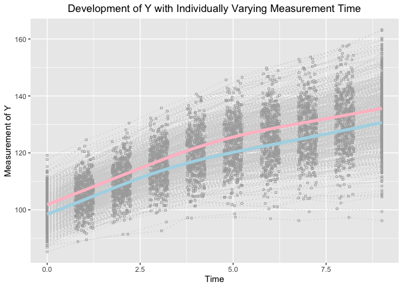
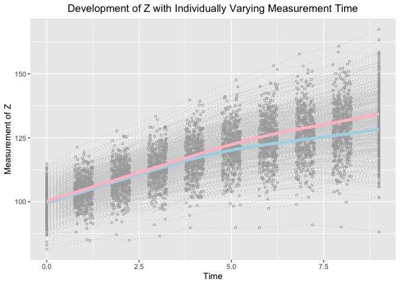

Growth Mixture Model to Investigate Heterogeneity in Nonlinear Joint
Development
================
Jin Liu
2021/11/21

## Require package would be used

``` r
library(OpenMx)
```

    ## OpenMx may run faster if it is compiled to take advantage of multiple cores.

``` r
library(tidyr)
library(ggplot2)
```

## OS, R version and OpenMx Version

``` r
mxOption(model = NULL, key = "Default optimizer", "CSOLNP", reset = FALSE)
mxVersion()
```

    ## OpenMx version: 2.19.6 [GIT v2.19.6]
    ## R version: R version 4.1.0 (2021-05-18)
    ## Platform: x86_64-apple-darwin17.0 
    ## MacOS: 12.0.1
    ## Default optimizer: CSOLNP
    ## NPSOL-enabled?: No
    ## OpenMP-enabled?: No

## “True” values of parameters

``` r
### Class 1
#### Population values of outcome-specific growth factor means
# meanY0 <- c(98, 5, 2.6, 3.5)
# meanZ0 <- c(100, 4.4, 2.0, 4.5)
### Population values of growth factor var-cov matrix
# psiYZ0 <- matrix(c(25, 1.5, 1.5, 7.5, 1.5, 1.5, 
#                    1.5, 1.0, 0.3, 1.5, 0.3, 0.3, 
#                    1.5, 0.3, 1.0, 1.5, 0.3, 0.3,  
#                    7.5, 1.5, 1.5, 25, 1.5, 1.5, 
#                    1.5, 0.3, 0.3, 1.5, 1.0, 0.3, 
#                    1.5, 0.3, 0.3, 1.5, 0.3, 1.0), nrow = 6)
### Class 2
#### Population values of outcome-specific growth factor means
# meanY0 <- c(102, 5, 2.6, 4.5)
# meanZ0 <- c(100, 4.4, 2.8, 5.5)
### Population values of growth factor var-cov matrix
# psiYZ0 <- matrix(c(25, 1.5, 1.5, 7.5, 1.5, 1.5, 
#                    1.5, 1.0, 0.3, 1.5, 0.3, 0.3, 
#                    1.5, 0.3, 1.0, 1.5, 0.3, 0.3,  
#                    7.5, 1.5, 1.5, 25, 1.5, 1.5, 
#                    1.5, 0.3, 0.3, 1.5, 1.0, 0.3, 
#                    1.5, 0.3, 0.3, 1.5, 0.3, 1.0), nrow = 6)
### Population values of logistic coefficients
# beta0 <- 0; beta1 <- log(1.5); beta2 <- log(1.7)
```

## Define Parameter lists

``` r
### Bilinear spline with fixed knots
paraBiFixed <- c("mueta0Y", "mueta1Y", "mueta2Y", "mugY", paste0("psi", c("0Y0Y", "0Y1Y", "0Y2Y", "1Y1Y", "1Y2Y", "2Y2Y")),
                 "mueta0Z", "mueta1Z", "mueta2Z", "mugZ", paste0("psi", c("0Z0Z", "0Z1Z", "0Z2Z", "1Z1Z", "1Z2Z", "2Z2Z")),
                 paste0("psi", c("0Y0Z", "1Y0Z", "2Y0Z", "0Y1Z", "1Y1Z", "2Y1Z", "0Y2Z", "1Y2Z", "2Y2Z")),
                 "residualsY", "residualsYZ", "residualsZ")
```

## Read in dataset for analyses (wide-format data)

``` r
load("BLSGM_bi_sub_dat.RData")
```

## Summarize data

``` r
summary(BLSGM_bi_sub_dat)
```

    ##        id              Y1               Y2               Y3        
    ##  Min.   :  1.0   Min.   : 85.29   Min.   : 88.85   Min.   : 91.38  
    ##  1st Qu.:125.8   1st Qu.: 96.64   1st Qu.:101.26   1st Qu.:105.92  
    ##  Median :250.5   Median : 99.88   Median :105.04   Median :110.19  
    ##  Mean   :250.5   Mean   :100.22   Mean   :105.23   Mean   :110.36  
    ##  3rd Qu.:375.2   3rd Qu.:103.84   3rd Qu.:109.20   3rd Qu.:114.79  
    ##  Max.   :500.0   Max.   :119.12   Max.   :124.59   Max.   :130.45  
    ##        Y4               Y5               Y6               Y7       
    ##  Min.   : 92.62   Min.   : 97.07   Min.   : 97.45   Min.   : 96.9  
    ##  1st Qu.:110.67   1st Qu.:114.81   1st Qu.:117.19   1st Qu.:119.7  
    ##  Median :115.47   Median :119.79   Median :123.32   Median :125.6  
    ##  Mean   :115.53   Mean   :119.87   Mean   :123.09   Mean   :125.8  
    ##  3rd Qu.:120.29   3rd Qu.:124.79   3rd Qu.:128.86   3rd Qu.:132.3  
    ##  Max.   :135.75   Max.   :140.65   Max.   :146.50   Max.   :149.8  
    ##        Y8               Y9              Y10               Z1        
    ##  Min.   : 96.23   Min.   : 97.32   Min.   : 96.19   Min.   : 81.49  
    ##  1st Qu.:121.45   1st Qu.:123.92   1st Qu.:125.90   1st Qu.: 96.94  
    ##  Median :128.51   Median :131.25   Median :133.45   Median : 99.89  
    ##  Mean   :128.19   Mean   :130.76   Mean   :133.34   Mean   : 99.83  
    ##  3rd Qu.:134.47   3rd Qu.:137.37   3rd Qu.:140.19   3rd Qu.:102.83  
    ##  Max.   :153.67   Max.   :157.94   Max.   :163.28   Max.   :114.74  
    ##        Z2               Z3               Z4               Z5        
    ##  Min.   : 84.78   Min.   : 84.96   Min.   : 86.57   Min.   : 89.79  
    ##  1st Qu.:101.06   1st Qu.:104.63   1st Qu.:109.48   1st Qu.:113.40  
    ##  Median :104.37   Median :108.73   Median :113.35   Median :117.59  
    ##  Mean   :104.30   Mean   :108.75   Mean   :113.28   Mean   :117.59  
    ##  3rd Qu.:107.64   3rd Qu.:112.57   3rd Qu.:117.50   3rd Qu.:122.25  
    ##  Max.   :121.29   Max.   :127.67   Max.   :133.32   Max.   :139.76  
    ##        Z6               Z7               Z8               Z9        
    ##  Min.   : 89.88   Min.   : 89.86   Min.   : 90.96   Min.   : 90.16  
    ##  1st Qu.:116.61   1st Qu.:118.90   1st Qu.:120.75   1st Qu.:122.77  
    ##  Median :121.65   Median :124.58   Median :126.94   Median :129.45  
    ##  Mean   :121.49   Mean   :124.40   Mean   :126.67   Mean   :129.05  
    ##  3rd Qu.:126.56   3rd Qu.:130.02   3rd Qu.:132.44   3rd Qu.:135.78  
    ##  Max.   :147.63   Max.   :153.14   Max.   :157.71   Max.   :160.79  
    ##       Z10               T1          T2               T3              T4       
    ##  Min.   : 88.13   Min.   :0   Min.   :0.7520   Min.   :1.750   Min.   :2.751  
    ##  1st Qu.:124.75   1st Qu.:0   1st Qu.:0.8471   1st Qu.:1.879   1st Qu.:2.894  
    ##  Median :131.75   Median :0   Median :0.9801   Median :2.009   Median :3.021  
    ##  Mean   :131.45   Mean   :0   Mean   :0.9870   Mean   :2.003   Mean   :3.015  
    ##  3rd Qu.:138.80   3rd Qu.:0   3rd Qu.:1.1191   3rd Qu.:2.126   3rd Qu.:3.154  
    ##  Max.   :167.38   Max.   :0   Max.   :1.2494   Max.   :2.249   Max.   :3.250  
    ##        T5              T6              T7              T8       
    ##  Min.   :3.751   Min.   :4.751   Min.   :5.751   Min.   :6.752  
    ##  1st Qu.:3.875   1st Qu.:4.891   1st Qu.:5.896   1st Qu.:6.853  
    ##  Median :4.002   Median :5.021   Median :5.999   Median :6.990  
    ##  Mean   :4.002   Mean   :5.011   Mean   :6.006   Mean   :6.993  
    ##  3rd Qu.:4.126   3rd Qu.:5.130   3rd Qu.:6.131   3rd Qu.:7.128  
    ##  Max.   :4.249   Max.   :5.250   Max.   :6.249   Max.   :7.250  
    ##        T9             T10          x1                  x2          
    ##  Min.   :7.751   Min.   :9   Min.   :-3.379334   Min.   :-3.87034  
    ##  1st Qu.:7.869   1st Qu.:9   1st Qu.:-0.808100   1st Qu.:-0.71771  
    ##  Median :7.998   Median :9   Median : 0.018376   Median : 0.02739  
    ##  Mean   :8.000   Mean   :9   Mean   : 0.006869   Mean   : 0.01487  
    ##  3rd Qu.:8.128   3rd Qu.:9   3rd Qu.: 0.720155   3rd Qu.: 0.76661  
    ##  Max.   :8.250   Max.   :9   Max.   : 3.527651   Max.   : 3.15211  
    ##      class      
    ##  Min.   :1.000  
    ##  1st Qu.:1.000  
    ##  Median :2.000  
    ##  Mean   :1.534  
    ##  3rd Qu.:2.000  
    ##  Max.   :2.000

## Visualize data

``` r
long_dat_T <- gather(BLSGM_bi_sub_dat[, c(1, 22:31, 34), ], key = var.T, value = time, T1:T10)
long_dat_Y <- gather(BLSGM_bi_sub_dat[, c(1, 2:11), ], key = var.Y, value = measuresY, Y1:Y10)
long_dat_Y$outcome <- "Y"
long_dat_Z <- gather(BLSGM_bi_sub_dat[, c(1, 12:21), ], key = var.Z, value = measuresZ, Z1:Z10)
long_dat_Z$outcome <- "Z"
long_dat <- data.frame(id = rep(long_dat_T$id, 2),
                       time = rep(long_dat_T$time, 2),
                       measures = c(long_dat_Y$measuresY, long_dat_Z$measuresZ),
                       outcome = c(long_dat_Y$outcome, long_dat_Z$outcome),
                       class = long_dat_T[, "class"])

ggplot(aes(x = time, y = measures), data = long_dat[long_dat$outcome == "Y", ]) +
  geom_line(aes(group = id), color = "lightgrey", linetype = "dotted") +
  geom_point(aes(group = id), color = "darkgrey", shape = 0, size = 0.8) +
  geom_smooth(aes(group = 1), size = 1.8, col = "lightblue", se = F, 
              data = long_dat[I(long_dat$outcome == "Y" & long_dat$class == 1), ] ) + 
  geom_smooth(aes(group = 1), size = 1.8, col = "pink", se = F, 
              data = long_dat[I(long_dat$outcome == "Y" & long_dat$class == 2), ] ) + 
  labs(title = "Development of Y with Individually Varying Measurement Time",
       x ="Time", y = "Measurement of Y") + 
  theme(plot.title = element_text(hjust = 0.5))
```

    ## `geom_smooth()` using method = 'gam' and formula 'y ~ s(x, bs = "cs")'
    ## `geom_smooth()` using method = 'gam' and formula 'y ~ s(x, bs = "cs")'

<!-- -->

``` r
ggplot(aes(x = time, y = measures), data = long_dat[long_dat$outcome == "Z", ]) +
  geom_line(aes(group = id), color = "lightgrey", linetype = "dotted") +
  geom_point(aes(group = id), color = "darkgrey", shape = 0, size = 0.8) +
  geom_smooth(aes(group = 1), size = 1.8, col = "lightblue", se = F, 
              data = long_dat[I(long_dat$outcome == "Z" & long_dat$class == 1), ] ) + 
  geom_smooth(aes(group = 1), size = 1.8, col = "pink", se = F, 
              data = long_dat[I(long_dat$outcome == "Z" & long_dat$class == 2), ] ) + 
  labs(title = "Development of Z with Individually Varying Measurement Time",
       x ="Time", y = "Measurement of Z") + 
  theme(plot.title = element_text(hjust = 0.5))
```

    ## `geom_smooth()` using method = 'gam' and formula 'y ~ s(x, bs = "cs")'
    ## `geom_smooth()` using method = 'gam' and formula 'y ~ s(x, bs = "cs")'

<!-- -->

## Load functions that help calculate initial values

``` r
source("getPosterior.R")
source("BLSGM_fixed.R")
source("PBLSGM_fixed.R")
source("FMM_BLSGM.R")
```

## Finite Mixture Model for joint development

``` r
source("FMM_PBLSGM.R")
FMM_PBLSGM <- getFMM_PBLSGM(dat = BLSGM_bi_sub_dat, T_records = list(1:10, 1:10), nClass = 2, traj_var = c("Y", "Z"), t_var = rep("T", 2), 
                            paraNames = paraBiFixed)
FMM_PBLSGM[[2]]
```

    ##             Name   Estimate        SE
    ## 1      c1mueta0Y  97.919300 0.4210000
    ## 2      c1mueta1Y   5.088100 0.0976000
    ## 3      c1mueta2Y   2.526500 0.0948000
    ## 4         c1mugY   3.455700 0.0406000
    ## 5      c1psi0Y0Y  21.564700 2.5965000
    ## 6      c1psi0Y1Y   2.015700 0.4416000
    ## 7      c1psi0Y2Y   1.341100 0.4349000
    ## 8      c1psi1Y1Y   1.084700 0.1328000
    ## 9      c1psi1Y2Y   0.475400 0.1024000
    ## 10     c1psi2Y2Y   1.102500 0.1310000
    ## 11     c1mueta0Z 100.008100 0.4071000
    ## 12     c1mueta1Z   4.523900 0.0965000
    ## 13     c1mueta2Z   1.904300 0.0987000
    ## 14        c1mugZ   4.506200 0.0374000
    ## 15     c1psi0Z0Z  19.871600 2.9214000
    ## 16     c1psi0Z1Z   0.822700 0.5196000
    ## 17     c1psi0Z2Z   0.844500 0.4581000
    ## 18     c1psi1Z1Z   0.969900 0.1305000
    ## 19     c1psi1Z2Z   0.385100 0.1011000
    ## 20     c1psi2Z2Z   1.011100 0.1393000
    ## 21     c1psi0Y0Z   7.749900 2.1850000
    ## 22     c1psi1Y0Z   1.250400 0.4051000
    ## 23     c1psi2Y0Z   0.906500 0.4276000
    ## 24     c1psi0Y1Z   2.230800 0.4727000
    ## 25     c1psi1Y1Z   0.415000 0.0975000
    ## 26     c1psi2Y1Z   0.359200 0.0961000
    ## 27     c1psi0Y2Z   0.917500 0.4412000
    ## 28     c1psi1Y2Z   0.257600 0.1010000
    ## 29     c1psi2Y2Z   0.057000 0.0985000
    ## 30  c1residualsY   0.948200 0.0439000
    ## 31 c1residualsYZ   0.263000 0.0311000
    ## 32  c1residualsZ   0.960600 0.0424000
    ## 33     c2mueta0Y 101.720100 0.3387000
    ## 34     c2mueta1Y   5.007600 0.0685000
    ## 35     c2mueta2Y   2.559500 0.0675000
    ## 36        c2mugY   4.476600 0.0319000
    ## 37     c2psi0Y0Y  26.071500 2.3477000
    ## 38     c2psi0Y1Y   1.267800 0.3490000
    ## 39     c2psi0Y2Y   1.148200 0.3430000
    ## 40     c2psi1Y1Y   0.982900 0.0934000
    ## 41     c2psi1Y2Y   0.360000 0.0700000
    ## 42     c2psi2Y2Y   0.969100 0.0926000
    ## 43     c2mueta0Z  99.826900 0.3363000
    ## 44     c2mueta1Z   4.354000 0.0694000
    ## 45     c2mueta2Z   2.639400 0.0800000
    ## 46        c2mugZ   5.479600 0.0411000
    ## 47     c2psi0Z0Z  27.387200 2.5320000
    ## 48     c2psi0Z1Z   1.640700 0.3960000
    ## 49     c2psi0Z2Z   2.638400 0.4444000
    ## 50     c2psi1Z1Z   1.021000 0.0971000
    ## 51     c2psi1Z2Z   0.434200 0.0899000
    ## 52     c2psi2Z2Z   1.248800 0.1317000
    ## 53     c2psi0Y0Z   7.943700 1.8674000
    ## 54     c2psi1Y0Z   1.637000 0.3426000
    ## 55     c2psi2Y0Z   1.417600 0.3492000
    ## 56     c2psi0Y1Z   1.763100 0.3916000
    ## 57     c2psi1Y1Z   0.332400 0.0688000
    ## 58     c2psi2Y1Z   0.256700 0.0681000
    ## 59     c2psi0Y2Z   2.433400 0.4439000
    ## 60     c2psi1Y2Z   0.373900 0.0787000
    ## 61     c2psi2Y2Z   0.235500 0.0786000
    ## 62  c2residualsY   1.004000 0.0342000
    ## 63 c2residualsYZ   0.297100 0.0241000
    ## 64  c2residualsZ   0.972500 0.0319000
    ## 65            p2   1.467409 0.1468587

## Cluter Predictor Mixture model for joint development

``` r
source("CPMM_PBLSGM.R")
CPMM_PBLSGM <- getCPMM_PBLSGM(dat = BLSGM_bi_sub_dat, T_records = list(1:10, 1:10), nClass = 2, traj_var = c("Y", "Z"), t_var = rep("T", 2), 
                              clus_cov = c("x1", "x2"), paraNames = paraBiFixed)
```

    ## # weights:  4 (3 variable)
    ## initial  value 346.573590 
    ## final  value 320.663303 
    ## converged

``` r
CPMM_PBLSGM[[2]]
```

    ##             Name    Estimate        SE
    ## 1      c1mueta0Y  98.2027000 0.4129000
    ## 2      c1mueta1Y   5.0526000 0.0901000
    ## 3      c1mueta2Y   2.6102000 0.0854000
    ## 4         c1mugY   3.4632000 0.0398000
    ## 5      c1psi0Y0Y  22.9237000 2.5892000
    ## 6      c1psi0Y1Y   1.7121000 0.4372000
    ## 7      c1psi0Y2Y   1.5464000 0.4108000
    ## 8      c1psi1Y1Y   1.1015000 0.1266000
    ## 9      c1psi1Y2Y   0.4651000 0.0957000
    ## 10     c1psi2Y2Y   1.1383000 0.1241000
    ## 11     c1mueta0Z  99.6878000 0.3915000
    ## 12     c1mueta1Z   4.4534000 0.0846000
    ## 13     c1mueta2Z   1.9388000 0.0905000
    ## 14        c1mugZ   4.5211000 0.0347000
    ## 15     c1psi0Z0Z  22.9803000 2.5441000
    ## 16     c1psi0Z1Z   1.3310000 0.4090000
    ## 17     c1psi0Z2Z   1.0964000 0.4129000
    ## 18     c1psi1Z1Z   1.0207000 0.1168000
    ## 19     c1psi1Z2Z   0.4098000 0.0897000
    ## 20     c1psi2Z2Z   1.0626000 0.1334000
    ## 21     c1psi0Y0Z   7.9107000 1.9482000
    ## 22     c1psi1Y0Z   1.1819000 0.4098000
    ## 23     c1psi2Y0Z   0.7773000 0.4080000
    ## 24     c1psi0Y1Z   2.3996000 0.4319000
    ## 25     c1psi1Y1Z   0.4083000 0.0921000
    ## 26     c1psi2Y1Z   0.3293000 0.0867000
    ## 27     c1psi0Y2Z   1.2919000 0.4342000
    ## 28     c1psi1Y2Z   0.2144000 0.0942000
    ## 29     c1psi2Y2Z   0.0991000 0.0898000
    ## 30  c1residualsY   0.9604000 0.0400000
    ## 31 c1residualsYZ   0.2741000 0.0292000
    ## 32  c1residualsZ   0.9637000 0.0397000
    ## 33     c2mueta0Y 101.7892000 0.3478000
    ## 34     c2mueta1Y   5.0438000 0.0713000
    ## 35     c2mueta2Y   2.5060000 0.0683000
    ## 36        c2mugY   4.4862000 0.0311000
    ## 37     c2psi0Y0Y  25.8591000 2.3746000
    ## 38     c2psi0Y1Y   1.3286000 0.3567000
    ## 39     c2psi0Y2Y   1.1496000 0.3475000
    ## 40     c2psi1Y1Y   0.9599000 0.0951000
    ## 41     c2psi1Y2Y   0.3708000 0.0713000
    ## 42     c2psi2Y2Y   0.9381000 0.0937000
    ## 43     c2mueta0Z 100.0458000 0.3435000
    ## 44     c2mueta1Z   4.4006000 0.0688000
    ## 45     c2mueta2Z   2.6786000 0.0787000
    ## 46        c2mugZ   5.5087000 0.0425000
    ## 47     c2psi0Z0Z  25.6966000 2.3593000
    ## 48     c2psi0Z1Z   1.3119000 0.3496000
    ## 49     c2psi0Z2Z   2.3520000 0.4110000
    ## 50     c2psi1Z1Z   0.9785000 0.0932000
    ## 51     c2psi1Z2Z   0.3627000 0.0828000
    ## 52     c2psi2Z2Z   1.1971000 0.1234000
    ## 53     c2psi0Y0Z   7.0661000 1.7356000
    ## 54     c2psi1Y0Z   1.6327000 0.3483000
    ## 55     c2psi2Y0Z   1.4942000 0.3493000
    ## 56     c2psi0Y1Z   1.4644000 0.3621000
    ## 57     c2psi1Y1Z   0.3126000 0.0691000
    ## 58     c2psi2Y1Z   0.2702000 0.0673000
    ## 59     c2psi0Y2Z   2.3184000 0.4193000
    ## 60     c2psi1Y2Z   0.3820000 0.0798000
    ## 61     c2psi2Y2Z   0.2760000 0.0779000
    ## 62  c2residualsY   0.9978000 0.0343000
    ## 63 c2residualsYZ   0.2929000 0.0250000
    ## 64  c2residualsZ   0.9688000 0.0334000
    ## 65        beta20   0.3167642 0.1529068
    ## 66        beta21   0.5361178 0.1360760
    ## 67        beta22   0.4424436 0.1279330
