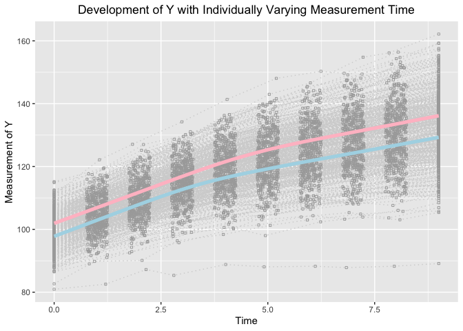
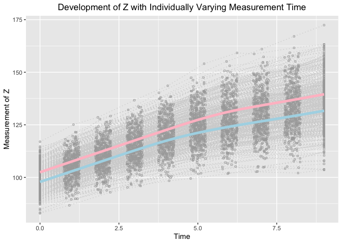

Extending Growth Mixture Model to Assess Heterogeneity in Joint Development with Piecewise Linear Trajectories in the Framework of Individual Measurement Occasions
================
Jin Liu

## OS, R version and OpenMx Version

``` r
OpenMx::mxVersion()
```

    ## OpenMx version: 2.17.3 [GIT v2.17.3]
    ## R version: R version 3.6.3 (2020-02-29)
    ## Platform: x86_64-apple-darwin15.6.0 
    ## MacOS: 10.15.7
    ## Default optimizer: CSOLNP
    ## NPSOL-enabled?: No
    ## OpenMP-enabled?: Yes

## Require package would be used

``` r
library(tidyr)
library(ggplot2)
```

## Read in dataset for analyses (wide-format data)

``` r
dat <- read.csv(file = "example_data.csv")
```

## Summarize data

``` r
table(dat$class)
```

    ## 
    ##   1   2 
    ## 253 247

``` r
summary(dat[dat$class == 1, ])
```

    ##        id              Y1               Y2               Y3        
    ##  Min.   :  1.0   Min.   : 80.93   Min.   : 82.56   Min.   : 87.21  
    ##  1st Qu.:113.0   1st Qu.: 94.70   1st Qu.: 99.50   1st Qu.:104.10  
    ##  Median :238.0   Median : 98.25   Median :102.80   Median :107.92  
    ##  Mean   :240.2   Mean   : 97.76   Mean   :102.80   Mean   :107.80  
    ##  3rd Qu.:369.0   3rd Qu.:100.82   3rd Qu.:106.12   3rd Qu.:111.44  
    ##  Max.   :498.0   Max.   :114.90   Max.   :117.44   Max.   :125.17  
    ##        Y4               Y5               Y6               Y7        
    ##  Min.   : 85.36   Min.   : 88.82   Min.   : 88.07   Min.   : 88.25  
    ##  1st Qu.:108.52   1st Qu.:111.99   1st Qu.:114.17   1st Qu.:116.90  
    ##  Median :112.71   Median :116.32   Median :118.86   Median :120.95  
    ##  Mean   :112.89   Mean   :116.63   Mean   :119.14   Mean   :121.75  
    ##  3rd Qu.:117.22   3rd Qu.:121.71   3rd Qu.:124.14   3rd Qu.:127.81  
    ##  Max.   :131.08   Max.   :134.53   Max.   :139.93   Max.   :143.75  
    ##        Y8               Y9              Y10               Z1        
    ##  Min.   : 87.83   Min.   : 88.26   Min.   : 89.13   Min.   : 82.95  
    ##  1st Qu.:118.63   1st Qu.:120.18   1st Qu.:122.31   1st Qu.: 94.08  
    ##  Median :124.13   Median :125.81   Median :128.72   Median : 98.28  
    ##  Mean   :124.28   Mean   :126.82   Mean   :129.30   Mean   : 97.84  
    ##  3rd Qu.:131.03   3rd Qu.:134.10   3rd Qu.:137.57   3rd Qu.:101.75  
    ##  Max.   :148.12   Max.   :152.37   Max.   :155.24   Max.   :112.05  
    ##        Z2               Z3               Z4               Z5        
    ##  Min.   : 86.73   Min.   : 92.59   Min.   : 95.27   Min.   : 98.39  
    ##  1st Qu.: 99.03   1st Qu.:103.70   1st Qu.:108.05   1st Qu.:112.94  
    ##  Median :103.13   Median :107.43   Median :112.55   Median :118.21  
    ##  Mean   :102.86   Mean   :107.70   Mean   :112.62   Mean   :117.74  
    ##  3rd Qu.:106.99   3rd Qu.:112.28   3rd Qu.:117.35   3rd Qu.:123.03  
    ##  Max.   :117.14   Max.   :126.77   Max.   :133.20   Max.   :136.43  
    ##        Z6               Z7              Z8              Z9       
    ##  Min.   : 99.47   Min.   :101.8   Min.   :102.7   Min.   :102.1  
    ##  1st Qu.:115.43   1st Qu.:118.4   1st Qu.:120.5   1st Qu.:122.2  
    ##  Median :121.29   Median :124.2   Median :126.1   Median :129.2  
    ##  Mean   :121.36   Mean   :124.0   Mean   :126.6   Mean   :129.1  
    ##  3rd Qu.:126.68   3rd Qu.:130.2   3rd Qu.:132.8   3rd Qu.:136.0  
    ##  Max.   :145.16   Max.   :148.9   Max.   :154.5   Max.   :157.2  
    ##       Z10              T1          T2               T3              T4       
    ##  Min.   :103.6   Min.   :0   Min.   :0.7566   Min.   :1.752   Min.   :2.750  
    ##  1st Qu.:124.1   1st Qu.:0   1st Qu.:0.8837   1st Qu.:1.855   1st Qu.:2.869  
    ##  Median :131.5   Median :0   Median :0.9923   Median :1.981   Median :3.004  
    ##  Mean   :131.7   Mean   :0   Mean   :1.0036   Mean   :1.983   Mean   :3.001  
    ##  3rd Qu.:138.3   3rd Qu.:0   3rd Qu.:1.1292   3rd Qu.:2.103   3rd Qu.:3.134  
    ##  Max.   :163.1   Max.   :0   Max.   :1.2484   Max.   :2.247   Max.   :3.243  
    ##        T5              T6              T7              T8       
    ##  Min.   :3.751   Min.   :4.753   Min.   :5.751   Min.   :6.751  
    ##  1st Qu.:3.893   1st Qu.:4.893   1st Qu.:5.849   1st Qu.:6.884  
    ##  Median :4.013   Median :4.987   Median :5.963   Median :7.012  
    ##  Mean   :4.014   Mean   :4.996   Mean   :5.983   Mean   :7.006  
    ##  3rd Qu.:4.149   3rd Qu.:5.104   3rd Qu.:6.100   3rd Qu.:7.124  
    ##  Max.   :4.250   Max.   :5.249   Max.   :6.249   Max.   :7.248  
    ##        T9             T10          x1                x2              class  
    ##  Min.   :7.751   Min.   :9   Min.   :-3.0932   Min.   :-3.3048   Min.   :1  
    ##  1st Qu.:7.887   1st Qu.:9   1st Qu.:-1.0588   1st Qu.:-0.9526   1st Qu.:1  
    ##  Median :8.017   Median :9   Median :-0.3986   Median :-0.3220   Median :1  
    ##  Mean   :8.014   Mean   :9   Mean   :-0.4278   Mean   :-0.3570   Mean   :1  
    ##  3rd Qu.:8.144   3rd Qu.:9   3rd Qu.: 0.1936   3rd Qu.: 0.2806   3rd Qu.:1  
    ##  Max.   :8.250   Max.   :9   Max.   : 1.9745   Max.   : 2.6465   Max.   :1

``` r
summary(dat[dat$class == 2, ])
```

    ##        id              Y1               Y2               Y3        
    ##  Min.   :  3.0   Min.   : 90.22   Min.   : 95.14   Min.   : 95.94  
    ##  1st Qu.:147.5   1st Qu.: 98.69   1st Qu.:103.65   1st Qu.:108.21  
    ##  Median :270.0   Median :101.74   Median :106.93   Median :111.89  
    ##  Mean   :261.1   Mean   :101.87   Mean   :107.00   Mean   :111.88  
    ##  3rd Qu.:386.0   3rd Qu.:104.83   3rd Qu.:110.48   3rd Qu.:115.50  
    ##  Max.   :500.0   Max.   :115.18   Max.   :122.15   Max.   :127.08  
    ##        Y4               Y5              Y6              Y7       
    ##  Min.   : 99.05   Min.   :101.6   Min.   :104.1   Min.   :107.1  
    ##  1st Qu.:112.86   1st Qu.:117.4   1st Qu.:120.8   1st Qu.:123.3  
    ##  Median :117.02   Median :121.7   Median :125.4   Median :128.2  
    ##  Mean   :116.82   Mean   :121.7   Mean   :125.5   Mean   :128.2  
    ##  3rd Qu.:120.41   3rd Qu.:125.9   3rd Qu.:129.9   3rd Qu.:133.4  
    ##  Max.   :134.23   Max.   :141.4   Max.   :148.1   Max.   :150.3  
    ##        Y8              Y9             Y10              Z1        
    ##  Min.   :110.6   Min.   :112.0   Min.   :112.1   Min.   : 89.52  
    ##  1st Qu.:125.4   1st Qu.:126.7   1st Qu.:129.1   1st Qu.: 98.98  
    ##  Median :130.7   Median :133.3   Median :136.0   Median :101.87  
    ##  Mean   :130.8   Mean   :133.5   Mean   :136.2   Mean   :102.42  
    ##  3rd Qu.:136.4   3rd Qu.:139.3   3rd Qu.:142.4   3rd Qu.:106.25  
    ##  Max.   :154.8   Max.   :156.4   Max.   :162.2   Max.   :116.97  
    ##        Z2              Z3               Z4               Z5       
    ##  Min.   : 91.2   Min.   : 93.85   Min.   : 97.67   Min.   :103.3  
    ##  1st Qu.:103.7   1st Qu.:108.60   1st Qu.:112.86   1st Qu.:116.8  
    ##  Median :107.2   Median :112.18   Median :117.39   Median :122.3  
    ##  Mean   :107.6   Mean   :112.60   Mean   :117.57   Mean   :122.4  
    ##  3rd Qu.:111.2   3rd Qu.:116.33   3rd Qu.:122.50   3rd Qu.:127.5  
    ##  Max.   :125.1   Max.   :129.16   Max.   :136.69   Max.   :143.6  
    ##        Z6              Z7              Z8              Z9       
    ##  Min.   :104.5   Min.   :107.1   Min.   :109.3   Min.   :108.6  
    ##  1st Qu.:121.8   1st Qu.:124.8   1st Qu.:127.3   1st Qu.:129.6  
    ##  Median :126.9   Median :130.8   Median :133.6   Median :136.2  
    ##  Mean   :127.5   Mean   :131.4   Mean   :134.1   Mean   :136.7  
    ##  3rd Qu.:132.9   3rd Qu.:138.0   3rd Qu.:140.2   3rd Qu.:143.3  
    ##  Max.   :154.0   Max.   :159.2   Max.   :161.0   Max.   :167.1  
    ##       Z10              T1          T2               T3              T4       
    ##  Min.   :112.3   Min.   :0   Min.   :0.7530   Min.   :1.753   Min.   :2.751  
    ##  1st Qu.:131.9   1st Qu.:0   1st Qu.:0.8955   1st Qu.:1.908   1st Qu.:2.866  
    ##  Median :138.8   Median :0   Median :1.0342   Median :2.038   Median :3.009  
    ##  Mean   :139.5   Mean   :0   Mean   :1.0172   Mean   :2.021   Mean   :3.003  
    ##  3rd Qu.:146.1   3rd Qu.:0   3rd Qu.:1.1404   3rd Qu.:2.142   3rd Qu.:3.133  
    ##  Max.   :172.4   Max.   :0   Max.   :1.2481   Max.   :2.244   Max.   :3.249  
    ##        T5              T6              T7              T8       
    ##  Min.   :3.750   Min.   :4.755   Min.   :5.750   Min.   :6.750  
    ##  1st Qu.:3.881   1st Qu.:4.883   1st Qu.:5.877   1st Qu.:6.868  
    ##  Median :4.009   Median :4.981   Median :5.980   Median :7.009  
    ##  Mean   :4.000   Mean   :4.998   Mean   :5.993   Mean   :7.001  
    ##  3rd Qu.:4.114   3rd Qu.:5.119   3rd Qu.:6.119   3rd Qu.:7.127  
    ##  Max.   :4.248   Max.   :5.249   Max.   :6.250   Max.   :7.250  
    ##        T9             T10          x1                x2              class  
    ##  Min.   :7.751   Min.   :9   Min.   :-3.1045   Min.   :-2.6063   Min.   :2  
    ##  1st Qu.:7.871   1st Qu.:9   1st Qu.:-0.3381   1st Qu.:-0.2939   1st Qu.:2  
    ##  Median :7.991   Median :9   Median : 0.3052   Median : 0.2381   Median :2  
    ##  Mean   :7.990   Mean   :9   Mean   : 0.2242   Mean   : 0.3037   Mean   :2  
    ##  3rd Qu.:8.100   3rd Qu.:9   3rd Qu.: 0.8927   3rd Qu.: 0.8742   3rd Qu.:2  
    ##  Max.   :8.249   Max.   :9   Max.   : 2.8702   Max.   : 2.8713   Max.   :2

## Visualize data

``` r
long_dat_T <- gather(dat[, c(1, 22:31, 34), ], key = var.T, value = time, T1:T10)
long_dat_Y <- gather(dat[, c(1, 2:11), ], key = var.Y, value = measuresY, Y1:Y10)
long_dat_Y$outcome <- "Y"
long_dat_Z <- gather(dat[, c(1, 12:21), ], key = var.Z, value = measuresZ, Z1:Z10)
long_dat_Z$outcome <- "Z"
long_dat <- data.frame(id = rep(long_dat_T$id, 2),
                       time = rep(long_dat_T$time, 2),
                       measures = c(long_dat_Y$measuresY, long_dat_Z$measuresZ),
                       outcome = c(long_dat_Y$outcome, long_dat_Z$outcome),
                       class = long_dat_T[, "class"])

ggplot(aes(x = time, y = measures), data = long_dat[long_dat$outcome == "Y", ]) +
  geom_line(aes(group = id), color = "lightgrey", linetype = "dotted") +
  geom_point(aes(group = id), color = "darkgrey", shape = 0, size = 0.8) +
  geom_smooth(aes(group = 1), size = 1.8, col = "lightblue", se = F, 
              data = long_dat[I(long_dat$outcome == "Y" & long_dat$class == 1), ] ) + 
  geom_smooth(aes(group = 1), size = 1.8, col = "pink", se = F, 
              data = long_dat[I(long_dat$outcome == "Y" & long_dat$class == 2), ] ) + 
  labs(title = "Development of Y with Individually Varying Measurement Time",
       x ="Time", y = "Measurement of Y") + 
  theme(plot.title = element_text(hjust = 0.5))
```

    ## `geom_smooth()` using method = 'gam' and formula 'y ~ s(x, bs = "cs")'
    ## `geom_smooth()` using method = 'gam' and formula 'y ~ s(x, bs = "cs")'

<!-- -->

``` r
ggplot(aes(x = time, y = measures), data = long_dat[long_dat$outcome == "Z", ]) +
  geom_line(aes(group = id), color = "lightgrey", linetype = "dotted") +
  geom_point(aes(group = id), color = "darkgrey", shape = 0, size = 0.8) +
  geom_smooth(aes(group = 1), size = 1.8, col = "lightblue", se = F, 
              data = long_dat[I(long_dat$outcome == "Z" & long_dat$class == 1), ] ) + 
  geom_smooth(aes(group = 1), size = 1.8, col = "pink", se = F, 
              data = long_dat[I(long_dat$outcome == "Z" & long_dat$class == 2), ] ) + 
  labs(title = "Development of Z with Individually Varying Measurement Time",
       x ="Time", y = "Measurement of Z") + 
  theme(plot.title = element_text(hjust = 0.5))
```

    ## `geom_smooth()` using method = 'gam' and formula 'y ~ s(x, bs = "cs")'
    ## `geom_smooth()` using method = 'gam' and formula 'y ~ s(x, bs = "cs")'

<!-- -->

## Parallel Bilinear Spline Growth Model with Unknown Fixed Knots

``` r
source("PBLSGMM_fixed.R")
```

``` r
out
```

    ##             Name     Estimate         SE        true
    ## 1      c1mueta0Y  97.66557460 0.36362116  98.0000000
    ## 2      c1mueta1Y   4.96215135 0.08759037   5.0000000
    ## 3      c1mueta2Y   2.51130582 0.07923683   2.6000000
    ## 4         c1mugY   3.44413144 0.03352316   3.5000000
    ## 5      c1mueta0Z  97.51220166 0.37562179  98.0000000
    ## 6      c1mueta1Z   4.94740228 0.07903040   5.0000000
    ## 7      c1mueta2Z   2.53223094 0.07926242   2.6000000
    ## 8         c1mugZ   4.52076775 0.03580721   4.5000000
    ## 9      c1psi0Y0Y  23.19002241 2.49913310  25.0000000
    ## 15     c1psi1Y1Y   1.26853386 0.13099877   1.0000000
    ## 20     c1psi2Y2Y   0.95561055 0.10547039   1.0000000
    ## 24     c1psi0Z0Z  24.62326712 2.49745371  25.0000000
    ## 27     c1psi1Z1Z   1.05644563 0.11136840   1.0000000
    ## 29     c1psi2Z2Z   0.96468186 0.11471661   1.0000000
    ## 12     c1psi0Y0Z   5.71484753 1.79264977   7.5000000
    ## 18     c1psi1Y1Z   0.34746018 0.08936118   0.3000000
    ## 23     c1psi2Y2Z   0.26396676 0.08065363   0.3000000
    ## 30  c1residualsY   1.02636760 0.03850767   1.0000000
    ## 31  c1residualsZ   1.02881587 0.03878226   1.0000000
    ## 32 c1residualsYZ   0.34199261 0.02906967   0.3000000
    ## 33     c2mueta0Y 101.94616846 0.34503213 102.0000000
    ## 34     c2mueta1Y   5.05047548 0.07668986   5.0000000
    ## 35     c2mueta2Y   2.69950844 0.07977675   2.6000000
    ## 36        c2mugY   4.47273119 0.03230874   4.5000000
    ## 37     c2mueta0Z 102.77029974 0.35689357 102.0000000
    ## 38     c2mueta1Z   5.00599066 0.07724659   5.0000000
    ## 39     c2mueta2Z   2.74586061 0.08305420   2.6000000
    ## 41     c2psi0Y0Y  19.60873559 2.02443423  25.0000000
    ## 47     c2psi1Y1Y   0.81583484 0.09545356   1.0000000
    ## 52     c2psi2Y2Y   1.01650895 0.10653690   1.0000000
    ## 56     c2psi0Z0Z  22.20661521 2.33778809  25.0000000
    ## 59     c2psi1Z1Z   1.01218107 0.10975156   1.0000000
    ## 61     c2psi2Z2Z   1.13161940 0.12326357   1.0000000
    ## 44     c2psi0Y0Z   5.50655780 1.63902570   7.5000000
    ## 50     c2psi1Y1Z   0.18139655 0.07494830   0.3000000
    ## 55     c2psi2Y2Z   0.38984659 0.08528544   0.3000000
    ## 62  c2residualsY   0.94636804 0.03559736   1.0000000
    ## 63  c2residualsZ   1.02508749 0.03855477   1.0000000
    ## 64 c2residualsYZ   0.31238929 0.02772068   0.3000000
    ## 65        beta20   0.07031003 0.15632343   0.0000000
    ## 66        beta21   0.60865553 0.13786990   0.4054651
    ## 67        beta22   0.54608484 0.14210841   0.5306283
