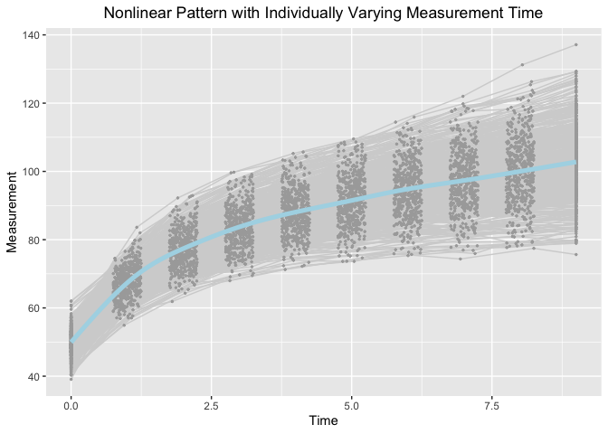

Jenss-Bayley Latent Change Score Model with Individual Ratio of Growth Acceleration in the Framework of Individual
Measurement Occasions
================
Jin Liu

## OS, R version and OpenMx Version

``` r
OpenMx::mxOption(model = NULL, key = "Default optimizer", "CSOLNP", reset = FALSE)
OpenMx::mxVersion()
```

    ## OpenMx version: 2.19.6 [GIT v2.19.6]
    ## R version: R version 4.1.0 (2021-05-18)
    ## Platform: x86_64-apple-darwin17.0 
    ## MacOS: 11.5.1
    ## Default optimizer: CSOLNP
    ## NPSOL-enabled?: No
    ## OpenMP-enabled?: No

## Require package would be used

``` r
library(tidyr)
library(ggplot2)
```

## Read in dataset for analyses (wide-format data)

``` r
dat <- read.csv(file = "example_data.csv")
```

## Summarize data

``` r
summary(dat)
```

    ##        id              Y1              Y2              Y3       
    ##  Min.   :  1.0   Min.   :39.09   Min.   :54.93   Min.   :61.88  
    ##  1st Qu.:125.8   1st Qu.:47.36   1st Qu.:64.22   1st Qu.:73.27  
    ##  Median :250.5   Median :49.52   Median :67.21   Median :77.17  
    ##  Mean   :250.5   Mean   :49.84   Mean   :67.41   Mean   :77.31  
    ##  3rd Qu.:375.2   3rd Qu.:52.42   3rd Qu.:70.70   3rd Qu.:80.45  
    ##  Max.   :500.0   Max.   :62.02   Max.   :83.62   Max.   :92.92  
    ##        Y4              Y5               Y6               Y7        
    ##  Min.   :67.97   Min.   : 71.25   Min.   : 73.63   Min.   : 75.33  
    ##  1st Qu.:79.22   1st Qu.: 83.61   1st Qu.: 86.43   1st Qu.: 88.99  
    ##  Median :83.65   Median : 87.85   Median : 91.29   Median : 94.48  
    ##  Mean   :83.64   Mean   : 88.12   Mean   : 91.57   Mean   : 94.68  
    ##  3rd Qu.:87.72   3rd Qu.: 92.48   3rd Qu.: 96.72   3rd Qu.: 99.93  
    ##  Max.   :99.77   Max.   :105.68   Max.   :109.52   Max.   :115.90  
    ##        Y8               Y9              Y10               T1   
    ##  Min.   : 74.34   Min.   : 77.46   Min.   : 75.64   Min.   :0  
    ##  1st Qu.: 91.15   1st Qu.: 93.44   1st Qu.: 95.20   1st Qu.:0  
    ##  Median : 97.12   Median : 99.81   Median :102.71   Median :0  
    ##  Mean   : 97.38   Mean   :100.08   Mean   :102.71   Mean   :0  
    ##  3rd Qu.:103.28   3rd Qu.:106.44   3rd Qu.:109.72   3rd Qu.:0  
    ##  Max.   :121.99   Max.   :131.23   Max.   :137.13   Max.   :0  
    ##        T2               T3              T4              T5       
    ##  Min.   :0.7509   Min.   :1.752   Min.   :2.751   Min.   :3.753  
    ##  1st Qu.:0.8802   1st Qu.:1.871   1st Qu.:2.857   1st Qu.:3.870  
    ##  Median :0.9969   Median :1.999   Median :3.002   Median :3.997  
    ##  Mean   :1.0004   Mean   :1.999   Mean   :2.996   Mean   :3.998  
    ##  3rd Qu.:1.1271   3rd Qu.:2.122   3rd Qu.:3.117   3rd Qu.:4.125  
    ##  Max.   :1.2498   Max.   :2.249   Max.   :3.250   Max.   :4.248  
    ##        T6              T7              T8              T9             T10   
    ##  Min.   :4.753   Min.   :5.751   Min.   :6.754   Min.   :7.751   Min.   :9  
    ##  1st Qu.:4.875   1st Qu.:5.879   1st Qu.:6.867   1st Qu.:7.873   1st Qu.:9  
    ##  Median :4.989   Median :6.008   Median :6.987   Median :8.009   Median :9  
    ##  Mean   :4.994   Mean   :6.000   Mean   :6.992   Mean   :8.005   Mean   :9  
    ##  3rd Qu.:5.108   3rd Qu.:6.115   3rd Qu.:7.120   3rd Qu.:8.149   3rd Qu.:9  
    ##  Max.   :5.248   Max.   :6.250   Max.   :7.250   Max.   :8.249   Max.   :9

## Visualize data

``` r
long_dat_T <- gather(dat, var.T, time, T1:T10)
long_dat_Y <- gather(dat, var.Y, measures, Y1:Y10)
long_dat <- data.frame(id = long_dat_T[, 1], time = long_dat_T[, 13],
                       measures = long_dat_Y[, 13])
ggplot(aes(x = time, y = measures), data = long_dat) +
  geom_line(aes(group = id), color = "lightgrey") +
  geom_point(aes(group = id), color = "darkgrey", size = 0.5) +
  geom_smooth(aes(group = 1), size = 1.8, col = "lightblue", se = F) + 
  labs(title = "Nonlinear Pattern with Individually Varying Measurement Time",
       x ="Time", y = "Measurement") + 
  theme(plot.title = element_text(hjust = 0.5))
```

    ## `geom_smooth()` using method = 'gam' and formula 'y ~ s(x, bs = "cs")'

<!-- -->

## Jenss-Bayley Latent Change Model with Random Ratio of Growth Acceleration

``` r
source("JB_LCM_random.R")
```

``` r
out
```

    ##         name      Estimate   Std.Error   true
    ## 12    mueta0  49.865717066 0.167841671  50.00
    ## 13    mueta1   2.562264650 0.051761912   2.50
    ## 14    mueta2 -30.504132127 0.312143716 -30.00
    ## 15     gamma  -0.696554375 0.006601911  -0.70
    ## 2      psi00  13.121092343 0.891769762  16.00
    ## 3      psi01   1.090375957 0.199910514   1.20
    ## 5      psi02   6.164288707 1.212664469   7.20
    ## 8      psi0g   0.098185886 0.025664556   0.12
    ## 4      psi11   1.210490610 0.084845550   1.00
    ## 6      psi12   3.003255277 0.401802289   1.80
    ## 9      psi1g   0.028275346 0.007720933   0.03
    ## 7      psi22  41.729792512 3.089850212  36.00
    ## 10     psi2g   0.152627194 0.046919269   0.18
    ## 11     psigg   0.009158409 0.001435261   0.01
    ## 1  residuals   0.997898660 0.025756973   1.00

## Jenss-Bayley Latent Change Model with Fixed Ratio of Growth Acceleration

``` r
source("JB_LCM_fixed.R")
```

``` r
out
```

    ##         name    Estimate   Std.Error  true
    ## 8     mueta0  49.8351616 0.164991045  50.0
    ## 9     mueta1   2.5880891 0.055812824   2.5
    ## 10    mueta2 -30.3378588 0.335602302 -30.0
    ## 11     gamma  -0.7066984 0.005234186  -0.7
    ## 2      psi00  12.5487914 0.855008929  16.0
    ## 3      psi01   1.1958975 0.206466377   1.2
    ## 5      psi02   6.8455521 1.247101525   7.2
    ## 4      psi11   1.4241372 0.092489102   1.0
    ## 6      psi12   4.2708561 0.442724264   1.8
    ## 7      psi22  49.0731405 3.328722246  36.0
    ## 1  residuals   1.0994960 0.026280359   1.0
