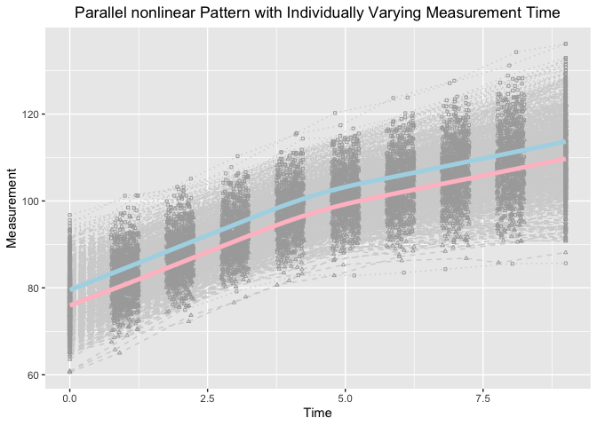
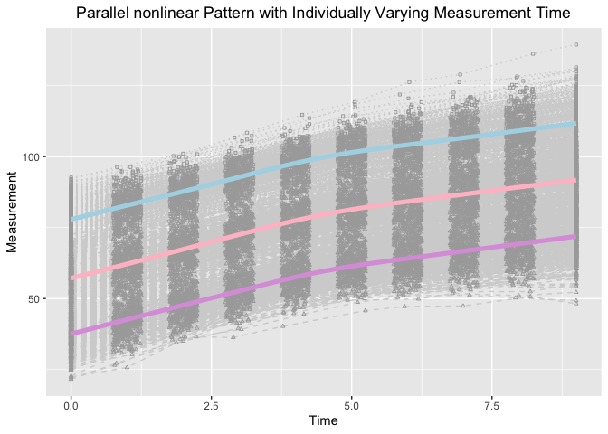

Assessing Mediational Processes in Parallel Bilinear Spline Growth Curve Models in the Framework
of Individual Measurement Occasions.
================
Jin Liu

## OS, R version and OpenMx Version

``` r
OpenMx::mxOption(model = NULL, key = "Default optimizer", "CSOLNP", reset = FALSE)
OpenMx::mxVersion()
```

    ## OpenMx version: 2.19.6 [GIT v2.19.6]
    ## R version: R version 4.1.0 (2021-05-18)
    ## Platform: x86_64-apple-darwin17.0 
    ## MacOS: 11.5.1
    ## Default optimizer: CSOLNP
    ## NPSOL-enabled?: No
    ## OpenMP-enabled?: No

## Require package would be used

``` r
library(tidyr)
library(ggplot2)
```

## First Model: Baseline X to longitudinal M to longitudinal Y

### Read in dataset for analyses (wide-format data)

``` r
source("generate_para.R")
```

    ## OpenMx may run faster if it is compiled to take advantage of multiple cores.

``` r
dat <- read.csv(file = "example_data_bi.csv")
```

### Summarize data

``` r
summary(dat)
```

    ##        id              Y1              Y2               Y3        
    ##  Min.   :  1.0   Min.   :66.25   Min.   : 71.87   Min.   : 74.93  
    ##  1st Qu.:125.8   1st Qu.:75.58   1st Qu.: 80.62   1st Qu.: 86.21  
    ##  Median :250.5   Median :79.45   Median : 84.62   Median : 89.50  
    ##  Mean   :250.5   Mean   :79.53   Mean   : 84.51   Mean   : 89.61  
    ##  3rd Qu.:375.2   3rd Qu.:83.36   3rd Qu.: 87.89   3rd Qu.: 92.82  
    ##  Max.   :500.0   Max.   :96.77   Max.   :101.30   Max.   :105.12  
    ##        Y4               Y5               Y6               Y7        
    ##  Min.   : 79.17   Min.   : 82.94   Min.   : 82.84   Min.   : 83.49  
    ##  1st Qu.: 91.03   1st Qu.: 96.19   1st Qu.: 99.78   1st Qu.:101.87  
    ##  Median : 94.40   Median : 99.28   Median :103.10   Median :105.58  
    ##  Mean   : 94.52   Mean   : 99.56   Mean   :103.34   Mean   :105.82  
    ##  3rd Qu.: 97.53   3rd Qu.:102.89   3rd Qu.:106.66   3rd Qu.:109.39  
    ##  Max.   :110.30   Max.   :115.61   Max.   :120.25   Max.   :123.82  
    ##        Y8              Y9              Y10               M1       
    ##  Min.   : 84.3   Min.   : 85.54   Min.   : 85.68   Min.   :60.57  
    ##  1st Qu.:104.2   1st Qu.:106.48   1st Qu.:108.61   1st Qu.:71.84  
    ##  Median :108.3   Median :110.93   Median :113.74   Median :75.51  
    ##  Mean   :108.4   Mean   :111.04   Mean   :113.66   Mean   :75.96  
    ##  3rd Qu.:112.7   3rd Qu.:115.30   3rd Qu.:118.64   3rd Qu.:79.84  
    ##  Max.   :127.7   Max.   :134.26   Max.   :136.16   Max.   :91.68  
    ##        M2              M3              M4               M5        
    ##  Min.   :64.98   Min.   :72.27   Min.   : 76.61   Min.   : 80.68  
    ##  1st Qu.:77.15   1st Qu.:82.40   1st Qu.: 87.38   1st Qu.: 92.16  
    ##  Median :80.29   Median :85.65   Median : 90.47   Median : 95.49  
    ##  Mean   :80.74   Mean   :85.81   Mean   : 90.70   Mean   : 95.61  
    ##  3rd Qu.:84.18   3rd Qu.:89.13   3rd Qu.: 94.05   3rd Qu.: 99.10  
    ##  Max.   :96.30   Max.   :99.40   Max.   :105.55   Max.   :111.04  
    ##        M6               M7               M8               M9        
    ##  Min.   : 82.84   Min.   : 86.27   Min.   : 86.80   Min.   : 85.79  
    ##  1st Qu.: 95.60   1st Qu.: 98.26   1st Qu.: 99.91   1st Qu.:102.18  
    ##  Median : 99.47   Median :101.90   Median :104.63   Median :107.38  
    ##  Mean   : 99.36   Mean   :101.93   Mean   :104.50   Mean   :107.12  
    ##  3rd Qu.:102.81   3rd Qu.:105.96   3rd Qu.:108.92   3rd Qu.:111.97  
    ##  Max.   :113.21   Max.   :117.35   Max.   :120.81   Max.   :124.38  
    ##       M10               T1          T2               T3              T4       
    ##  Min.   : 88.14   Min.   :0   Min.   :0.7508   Min.   :1.753   Min.   :2.755  
    ##  1st Qu.:104.19   1st Qu.:0   1st Qu.:0.8729   1st Qu.:1.882   1st Qu.:2.875  
    ##  Median :110.01   Median :0   Median :1.0016   Median :2.018   Median :3.014  
    ##  Mean   :109.69   Mean   :0   Mean   :1.0044   Mean   :2.007   Mean   :3.004  
    ##  3rd Qu.:115.49   3rd Qu.:0   3rd Qu.:1.1311   3rd Qu.:2.136   3rd Qu.:3.137  
    ##  Max.   :128.47   Max.   :0   Max.   :1.2493   Max.   :2.246   Max.   :3.248  
    ##        T5              T6              T7              T8       
    ##  Min.   :3.750   Min.   :4.752   Min.   :5.750   Min.   :6.751  
    ##  1st Qu.:3.870   1st Qu.:4.871   1st Qu.:5.862   1st Qu.:6.871  
    ##  Median :4.007   Median :4.995   Median :5.993   Median :6.989  
    ##  Mean   :4.001   Mean   :5.002   Mean   :5.997   Mean   :6.994  
    ##  3rd Qu.:4.136   3rd Qu.:5.138   3rd Qu.:6.130   3rd Qu.:7.118  
    ##  Max.   :4.248   Max.   :5.249   Max.   :6.247   Max.   :7.250  
    ##        T9             T10          X            
    ##  Min.   :7.753   Min.   :9   Min.   :-3.617875  
    ##  1st Qu.:7.882   1st Qu.:9   1st Qu.:-0.663389  
    ##  Median :8.013   Median :9   Median : 0.005591  
    ##  Mean   :8.004   Mean   :9   Mean   :-0.037106  
    ##  3rd Qu.:8.120   3rd Qu.:9   3rd Qu.: 0.588703  
    ##  Max.   :8.250   Max.   :9   Max.   : 2.890414

### Visualize data

``` r
long_dat_T <- gather(dat[, c(1, 22:31), ], key = var.T, value = time, T1:T10)
long_dat_Y <- gather(dat[, c(1, 2:11), ], key = var.Y, value = measuresY, Y1:Y10)
long_dat_Y$outcome <- "Y"
long_dat_M <- gather(dat[, c(1, 12:21), ], key = var.M, value = measuresM, M1:M10)
long_dat_M$outcome <- "M"
long_dat <- data.frame(id = rep(long_dat_T$id, 2),
                       time = rep(long_dat_T$time, 2),
                       measures = c(long_dat_Y$measuresY, long_dat_M$measuresM),
                       outcome = c(long_dat_Y$outcome, long_dat_M$outcome))

ggplot(aes(x = time, y = measures), data = long_dat) +
  geom_line(aes(group = id), color = "lightgrey", linetype = "dotted", 
            data = long_dat[long_dat$outcome == "Y", ]) +
  geom_line(aes(group = id), color = "lightgrey", linetype = "dashed", 
            data = long_dat[long_dat$outcome == "M", ]) +
  geom_point(aes(group = id), color = "darkgrey", shape = 0,
             data = long_dat[long_dat$outcome == "Y", ], size = 0.8) +
  geom_point(aes(group = id), color = "darkgrey", shape = 2,
             data = long_dat[long_dat$outcome == "M", ], size = 0.8) +
  geom_smooth(aes(group = 1), size = 1.8, col = "lightblue", se = F, 
              data = long_dat[long_dat$outcome == "Y", ] ) + 
  geom_smooth(aes(group = 1), size = 1.8, col = "pink", se = F, 
              data = long_dat[long_dat$outcome == "M", ] ) + 
  labs(title = "Parallel nonlinear Pattern with Individually Varying Measurement Time",
       x ="Time", y = "Measurement") + 
  theme(plot.title = element_text(hjust = 0.5))
```

    ## `geom_smooth()` using method = 'gam' and formula 'y ~ s(x, bs = "cs")'
    ## `geom_smooth()` using method = 'gam' and formula 'y ~ s(x, bs = "cs")'

<!-- -->

### Parallel Latent Basis Growth Model

``` r
source("Bivariate.R")
```

``` r
out
```

    ##           Name     Estimate   Std.Error         true
    ## 1      muetaY1   5.01075647 0.045913704   5.00000000
    ## 2      muetaYr 101.92089407 0.238141720 102.00000000
    ## 3      muetaY2   2.58665197 0.047091793   2.60000000
    ## 4         mugY   4.47255767 0.020682949   4.50000000
    ## 5      muetaM1   4.92513105 0.045113764   5.00000000
    ## 6      muetaMr  98.07833706 0.236924203  98.00000000
    ## 7      muetaM2   2.58054996 0.048604691   2.60000000
    ## 8         mugM   4.50404383 0.021346727   4.50000000
    ## 9      psiY1Y1   0.64738920 0.044684992   0.66664184
    ## 10     psiY1Yr  -0.13856411 0.142526198  -0.27578189
    ## 11     psiY1Y2  -0.10156670 0.025706909  -0.10374031
    ## 12     psiYrYr  13.96980000 0.908995883  13.45559949
    ## 13     psiYrY2  -1.00840642 0.123163681  -0.96474617
    ## 14     psiY2Y2   0.38593906 0.028244416   0.39105612
    ## 15     psiM1M1   0.64988026 0.045119818   0.73990000
    ## 16     psiM1Mr   0.04906381 0.160350703   0.19950000
    ## 17     psiM1M2  -0.01106151 0.034927132   0.03990000
    ## 18     psiMrMr  17.70037082 1.144811307  18.49750000
    ## 19     psiMrM2   0.14425889 0.176307476   0.19950000
    ## 20     psiM2M2   0.79408653 0.054311682   0.73990000
    ## 21         muX  -0.03710681 0.044608767   0.00000000
    ## 22       phi11   0.99509222 0.062946563   1.00000000
    ## 23  Mediator11   0.17663761 0.028587354   0.15455334
    ## 24  Mediator1r   0.45804889 0.120232185   0.45078057
    ## 25  Mediatorrr   0.75854291 0.120513039   0.77276670
    ## 26  Mediator12   0.09376927 0.021497838   0.09015611
    ## 27  Mediatorr2   0.07656859 0.019392926   0.09015611
    ## 28  Mediator22   0.15003473 0.020044170   0.15455334
    ## 29      total1   0.49766126 0.039588325   0.51517780
    ## 30      totalr   2.98320887 0.181630799   3.02666956
    ## 31      total2   0.73532962 0.032980878   0.69549003
    ## 32      betaY1   0.32102365 0.045498658   0.36062446
    ## 33      betaYr   1.76661706 0.232855470   1.80312229
    ## 34      betaY2   0.41495703 0.043423333   0.36062446
    ## 35      betaM1   0.52919385 0.037791276   0.51000000
    ## 36      betaMr   2.60701136 0.191139816   2.55000000
    ## 37      betaM2   0.54738337 0.041431727   0.51000000
    ## 38    betaM1Y1   0.33378622 0.048470668   0.30304576
    ## 39    betaM1Yr   0.86555974 0.218748532   0.88388348
    ## 40    betaM1Y2   0.17719267 0.038583555   0.17677670
    ## 41    betaMrYr   0.29096264 0.041046950   0.30304576
    ## 42    betaMrY2   0.02937026 0.007104049   0.03535534
    ## 43    betaM2Y2   0.27409442 0.030178028   0.30304576
    ## 44  residualsY   0.95387513 0.022797322   1.00000000
    ## 45  residualsM   0.97452221 0.023300136   1.00000000
    ## 46 residualsYM   0.28681947 0.016999891   0.30000000

## Second Model: Longitudinal X to longitudinal M to longitudinal Y

### Read in dataset for analyses (wide-format data)

``` r
dat <- read.csv(file = "example_data_tri.csv")
```

### Summarize data

``` r
summary(dat)
```

    ##        id              Y1              Y2              Y3        
    ##  Min.   :  1.0   Min.   :58.83   Min.   :67.90   Min.   : 69.83  
    ##  1st Qu.:125.8   1st Qu.:73.96   1st Qu.:79.30   1st Qu.: 84.33  
    ##  Median :250.5   Median :78.21   Median :83.16   Median : 88.21  
    ##  Mean   :250.5   Mean   :77.90   Mean   :82.87   Mean   : 87.73  
    ##  3rd Qu.:375.2   3rd Qu.:81.74   3rd Qu.:86.39   3rd Qu.: 91.21  
    ##  Max.   :500.0   Max.   :92.64   Max.   :96.32   Max.   :101.04  
    ##        Y4               Y5               Y6               Y7        
    ##  Min.   : 73.39   Min.   : 79.12   Min.   : 82.61   Min.   : 83.89  
    ##  1st Qu.: 89.34   1st Qu.: 94.27   1st Qu.: 98.13   1st Qu.:100.34  
    ##  Median : 92.88   Median : 97.74   Median :101.63   Median :104.23  
    ##  Mean   : 92.71   Mean   : 97.76   Mean   :101.53   Mean   :104.12  
    ##  3rd Qu.: 96.17   3rd Qu.:101.32   3rd Qu.:105.09   3rd Qu.:108.17  
    ##  Max.   :108.42   Max.   :114.71   Max.   :119.21   Max.   :126.25  
    ##        Y8               Y9              Y10               M1       
    ##  Min.   : 85.15   Min.   : 87.22   Min.   : 85.64   Min.   :43.46  
    ##  1st Qu.:102.54   1st Qu.:104.77   1st Qu.:106.53   1st Qu.:52.91  
    ##  Median :106.50   Median :109.03   Median :111.37   Median :57.31  
    ##  Mean   :106.63   Mean   :109.18   Mean   :111.72   Mean   :57.18  
    ##  3rd Qu.:111.18   3rd Qu.:114.02   3rd Qu.:117.24   3rd Qu.:61.09  
    ##  Max.   :128.90   Max.   :136.20   Max.   :139.41   Max.   :72.72  
    ##        M2              M3              M4              M5       
    ##  Min.   :48.59   Min.   :55.36   Min.   :59.41   Min.   :63.85  
    ##  1st Qu.:58.56   1st Qu.:63.93   1st Qu.:68.65   1st Qu.:73.78  
    ##  Median :62.26   Median :67.49   Median :72.40   Median :77.63  
    ##  Mean   :62.24   Mean   :67.42   Mean   :72.37   Mean   :77.56  
    ##  3rd Qu.:65.77   3rd Qu.:70.75   3rd Qu.:76.09   3rd Qu.:81.19  
    ##  Max.   :76.02   Max.   :80.60   Max.   :87.24   Max.   :92.11  
    ##        M6              M7               M8               M9        
    ##  Min.   :67.29   Min.   : 68.29   Min.   : 70.66   Min.   : 70.56  
    ##  1st Qu.:77.40   1st Qu.: 79.69   1st Qu.: 81.82   1st Qu.: 83.81  
    ##  Median :81.57   Median : 84.42   Median : 86.83   Median : 89.84  
    ##  Mean   :81.50   Mean   : 84.16   Mean   : 86.65   Mean   : 89.30  
    ##  3rd Qu.:85.37   3rd Qu.: 88.53   3rd Qu.: 91.46   3rd Qu.: 94.43  
    ##  Max.   :95.79   Max.   :100.19   Max.   :103.52   Max.   :108.39  
    ##       M10               X1              X2              X3       
    ##  Min.   : 70.63   Min.   :21.58   Min.   :25.70   Min.   :34.43  
    ##  1st Qu.: 85.86   1st Qu.:33.89   1st Qu.:38.95   1st Qu.:44.24  
    ##  Median : 92.25   Median :37.52   Median :42.68   Median :47.90  
    ##  Mean   : 91.81   Mean   :37.62   Mean   :42.63   Mean   :47.70  
    ##  3rd Qu.: 97.49   3rd Qu.:41.53   3rd Qu.:46.33   3rd Qu.:50.94  
    ##  Max.   :112.16   Max.   :53.82   Max.   :57.35   Max.   :62.09  
    ##        X4              X5              X6              X7       
    ##  Min.   :36.30   Min.   :40.23   Min.   :45.75   Min.   :47.22  
    ##  1st Qu.:49.28   1st Qu.:54.69   1st Qu.:58.04   1st Qu.:60.17  
    ##  Median :52.53   Median :57.42   Median :61.34   Median :63.86  
    ##  Mean   :52.53   Mean   :57.64   Mean   :61.47   Mean   :64.13  
    ##  3rd Qu.:55.61   3rd Qu.:60.95   3rd Qu.:65.10   3rd Qu.:68.27  
    ##  Max.   :66.35   Max.   :72.49   Max.   :75.46   Max.   :80.63  
    ##        X8              X9             X10              T1          T2        
    ##  Min.   :47.41   Min.   :50.27   Min.   :48.19   Min.   :0   Min.   :0.7501  
    ##  1st Qu.:62.32   1st Qu.:64.40   1st Qu.:66.52   1st Qu.:0   1st Qu.:0.8647  
    ##  Median :66.70   Median :69.05   Median :71.71   Median :0   Median :1.0147  
    ##  Mean   :66.67   Mean   :69.30   Mean   :71.98   Mean   :0   Mean   :1.0045  
    ##  3rd Qu.:70.84   3rd Qu.:74.12   3rd Qu.:77.34   3rd Qu.:0   3rd Qu.:1.1361  
    ##  Max.   :84.69   Max.   :88.54   Max.   :95.76   Max.   :0   Max.   :1.2496  
    ##        T3              T4              T5              T6       
    ##  Min.   :1.752   Min.   :2.751   Min.   :3.753   Min.   :4.750  
    ##  1st Qu.:1.880   1st Qu.:2.869   1st Qu.:3.875   1st Qu.:4.884  
    ##  Median :2.008   Median :2.958   Median :4.018   Median :5.016  
    ##  Mean   :2.003   Mean   :2.983   Mean   :4.005   Mean   :5.008  
    ##  3rd Qu.:2.123   3rd Qu.:3.113   3rd Qu.:4.125   3rd Qu.:5.132  
    ##  Max.   :2.250   Max.   :3.250   Max.   :4.249   Max.   :5.250  
    ##        T7              T8              T9             T10   
    ##  Min.   :5.750   Min.   :6.752   Min.   :7.751   Min.   :9  
    ##  1st Qu.:5.881   1st Qu.:6.877   1st Qu.:7.865   1st Qu.:9  
    ##  Median :6.007   Median :6.997   Median :8.005   Median :9  
    ##  Mean   :6.003   Mean   :7.001   Mean   :7.997   Mean   :9  
    ##  3rd Qu.:6.130   3rd Qu.:7.125   3rd Qu.:8.127   3rd Qu.:9  
    ##  Max.   :6.247   Max.   :7.249   Max.   :8.249   Max.   :9

### Visualize data

``` r
long_dat_T <- gather(dat[, c(1, 32:41), ], key = var.T, value = time, T1:T10)
long_dat_Y <- gather(dat[, c(1, 2:11), ], key = var.Y, value = measuresY, Y1:Y10)
long_dat_Y$outcome <- "Y"
long_dat_M <- gather(dat[, c(1, 12:21), ], key = var.M, value = measuresM, M1:M10)
long_dat_M$outcome <- "M"
long_dat_X <- gather(dat[, c(1, 22:31), ], key = var.X, value = measuresX, X1:X10)
long_dat_X$outcome <- "X"
long_dat <- data.frame(id = rep(long_dat_T$id, 3),
                       time = rep(long_dat_T$time, 3),
                       measures = c(long_dat_Y$measuresY, long_dat_M$measuresM, long_dat_X$measuresX),
                       outcome = c(long_dat_Y$outcome, long_dat_M$outcome, long_dat_X$outcome))

ggplot(aes(x = time, y = measures), data = long_dat) +
  geom_line(aes(group = id), color = "lightgrey", linetype = "dotted", 
            data = long_dat[long_dat$outcome == "Y", ]) +
  geom_line(aes(group = id), color = "lightgrey", linetype = "dashed", 
            data = long_dat[long_dat$outcome == "M", ]) +
  geom_line(aes(group = id), color = "lightgrey", linetype = "dashed", 
            data = long_dat[long_dat$outcome == "X", ]) +
  geom_point(aes(group = id), color = "darkgrey", shape = 0,
             data = long_dat[long_dat$outcome == "Y", ], size = 0.8) +
  geom_point(aes(group = id), color = "darkgrey", shape = 2,
             data = long_dat[long_dat$outcome == "M", ], size = 0.8) +
  geom_point(aes(group = id), color = "darkgrey", shape = 2,
             data = long_dat[long_dat$outcome == "X", ], size = 0.8) +
  geom_smooth(aes(group = 1), size = 1.8, col = "lightblue", se = F, 
              data = long_dat[long_dat$outcome == "Y", ] ) + 
  geom_smooth(aes(group = 1), size = 1.8, col = "pink", se = F, 
              data = long_dat[long_dat$outcome == "M", ] ) + 
  geom_smooth(aes(group = 1), size = 1.8, col = "plum", se = F, 
              data = long_dat[long_dat$outcome == "X", ] ) + 
  labs(title = "Parallel nonlinear Pattern with Individually Varying Measurement Time",
       x ="Time", y = "Measurement") + 
  theme(plot.title = element_text(hjust = 0.5))
```

    ## `geom_smooth()` using method = 'gam' and formula 'y ~ s(x, bs = "cs")'
    ## `geom_smooth()` using method = 'gam' and formula 'y ~ s(x, bs = "cs")'
    ## `geom_smooth()` using method = 'gam' and formula 'y ~ s(x, bs = "cs")'

<!-- -->

### Parallel Latent Basis Growth Model

``` r
source("TRivariate.R")
```

``` r
out
```

    ##           Name      Estimate   Std.Error         true
    ## 1      muetaY1  4.964553e+00 0.044345202   5.00000000
    ## 2      muetaYr  1.002865e+02 0.238323134 100.00000000
    ## 3      muetaY2  2.552645e+00 0.045207752   2.60000000
    ## 4         mugY  4.515698e+00 0.021102523   4.50000000
    ## 5      muetaM1  5.092950e+00 0.044851396   5.00000000
    ## 6      muetaMr  8.033990e+01 0.242697468  80.00000000
    ## 7      muetaM2  2.585342e+00 0.047197644   2.60000000
    ## 8         mugM  4.548680e+00 0.020081863   4.50000000
    ## 9      muetaX1  4.998240e+00 0.046932263   5.00000000
    ## 10     muetaXr  6.013455e+01 0.234329079  60.00000000
    ## 11     muetaX2  2.629690e+00 0.047118364   2.60000000
    ## 12        mugX  4.501920e+00 0.021444714   4.50000000
    ## 13     psiY1Y1  7.967672e-01 0.054229288   0.86995000
    ## 14     psiY1Yr  8.950364e-01 0.185464372   0.97980000
    ## 15     psiY1Y2  1.090358e-01 0.034494680   0.17645250
    ## 16     psiYrYr  1.814503e+01 1.178214396  19.96056250
    ## 17     psiYrY2  6.848021e-01 0.162994115   0.57339375
    ## 18     psiY2Y2  6.222576e-01 0.043457939   0.70738750
    ## 19     psiM1M1  7.906160e-01 0.053474824   0.86995000
    ## 20     psiM1Mr  1.180043e+00 0.205019861   0.97980000
    ## 21     psiM1M2  1.909443e-01 0.037219659   0.17645250
    ## 22     psiMrMr  2.241527e+01 1.444353251  19.96056250
    ## 23     psiMrM2  1.098942e+00 0.196130515   0.57339375
    ## 24     psiM2M2  7.362462e-01 0.050316849   0.70738750
    ## 25     psiX1X1  1.009264e+00 0.067996148   1.00000000
    ## 26     psiX1Xr  1.386409e+00 0.238713695   1.50000000
    ## 27     psiX1X2  2.934701e-01 0.049450465   0.30000000
    ## 28     psiXrXr  2.370030e+01 1.529822728  25.00000000
    ## 29     psiXrX2  1.595620e+00 0.238533575   1.50000000
    ## 30     psiX2X2  1.017944e+00 0.068563013   1.00000000
    ## 31    betaX1Y1  3.226592e-01 0.045777991   0.36062446
    ## 32    betaX1Yr  8.825770e-01 0.222979801   0.90156115
    ## 33    betaX1Y2  2.310784e-01 0.044012661   0.18031223
    ## 34    betaXrYr  4.498010e-01 0.041961531   0.36062446
    ## 35    betaXrY2  3.826726e-02 0.008644662   0.03606245
    ## 36    betaX2Y2  3.195651e-01 0.045124014   0.36062446
    ## 37    betaX1M1  3.551179e-01 0.042300674   0.36062446
    ## 38    betaX1Mr  9.605634e-01 0.232302165   0.90156115
    ## 39    betaX1M2  1.839760e-01 0.044181491   0.18031223
    ## 40    betaXrMr  2.916124e-01 0.044063795   0.36062446
    ## 41    betaXrM2  2.665391e-02 0.009274868   0.03606245
    ## 42    betaX2M2  3.832053e-01 0.043672552   0.36062446
    ## 43    betaM1Y1 -4.997178e-02 0.047919216   0.00000000
    ## 44    betaM1Yr -1.357202e-01 0.232686038   0.00000000
    ## 45    betaM1Y2  1.530018e-02 0.045856110   0.00000000
    ## 46    betaMrYr  1.700490e-02 0.041534033   0.00000000
    ## 47    betaMrY2 -2.160023e-03 0.008375335   0.00000000
    ## 48    betaM2Y2  1.416623e-02 0.047717403   0.00000000
    ## 49 mediator111 -1.774587e-02 0.017153530   0.00000000
    ## 50 mediatorrrr  4.958840e-03 0.012130722   0.00000000
    ## 51 mediator222  5.428574e-03 0.018304314   0.00000000
    ## 52 mediator11r -4.819668e-02 0.082943537   0.00000000
    ## 53 mediator1rr  1.633429e-02 0.040043432   0.00000000
    ## 54 mediator112  5.433369e-03 0.016284930   0.00000000
    ## 55 mediator1r2 -2.074839e-03 0.008066132   0.00000000
    ## 56 mediator122  2.606246e-03 0.008791052   0.00000000
    ## 57 mediatorrr2 -6.298896e-04 0.002445226   0.00000000
    ## 58 mediatorr22  3.775854e-04 0.001279802   0.00000000
    ## 59     total11  3.049133e-01 0.042430403   0.36062446
    ## 60     total1r  8.507146e-01 0.206772252   0.90156115
    ## 61     total12  2.370432e-01 0.040910745   0.18031223
    ## 62     totalrr  4.547598e-01 0.040155984   0.36062446
    ## 63     totalr2  3.801496e-02 0.008252436   0.03606245
    ## 64     total22  3.249937e-01 0.041435841   0.36062446
    ## 65  residualsY  9.850669e-01 0.023556821   1.00000000
    ## 66  residualsM  9.569226e-01 0.022886500   1.00000000
    ## 67  residualsX  1.006425e+00 0.024057972   1.00000000
    ## 68 residualsYM  2.953941e-01 0.017161636   0.30000000
    ## 69 residualsYX  2.776027e-01 0.017472075   0.30000000
    ## 70 residualsMX  3.166611e-01 0.017431991   0.30000000
