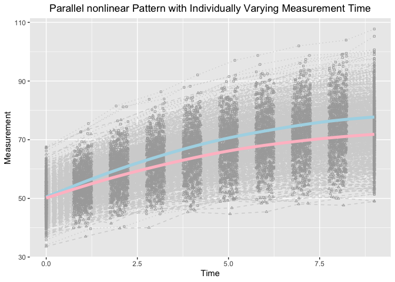

Extending Latent Basis Growth Model to Explore Joint Development in the Framework of Individual Measurement
Occasions
================
Jin Liu

## OS, R version and OpenMx Version

``` r
OpenMx::mxOption(model = NULL, key = "Default optimizer", "CSOLNP", reset = FALSE)
OpenMx::mxVersion()
```

    ## OpenMx version: 2.19.6 [GIT v2.19.6]
    ## R version: R version 4.1.0 (2021-05-18)
    ## Platform: x86_64-apple-darwin17.0 
    ## MacOS: 11.5.1
    ## Default optimizer: CSOLNP
    ## NPSOL-enabled?: No
    ## OpenMP-enabled?: No

## Require package would be used

``` r
library(tidyr)
library(ggplot2)
```

## Read in dataset for analyses (wide-format data)

``` r
dat <- read.csv(file = "example_data.csv")
```

## Summarize data

``` r
summary(dat)
```

    ##        id              Y1              Y2              Y3       
    ##  Min.   :  1.0   Min.   :34.08   Min.   :39.65   Min.   :40.39  
    ##  1st Qu.:125.8   1st Qu.:46.93   1st Qu.:51.79   1st Qu.:56.44  
    ##  Median :250.5   Median :50.44   Median :55.22   Median :59.74  
    ##  Mean   :250.5   Mean   :50.38   Mean   :55.46   Mean   :59.98  
    ##  3rd Qu.:375.2   3rd Qu.:53.69   3rd Qu.:58.76   3rd Qu.:63.61  
    ##  Max.   :500.0   Max.   :67.56   Max.   :75.51   Max.   :81.49  
    ##        Y4              Y5              Y6              Y7       
    ##  Min.   :44.70   Min.   :46.43   Min.   :49.87   Min.   :49.62  
    ##  1st Qu.:59.98   1st Qu.:63.08   1st Qu.:65.79   1st Qu.:67.67  
    ##  Median :63.78   Median :67.47   Median :70.63   Median :72.66  
    ##  Mean   :63.96   Mean   :67.57   Mean   :70.57   Mean   :72.99  
    ##  3rd Qu.:67.73   3rd Qu.:71.84   3rd Qu.:74.98   3rd Qu.:77.70  
    ##  Max.   :86.33   Max.   :92.09   Max.   :97.06   Max.   :98.72  
    ##        Y8               Y9              Y10               Z1       
    ##  Min.   : 51.17   Min.   : 50.07   Min.   : 51.36   Min.   :33.60  
    ##  1st Qu.: 70.02   1st Qu.: 70.83   1st Qu.: 71.99   1st Qu.:46.51  
    ##  Median : 74.91   Median : 76.49   Median : 77.63   Median :49.92  
    ##  Mean   : 75.16   Mean   : 76.59   Mean   : 77.63   Mean   :50.04  
    ##  3rd Qu.: 80.14   3rd Qu.: 81.74   3rd Qu.: 82.99   3rd Qu.:53.58  
    ##  Max.   :101.98   Max.   :103.95   Max.   :107.73   Max.   :67.23  
    ##        Z2              Z3              Z4              Z5       
    ##  Min.   :37.01   Min.   :39.80   Min.   :40.03   Min.   :45.35  
    ##  1st Qu.:50.42   1st Qu.:53.58   1st Qu.:56.36   1st Qu.:58.61  
    ##  Median :53.81   Median :57.89   Median :60.88   Median :64.05  
    ##  Mean   :54.10   Mean   :57.65   Mean   :60.87   Mean   :63.67  
    ##  3rd Qu.:57.74   3rd Qu.:61.69   3rd Qu.:65.38   3rd Qu.:68.14  
    ##  Max.   :73.55   Max.   :76.73   Max.   :82.63   Max.   :85.94  
    ##        Z6              Z7              Z8              Z9       
    ##  Min.   :44.70   Min.   :45.43   Min.   :48.04   Min.   :47.64  
    ##  1st Qu.:60.94   1st Qu.:62.73   1st Qu.:64.18   1st Qu.:65.42  
    ##  Median :66.54   Median :68.81   Median :69.94   Median :71.14  
    ##  Mean   :66.16   Mean   :68.12   Mean   :69.69   Mean   :70.91  
    ##  3rd Qu.:71.36   3rd Qu.:73.01   3rd Qu.:75.46   3rd Qu.:76.68  
    ##  Max.   :87.81   Max.   :89.46   Max.   :92.16   Max.   :95.54  
    ##       Z10              T1          T2               T3              T4       
    ##  Min.   :48.97   Min.   :0   Min.   :0.7502   Min.   :1.750   Min.   :2.751  
    ##  1st Qu.:66.20   1st Qu.:0   1st Qu.:0.8867   1st Qu.:1.876   1st Qu.:2.884  
    ##  Median :71.91   Median :0   Median :1.0104   Median :2.001   Median :3.007  
    ##  Mean   :71.72   Mean   :0   Mean   :1.0029   Mean   :1.997   Mean   :3.004  
    ##  3rd Qu.:77.50   3rd Qu.:0   3rd Qu.:1.1249   3rd Qu.:2.114   3rd Qu.:3.128  
    ##  Max.   :95.52   Max.   :0   Max.   :1.2497   Max.   :2.250   Max.   :3.250  
    ##        T5              T6              T7              T8       
    ##  Min.   :3.750   Min.   :4.752   Min.   :5.751   Min.   :6.751  
    ##  1st Qu.:3.883   1st Qu.:4.886   1st Qu.:5.877   1st Qu.:6.855  
    ##  Median :4.008   Median :5.007   Median :5.995   Median :6.985  
    ##  Mean   :4.006   Mean   :5.005   Mean   :5.997   Mean   :6.998  
    ##  3rd Qu.:4.128   3rd Qu.:5.129   3rd Qu.:6.120   3rd Qu.:7.122  
    ##  Max.   :4.249   Max.   :5.250   Max.   :6.250   Max.   :7.249  
    ##        T9             T10   
    ##  Min.   :7.751   Min.   :9  
    ##  1st Qu.:7.871   1st Qu.:9  
    ##  Median :7.995   Median :9  
    ##  Mean   :7.997   Mean   :9  
    ##  3rd Qu.:8.129   3rd Qu.:9  
    ##  Max.   :8.250   Max.   :9

## Visualize data

``` r
long_dat_T <- gather(dat[, c(1, 22:31), ], key = var.T, value = time, T1:T10)
long_dat_Y <- gather(dat[, c(1, 2:11), ], key = var.Y, value = measuresY, Y1:Y10)
long_dat_Y$outcome <- "Y"
long_dat_Z <- gather(dat[, c(1, 12:21), ], key = var.Z, value = measuresZ, Z1:Z10)
long_dat_Z$outcome <- "Z"
long_dat <- data.frame(id = rep(long_dat_T$id, 2),
                       time = rep(long_dat_T$time, 2),
                       measures = c(long_dat_Y$measuresY, long_dat_Z$measuresZ),
                       outcome = c(long_dat_Y$outcome, long_dat_Z$outcome))

ggplot(aes(x = time, y = measures), data = long_dat) +
  geom_line(aes(group = id), color = "lightgrey", linetype = "dotted", 
            data = long_dat[long_dat$outcome == "Y", ]) +
  geom_line(aes(group = id), color = "lightgrey", linetype = "dashed", 
            data = long_dat[long_dat$outcome == "Z", ]) +
  geom_point(aes(group = id), color = "darkgrey", shape = 0,
             data = long_dat[long_dat$outcome == "Y", ], size = 0.8) +
  geom_point(aes(group = id), color = "darkgrey", shape = 2,
             data = long_dat[long_dat$outcome == "Z", ], size = 0.8) +
  geom_smooth(aes(group = 1), size = 1.8, col = "lightblue", se = F, 
              data = long_dat[long_dat$outcome == "Y", ] ) + 
  geom_smooth(aes(group = 1), size = 1.8, col = "pink", se = F, 
              data = long_dat[long_dat$outcome == "Z", ] ) + 
  labs(title = "Parallel nonlinear Pattern with Individually Varying Measurement Time",
       x ="Time", y = "Measurement") + 
  theme(plot.title = element_text(hjust = 0.5))
```

    ## `geom_smooth()` using method = 'gam' and formula 'y ~ s(x, bs = "cs")'
    ## `geom_smooth()` using method = 'gam' and formula 'y ~ s(x, bs = "cs")'

<!-- -->

## Parallel Latent Basis Growth Model

``` r
source("Parallel_Development.R")
```

``` r
out
```

    ##           Name    Estimate          SE   true
    ## 1      mueta0Y 50.39475508 0.226345821 50.000
    ## 2      mueta1Y  5.04449003 0.302265133  5.000
    ## 3      mueta0Z 50.03952786 0.227881161 50.000
    ## 4      mueta1Z  4.20445208 0.302856062  4.000
    ## 5      psi0Y0Y 24.66773200 1.585628455 25.000
    ## 6      psi0Y1Y  1.89638644 0.267916670  1.500
    ## 7      psi0Y0Z  7.86919984 1.180599970  7.500
    ## 8      psi0Y1Z  1.69551169 0.280581057  1.500
    ## 9      psi1Y1Y  1.02941706 0.139400871  1.000
    ## 10     psi1Y0Z  1.69629730 0.263130545  1.500
    ## 11     psi1Y1Z  0.36722284 0.065187376  0.300
    ## 12     psi0Z0Z 25.00438752 1.606638478 25.000
    ## 13     psi0Z1Z  1.79026859 0.285102132  1.500
    ## 14     psi1Z1Z  1.13676296 0.178288029  1.000
    ## 15  residualsY  0.98204289 0.021959828  1.000
    ## 16  residualsZ  1.00660280 0.022509783  1.000
    ## 17 residualsYZ  0.28636153 0.016361585  0.300
    ## 18      rateY3  0.99998848 0.060418957  1.000
    ## 19      rateY4  0.90126959 0.054706026  0.900
    ## 20      rateY5  0.78615294 0.048018388  0.800
    ## 21      rateY6  0.71157574 0.043754176  0.700
    ## 22      rateY7  0.59797945 0.037247039  0.600
    ## 23      rateY8  0.48736609 0.031062039  0.500
    ## 24      rateY9  0.42002614 0.027682307  0.400
    ## 25     rateY10  0.29268181 0.024702276  0.300
    ## 26      rateZ3  0.96534302 0.070138644  1.000
    ## 27      rateZ4  0.84444370 0.061751113  0.900
    ## 28      rateZ5  0.76310730 0.056080485  0.800
    ## 29      rateZ6  0.66986578 0.049661651  0.700
    ## 30      rateZ7  0.59437030 0.044499510  0.600
    ## 31      rateZ8  0.46840977 0.036010758  0.500
    ## 32      rateZ9  0.36132424 0.029477606  0.400
    ## 33     rateZ10  0.28929587 0.029351703  0.300
    ## 34  abs_rateY1  5.04443194 0.075326216  5.000
    ## 35  abs_rateY2  4.54644546 0.072588229  4.500
    ## 36  abs_rateY3  3.96574069 0.068883603  4.000
    ## 37  abs_rateY4  3.58953674 0.067455892  3.500
    ## 38  abs_rateY5  3.01650139 0.064303958  3.000
    ## 39  abs_rateY6  2.45851338 0.062119934  2.500
    ## 40  abs_rateY7  2.11881767 0.059260181  2.000
    ## 41  abs_rateY8  1.47643050 0.058263841  1.500
    ## 42  abs_rateY9  1.00889801 0.060453027  1.000
    ## 43  abs_rateZ1  4.05873848 0.075828805  4.000
    ## 44  abs_rateZ2  3.55042308 0.072113115  3.600
    ## 45  abs_rateZ3  3.20844807 0.069654762  3.200
    ## 46  abs_rateZ4  2.81641859 0.066917787  2.800
    ## 47  abs_rateZ5  2.49900144 0.065179519  2.400
    ## 48  abs_rateZ6  1.96940643 0.061908132  2.000
    ## 49  abs_rateZ7  1.51917043 0.058624552  1.600
    ## 50  abs_rateZ8  1.21633064 0.058073709  1.200
    ## 51  abs_rateZ9  0.84089042 0.060571212  0.800
    ## 52        Cov1  0.35449193 0.051283523  0.300
    ## 53        Cov2  0.27948281 0.040551712  0.243
    ## 54        Cov3  0.22030398 0.032064142  0.192
    ## 55        Cov4  0.17504053 0.025564673  0.147
    ## 56        Cov5  0.13051879 0.019218861  0.108
    ## 57        Cov6  0.08383222 0.012525335  0.075
    ## 58        Cov7  0.05573180 0.008436182  0.048
    ## 59        Cov8  0.03109336 0.004929213  0.027
    ## 60        Cov9  0.01468891 0.002607495  0.012
