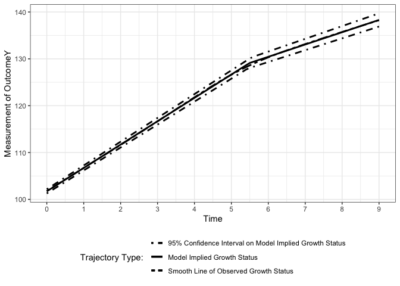
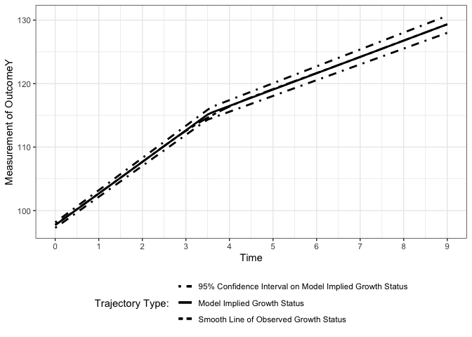

Estimating Knots and Their Association in Parallel Bilinear Spline
Growth Curve Models in the Framework of Individual Measurement Occasions
================
Jin Liu

## Require package would be used

``` r
library(nlpsem)
```

    ## Loading required package: OpenMx

    ## OpenMx may run faster if it is compiled to take advantage of multiple cores.

``` r
OpenMx::mxOption(model = NULL, key = "Default optimizer", "CSOLNP", reset = FALSE)
OpenMx::mxVersion()
```

    ## OpenMx version: 2.21.8 [GIT v2.21.8]
    ## R version: R version 4.2.2 (2022-10-31)
    ## Platform: aarch64-apple-darwin20 
    ## MacOS: 14.4.1
    ## Default optimizer: CSOLNP
    ## NPSOL-enabled?: No
    ## OpenMP-enabled?: No

## Read in dataset for analyses (wide-format data)

``` r
load("Bi_BLS_dat.RData")
```

## First Model: Multivariate Latent Growth Curve Model w/ Random Knots

### Specify parameters need to be print out

``` r
paraBLS_PLGCM.f <- c(
  "Y_mueta0", "Y_mueta1", "Y_mueta2", "Y_knot",
  paste0("Y_psi", c("00", "01", "02", "0g", "11", "12", "1g", "22", "2g", "gg")), "Y_res",
  "Z_mueta0", "Z_mueta1", "Z_mueta2", "Z_knot",
  paste0("Z_psi", c("00", "01", "02", "0g", "11", "12", "1g", "22", "2g", "gg")), "Z_res",
  paste0("YZ_psi", c(c("00", "10", "20", "g0", "01", "11", "21", "g1",
                       "02", "12", "22", "g2", "0g", "1g", "2g", "gg"))),"YZ_res"
  )
```

### Fit the model

``` r
BLS_PLGCM_f_out <- getMGM(dat = Bi_BLS_dat, t_var = c("T", "T"), y_var = c("Y", "Z"), curveFun = "BLS", intrinsic = TRUE, records = list(1:10, 1:10), 
                          y_model = "LGCM", res_scale = c(0.1, 0.1), res_cor = 0.3, paramOut = TRUE, names = paraBLS_PLGCM.f)
```

### Visulize longitudinal outcomes

``` r
xstarts <- mean(Bi_BLS_dat$T1)
Figure1 <- getFigure(
  model = BLS_PLGCM_f_out@mxOutput, sub_Model = "MGM", y_var = c("Y", "Z"), curveFun = "BLS", y_model = "LGCM", t_var = c("T", "T"), 
  records = list(1:10, 1:10), m_var = NULL, x_var = NULL, x_type = NULL, xstarts = xstarts, xlab = c("Time", "Time"), outcome = c("OutcomeY", "OutcomeZ")
)
```

    ## Treating first argument as an object that stores a character
    ## Treating first argument as an object that stores a character

``` r
show(Figure1)
```

    ## figOutput Object
    ## --------------------
    ## Trajectories: 2 
    ## 
    ## Trajectory 1 :
    ##   Figure 1:

    ## `geom_smooth()` using method = 'gam' and formula = 'y ~ s(x, bs = "cs")'

<!-- -->

    ## 
    ## Trajectory 2 :
    ##   Figure 1:

    ## `geom_smooth()` using method = 'gam' and formula = 'y ~ s(x, bs = "cs")'

<!-- -->

## Second Model: Multivariate Latent Growth Curve Model w/ Fixed Knots

### Specify parameters need to be print out

``` r
paraBLS_PLGCM.r <- c(
  "Y_mueta0", "Y_mueta1", "Y_mueta2", "Y_knot",
  paste0("Y_psi", c("00", "01", "02", "11", "12", "22")), "Y_res",
  "Z_mueta0", "Z_mueta1", "Z_mueta2", "Z_knot",
  paste0("Z_psi", c("00", "01", "02", "11", "12", "22")), "Z_res",
  paste0("YZ_psi", c(c("00", "10", "20", "01", "11", "21", "02", "12", "22"))),"YZ_res"
  )
```

### Fit the model

``` r
BLS_PLGCM_r_out <- getMGM(dat = Bi_BLS_dat, t_var = c("T", "T"), y_var = c("Y", "Z"), curveFun = "BLS", intrinsic = FALSE, records = list(1:10, 1:10), 
                          y_model = "LGCM", res_scale = c(0.1, 0.1), res_cor = 0.3, paramOut = TRUE, names = paraBLS_PLGCM.r)
```

### Visulize longitudinal outcomes

``` r
xstarts <- mean(Bi_BLS_dat$T1)
Figure1 <- getFigure(
  model = BLS_PLGCM_r_out@mxOutput, sub_Model = "MGM", y_var = c("Y", "Z"), curveFun = "BLS", y_model = "LGCM", t_var = c("T", "T"), 
  records = list(1:10, 1:10), m_var = NULL, x_var = NULL, x_type = NULL, xstarts = xstarts, xlab = c("Time", "Time"), outcome = c("OutcomeY", "OutcomeZ")
)
```

    ## Treating first argument as an object that stores a character
    ## Treating first argument as an object that stores a character

``` r
show(Figure1)
```

    ## figOutput Object
    ## --------------------
    ## Trajectories: 2 
    ## 
    ## Trajectory 1 :
    ##   Figure 1:

    ## `geom_smooth()` using method = 'gam' and formula = 'y ~ s(x, bs = "cs")'

<!-- -->

    ## 
    ## Trajectory 2 :
    ##   Figure 1:

    ## `geom_smooth()` using method = 'gam' and formula = 'y ~ s(x, bs = "cs")'

<!-- -->
