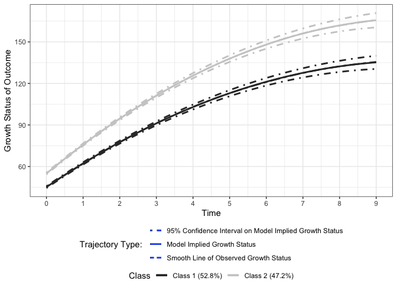
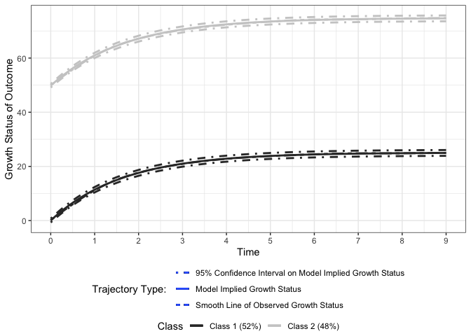
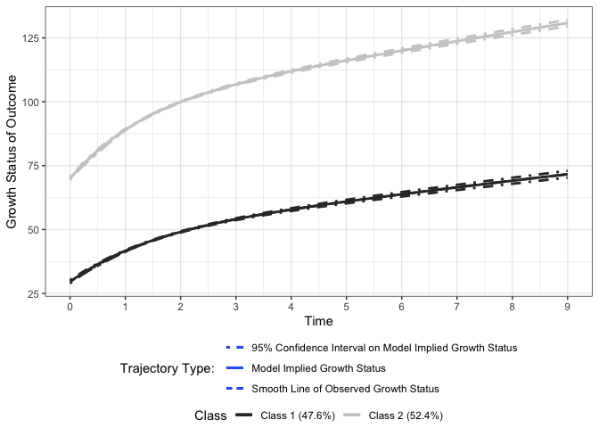

Extending Mixture of Experts Model to Investigate Heterogeneity of
Trajectories: When, Where and How to Add Which Covariates
================
Jin Liu

## Require package would be used

``` r
library(nlpsem)
```

    ## Loading required package: OpenMx

    ## OpenMx may run faster if it is compiled to take advantage of multiple cores.

``` r
OpenMx::mxOption(model = NULL, key = "Default optimizer", "CSOLNP", reset = FALSE)
OpenMx::mxVersion()
```

    ## OpenMx version: 2.21.8 [GIT v2.21.8]
    ## R version: R version 4.2.2 (2022-10-31)
    ## Platform: aarch64-apple-darwin20 
    ## MacOS: 14.4.1
    ## Default optimizer: CSOLNP
    ## NPSOL-enabled?: No
    ## OpenMP-enabled?: No

## First Model: Full Mixture Model with Quadratic Functional Form

### Read in dataset for analyses (wide-format data)

``` r
load("QUAD_dat2.RData")
```

### Specify parameters need to be print out

``` r
paraQUAD.TIC_LGCM.r <- c("alpha0", "alpha1", "alpha2", paste0("psi", c("00", "01", "02", "11", "12", "22")), "residuals",
                         paste0("beta1", 0:2), paste0("beta2", 0:2), paste0("mux", 1:2), paste0("phi", c("11", "12", "22")),
                         "mueta0", "mueta1", "mueta2")
```

### Fit the model

``` r
Full_MIX_QUAD_LGCM_out <-  getMIX(dat = QUAD_dat2, prop_starts = c(0.45, 0.55), sub_Model = "LGCM", cluster_TIC = c("gx1", "gx2"), y_var = "Y", t_var = "T",
                                  records = 1:10, curveFun = "QUAD", intrinsic = FALSE, res_scale = list(0.3, 0.3), growth_TIC = c("ex1", "ex2"), 
                                  paramOut = TRUE, names = paraQUAD.TIC_LGCM.r)
```

    ## # weights:  4 (3 variable)
    ## initial  value 346.573590 
    ## final  value 335.400941 
    ## converged

### Visulize longitudinal outcomes

``` r
xstarts <- mean(QUAD_dat2$T1)
Figure1 <- getFigure(
  model = Full_MIX_QUAD_LGCM_out@mxOutput, nClass = 2, cluster_TIC = c("gx1", "gx2"), sub_Model = "LGCM", y_var = "Y", curveFun = "QUAD", t_var = "T", records = 1:10,
  m_var = NULL, x_var = NULL, x_type = NULL, xstarts = xstarts, xlab = "Time", outcome = "Outcome"
)
```

    ## Treating first argument as an object that stores a character
    ## Treating first argument as an object that stores a character

``` r
show(Figure1)
```

    ## figOutput Object
    ## --------------------
    ## Trajectories: 1 
    ## Figure 1:

    ## `geom_smooth()` using method = 'gam' and formula = 'y ~ s(x, bs = "cs")'

<!-- -->

## Second Model: Full Mixture Model with Exponential Functional Form

### Read in dataset for analyses (wide-format data)

``` r
load("EXP_dat2.RData")
```

### Specify parameters need to be print out

``` r
paraEXP.TIC_LGCM.r <- c("alpha0", "alpha1", "ratio", paste0("psi", c("00", "01", "11")), "residuals",
                        paste0("beta1", 0:1), paste0("beta2", 0:1), paste0("mux", 1:2), paste0("phi", c("11", "12", "22")),
                        "mueta0", "mueta1")
```

### Fit the model

``` r
Full_MIX_EXP_LGCM_out <-  getMIX(dat = EXP_dat2, prop_starts = c(0.45, 0.55), sub_Model = "LGCM", cluster_TIC = c("gx1", "gx2"), y_var = "Y", t_var = "T",
                                 records = 1:10, curveFun = "EXP", intrinsic = FALSE, res_scale = list(0.3, 0.3), growth_TIC = c("ex1", "ex2"), 
                                 paramOut = TRUE, names = paraEXP.TIC_LGCM.r)
```

    ## # weights:  4 (3 variable)
    ## initial  value 346.573590 
    ## final  value 321.894411 
    ## converged

### Visulize longitudinal outcomes

``` r
xstarts <- mean(EXP_dat2$T1)
Figure2 <- getFigure(
  model = Full_MIX_EXP_LGCM_out@mxOutput, nClass = 2, cluster_TIC = c("gx1", "gx2"), sub_Model = "LGCM", y_var = "Y", curveFun = "EXP", t_var = "T", records = 1:10,
  m_var = NULL, x_var = NULL, x_type = NULL, xstarts = xstarts, xlab = "Time", outcome = "Outcome"
)
```

    ## Treating first argument as an object that stores a character
    ## Treating first argument as an object that stores a character
    ## Treating first argument as an object that stores a character
    ## Treating first argument as an object that stores a character
    ## Treating first argument as an object that stores a character
    ## Treating first argument as an object that stores a character

``` r
show(Figure2)
```

    ## figOutput Object
    ## --------------------
    ## Trajectories: 1 
    ## Figure 1:

    ## `geom_smooth()` using method = 'gam' and formula = 'y ~ s(x, bs = "cs")'

<!-- -->

## Third Model: Full Mixture Model with Jenss-Bayley Functional Form

## Read in dataset for analyses (wide-format data)

``` r
load("JB_dat2.RData")
```

## Specify parameters need to be print out

``` r
paraJB.TIC_LGCM.r <- c("alpha0", "alpha1", "alpha2", "ratio", paste0("psi", c("00", "01", "02", "11", "12", "22")), "residuals",
                       paste0("beta1", 0:2), paste0("beta2", 0:2), paste0("mux", 1:2), paste0("phi", c("11", "12", "22")),
                       "mueta0", "mueta1", "mueta2")
```

### Fit the model

``` r
Full_MIX_JB_LGCM_out <-  getMIX(dat = JB_dat2, prop_starts = c(0.45, 0.55), sub_Model = "LGCM", cluster_TIC = c("gx1", "gx2"), y_var = "Y", t_var = "T",
                                records = 1:10, curveFun = "JB", intrinsic = FALSE, res_scale = list(0.3, 0.3), growth_TIC = c("ex1", "ex2"), 
                                paramOut = TRUE, names = paraJB.TIC_LGCM.r)
```

    ## # weights:  4 (3 variable)
    ## initial  value 346.573590 
    ## final  value 330.497760 
    ## converged

### Visulize longitudinal outcomes

``` r
xstarts <- mean(JB_dat2$T1)
Figure3 <- getFigure(
  model = Full_MIX_JB_LGCM_out@mxOutput, nClass = 2, cluster_TIC = c("gx1", "gx2"), sub_Model = "LGCM", y_var = "Y", curveFun = "JB", t_var = "T", records = 1:10,
  m_var = NULL, x_var = NULL, x_type = NULL, xstarts = xstarts, xlab = "Time", outcome = "Outcome"
)
```

    ## Treating first argument as an object that stores a character
    ## Treating first argument as an object that stores a character
    ## Treating first argument as an object that stores a character
    ## Treating first argument as an object that stores a character
    ## Treating first argument as an object that stores a character
    ## Treating first argument as an object that stores a character

``` r
show(Figure3)
```

    ## figOutput Object
    ## --------------------
    ## Trajectories: 1 
    ## Figure 1:

    ## `geom_smooth()` using method = 'gam' and formula = 'y ~ s(x, bs = "cs")'

<!-- -->
