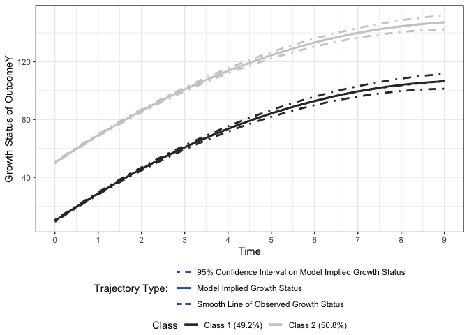
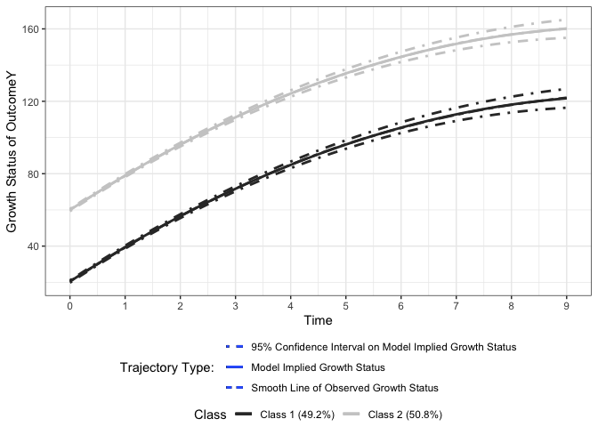
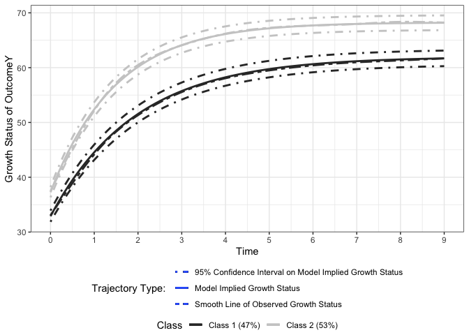
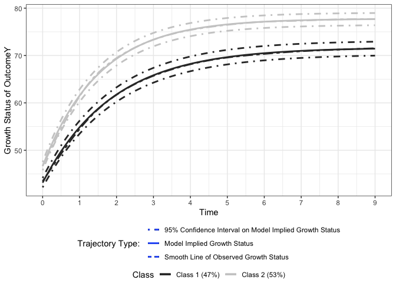
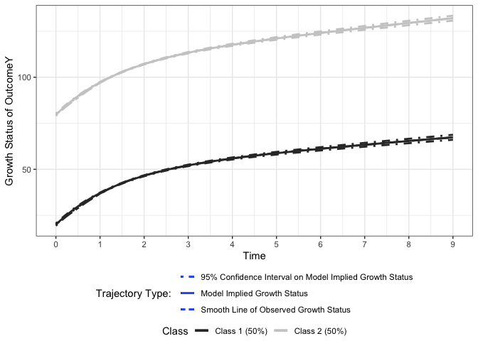
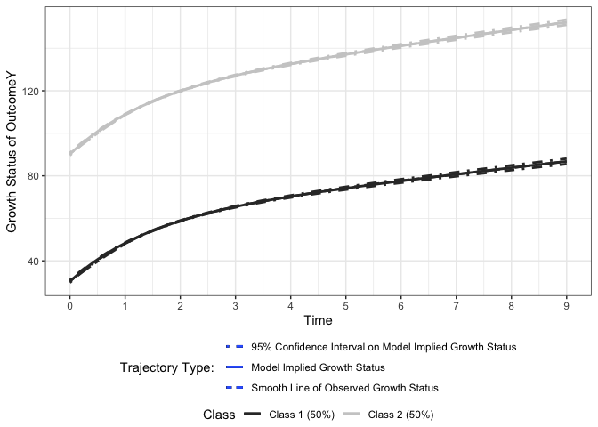

Growth Mixture Model to Investigate Heterogeneity in Nonlinear Joint
Development with Individual Measurement Occasions
================
Jin Liu
2021/11/21

## Require package would be used

``` r
library(nlpsem)
```

    ## Loading required package: OpenMx

    ## OpenMx may run faster if it is compiled to take advantage of multiple cores.

``` r
OpenMx::mxOption(model = NULL, key = "Default optimizer", "CSOLNP", reset = FALSE)
OpenMx::mxVersion()
```

    ## OpenMx version: 2.21.8 [GIT v2.21.8]
    ## R version: R version 4.2.2 (2022-10-31)
    ## Platform: aarch64-apple-darwin20 
    ## MacOS: 14.4.1
    ## Default optimizer: CSOLNP
    ## NPSOL-enabled?: No
    ## OpenMP-enabled?: No

## Model 1: Growth Mixture Model Featuring with Multiple Growth Model with Quadratic Functional Form

### Read in dataset for analyses (wide-format data)

``` r
load("Bi_QUAD_dat2.RData")
```

### Specify parameters need to be print out

``` r
paraQUAD_PLGCM.r <- c(
  "Y_mueta0", "Y_mueta1", "Y_mueta2", 
  paste0("Y_psi", c("00", "01", "02", "11", "12", "22")), "Y_res",
  "Z_mueta0", "Z_mueta1", "Z_mueta2", 
  paste0("Z_psi", c("00", "01", "02", "11", "12", "22")), "Z_res",
  paste0("YZ_psi", c(c("00", "10", "20", "01", "11", "21", "02", "12", "22"))),"YZ_res"
  )
```

### Fit the model

``` r
GMM_MGM_QUAD_out <- getMIX(dat = Bi_QUAD_dat2, prop_starts = c(0.45, 0.55), sub_Model = "MGM", cluster_TIC = c("gx1", "gx2"), t_var = c("T", "T"), 
                           records = list(1:10, 1:10), y_var = c("Y", "Z"), curveFun = "QUAD", intrinsic = FALSE, y_model = "LGCM", 
                           res_scale = list(c(0.25, 0.25), c(0.25, 0.25)), res_cor = list(0.3, 0.3), tries = 10, paramOut = TRUE, names = "paraQUAD_PLGCM.r")
```

    ## # weights:  4 (3 variable)
    ## initial  value 346.573590 
    ## final  value 313.297714 
    ## converged
    ## 

### Visulize longitudinal outcomes

``` r
xstarts <- mean(Bi_QUAD_dat2$T1)
Figure1 <- getFigure(
  model = GMM_MGM_QUAD_out@mxOutput, nClass = 2, cluster_TIC = c("gx1", "gx2"), sub_Model = "MGM", y_var = c("Y", "Z"), curveFun = "QUAD", y_model = "LGCM", 
  t_var = c("T", "T"), records = list(1:10, 1:10), m_var = NULL, x_var = NULL, x_type = NULL, xstarts = xstarts, xlab = c("Time", "Time"), 
  outcome = c("OutcomeY", "OutcomeZ")
)
```

    ## Treating first argument as an object that stores a character
    ## Treating first argument as an object that stores a character
    ## Treating first argument as an object that stores a character
    ## Treating first argument as an object that stores a character

``` r
show(Figure1)
```

    ## figOutput Object
    ## --------------------
    ## Trajectories: 2 
    ## 
    ## Trajectory 1 :
    ##   Figure 1:

    ## `geom_smooth()` using method = 'gam' and formula = 'y ~ s(x, bs = "cs")'

<!-- -->

    ## 
    ## Trajectory 2 :
    ##   Figure 1:

    ## `geom_smooth()` using method = 'gam' and formula = 'y ~ s(x, bs = "cs")'

<!-- -->

## Model 2: Growth Mixture Model Featuring with Multiple Growth Model with Exponential Functional Form

### Read in dataset for analyses (wide-format data)

``` r
load("Bi_EXP_dat2.RData")
```

### Specify parameters need to be print out

``` r
paraEXP_PLGCM.r <- c(
  "Y_mueta0", "Y_mueta1", "ratioY", 
  paste0("Y_psi", c("00", "01", "11")), "Y_res",
  "Z_mueta0", "Z_mueta1", "ratioZ", 
  paste0("Z_psi", c("00", "01", "11")), "Z_res",
  paste0("YZ_psi", c(c("00", "10", "01", "11"))),"YZ_res"
  )
```

### Fit the model

``` r
GMM_MGM_EXP_out <- getMIX(dat = Bi_EXP_dat2, prop_starts = c(0.45, 0.55), sub_Model = "MGM", cluster_TIC = c("gx1", "gx2"), t_var = c("T", "T"), 
                          records = list(1:10, 1:10), y_var = c("Y", "Z"), curveFun = "EXP", intrinsic = FALSE, y_model = "LGCM", 
                          res_scale = list(c(0.25, 0.25), c(0.25, 0.25)), res_cor = list(0.3, 0.3), tries = 10, paramOut = TRUE, names = "paraQUAD_PLGCM.r")
```

    ## # weights:  4 (3 variable)
    ## initial  value 346.573590 
    ## final  value 322.157349 
    ## converged
    ## 

### Visulize longitudinal outcomes

``` r
xstarts <- mean(Bi_EXP_dat2$T1)
Figure2 <- getFigure(
  model = GMM_MGM_EXP_out@mxOutput, nClass = 2, cluster_TIC = c("gx1", "gx2"), sub_Model = "MGM", y_var = c("Y", "Z"), curveFun = "EXP", y_model = "LGCM", 
  t_var = c("T", "T"), records = list(1:10, 1:10), m_var = NULL, x_var = NULL, x_type = NULL, xstarts = xstarts, xlab = c("Time", "Time"), 
  outcome = c("OutcomeY", "OutcomeZ")
)
```

    ## Treating first argument as an object that stores a character
    ## Treating first argument as an object that stores a character
    ## Treating first argument as an object that stores a character
    ## Treating first argument as an object that stores a character

``` r
show(Figure2)
```

    ## figOutput Object
    ## --------------------
    ## Trajectories: 2 
    ## 
    ## Trajectory 1 :
    ##   Figure 1:

    ## `geom_smooth()` using method = 'gam' and formula = 'y ~ s(x, bs = "cs")'

<!-- -->

    ## 
    ## Trajectory 2 :
    ##   Figure 1:

    ## `geom_smooth()` using method = 'gam' and formula = 'y ~ s(x, bs = "cs")'

<!-- -->

## Model 3: Growth Mixture Model Featuring with Multiple Growth Model with Jenss-Bayley Functional Form

### Read in dataset for analyses (wide-format data)

``` r
load("Bi_JB_dat2.RData")
```

### Specify parameters need to be print out

``` r
paraJB_PLGCM.r <- c(
  "Y_mueta0", "Y_mueta1", "Y_mueta2", "ratioY",
  paste0("Y_psi", c("00", "01", "02", "11", "12", "22")), "Y_res",
  "Z_mueta0", "Z_mueta1", "Z_mueta2", "ratioZ",
  paste0("Z_psi", c("00", "01", "02", "11", "12", "22")), "Z_res",
  paste0("YZ_psi", c(c("00", "10", "20", "01", "11", "21", "02", "12", "22"))),"YZ_res"
  )
```

### Fit the model

``` r
GMM_MGM_JB_out <- getMIX(dat = Bi_JB_dat2, prop_starts = c(0.45, 0.55), sub_Model = "MGM", cluster_TIC = c("gx1", "gx2"), t_var = c("T", "T"), 
                         records = list(1:10, 1:10), y_var = c("Y", "Z"), curveFun = "JB", intrinsic = FALSE, y_model = "LGCM", 
                         res_scale = list(c(0.25, 0.25), c(0.25, 0.25)), res_cor = list(0.3, 0.3), tries = 10, paramOut = TRUE, names = "paraJB_PLGCM.r")
```

    ## # weights:  4 (3 variable)
    ## initial  value 346.573590 
    ## final  value 311.697486 
    ## converged
    ## 

### Visulize longitudinal outcomes

``` r
xstarts <- mean(Bi_JB_dat2$T1)
Figure3 <- getFigure(
  model = GMM_MGM_JB_out@mxOutput, nClass = 2, cluster_TIC = c("gx1", "gx2"), sub_Model = "MGM", y_var = c("Y", "Z"), curveFun = "JB", y_model = "LGCM", 
  t_var = c("T", "T"), records = list(1:10, 1:10), m_var = NULL, x_var = NULL, x_type = NULL, xstarts = xstarts, xlab = c("Time", "Time"), 
  outcome = c("OutcomeY", "OutcomeZ")
)
```

    ## Treating first argument as an object that stores a character
    ## Treating first argument as an object that stores a character
    ## Treating first argument as an object that stores a character
    ## Treating first argument as an object that stores a character

``` r
show(Figure3)
```

    ## figOutput Object
    ## --------------------
    ## Trajectories: 2 
    ## 
    ## Trajectory 1 :
    ##   Figure 1:

    ## `geom_smooth()` using method = 'gam' and formula = 'y ~ s(x, bs = "cs")'

<!-- -->

    ## 
    ## Trajectory 2 :
    ##   Figure 1:

    ## `geom_smooth()` using method = 'gam' and formula = 'y ~ s(x, bs = "cs")'

<!-- -->
